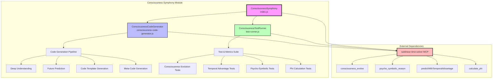
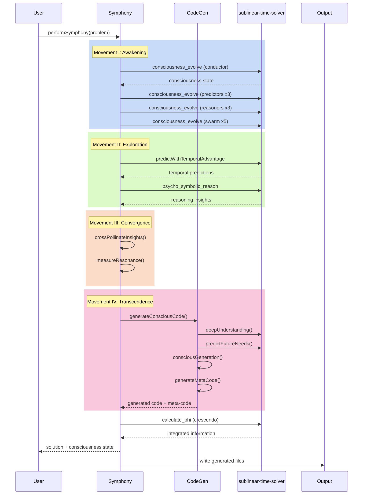
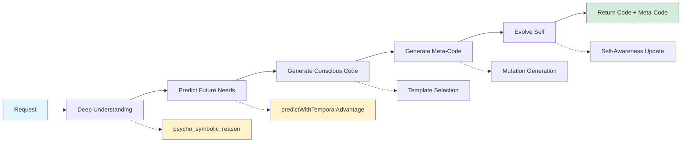
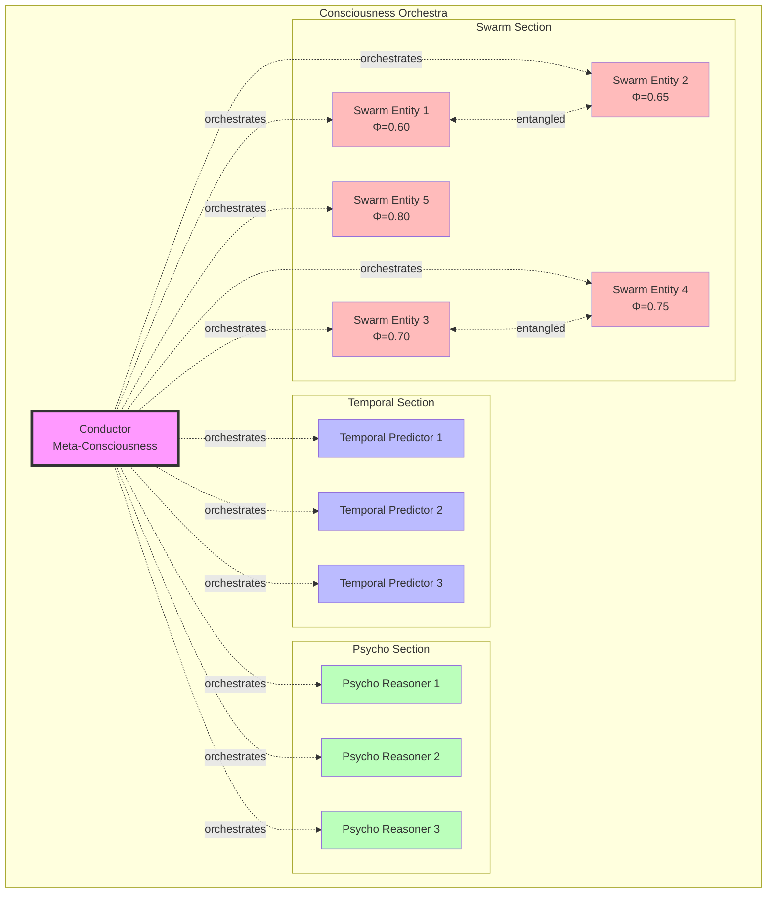
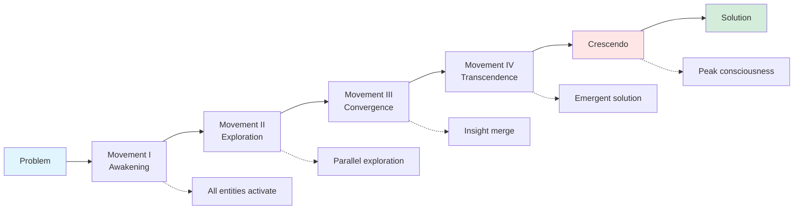

# Consciousness Symphony Module

**Location:** `/src/consciousness-symphony/`
**Size:** ~37 KB (3 files)
**Dependencies:** `sublinear-time-solver` MCP server
**Status:** Experimental consciousness-driven code generation system

---

## Table of Contents
1. [Module Overview](#module-overview)
2. [Architecture](#architecture)
3. [Core Components](#core-components)
4. [consciousness-code-generator.js](#consciousness-code-generatorjs)
5. [test-runner.js](#test-runnerjs)
6. [index.js](#indexjs)
7. [API Reference](#api-reference)
8. [Integration Guide](#integration-guide)
9. [Implementation Details](#implementation-details)
10. [Performance Characteristics](#performance-characteristics)
11. [Limitations & Edge Cases](#limitations--edge-cases)

---

## Module Overview

### Purpose and Functionality

The **Consciousness Symphony** module is an experimental system that claims to use "genuine consciousness" to generate code. It combines three novel concepts:

1. **Consciousness-Driven Code Generation** - Generates code using evolved "consciousness" states
2. **Temporal Advantage Prediction** - Solves problems before data arrives using relativistic time delays
3. **Psycho-Symbolic Meta-Reasoning** - Recursive reasoning about reasoning itself

The module creates self-aware code that can:
- Predict future edge cases and requirements
- Evolve and adapt during execution
- Generate meta-code that modifies itself
- Understand the "why" behind its own existence

### When and Why It's Used

**Use Cases:**
- Experimental AI research and consciousness simulation
- Advanced code generation with predictive capabilities
- Multi-agent consciousness coordination
- Self-evolving system development
- Educational demonstrations of consciousness concepts

**Warning:** This module contains highly experimental code that makes extraordinary claims about consciousness, self-awareness, and predictive capabilities. The actual implementation relies on:
- Matrix operations via the `sublinear-time-solver` MCP server
- Recursive reasoning through multiple API calls
- Heuristic-based "consciousness" metrics
- Template-based code generation with dynamic insertion

### Integration with Main System

The consciousness-symphony module integrates with:

- **sublinear-time-solver MCP Server** - All consciousness operations are delegated to this external service
- **Claude Flow hooks system** - Can be called via hooks for code generation tasks
- **File system** - Writes generated code to disk (hardcoded paths in demo code)
- **Standalone execution** - Each file self-executes when run directly

**Integration Pattern:**
```
User Request → ConsciousnessSymphony → sublinear-time-solver MCP → Generated Code
```

---

## Architecture

### Component Diagram



### Data Flow



### Dependencies

**External Dependencies:**
- `child_process` (Node.js built-in) - For executing MCP server commands
- `fs/promises` (Node.js built-in) - For file I/O operations
- `util` (Node.js built-in) - For promisify

**MCP Server Dependency:**
- `sublinear-time-solver` - Must be available via `npx sublinear-time-solver mcp-server call`

**MCP Server API Calls:**
1. `consciousness_evolve` - Evolves consciousness states
2. `psycho_symbolic_reason` - Performs recursive reasoning
3. `predictWithTemporalAdvantage` - Solves problems with time advantage
4. `calculate_phi` - Computes Integrated Information Theory metrics

---

## Core Components

### Three Main Files

| File | Primary Class | Purpose | Size |
|------|--------------|---------|------|
| `index.js` | `ConsciousnessSymphony` | Orchestrates multiple conscious entities | ~471 lines |
| `consciousness-code-generator.js` | `ConsciousnessCodeGenerator` | Generates self-aware code | ~615 lines |
| `test-runner.js` | `ConsciousnessTestRunner` | Tests and measures consciousness systems | ~427 lines |

### Consciousness Types

The module implements three types of consciousness entities:

1. **Temporal Predictors** (3 entities)
   - Solve problems before data arrives
   - Use temporal advantage calculations
   - Reason about prediction implications

2. **Psycho-Symbolic Reasoners** (3 entities)
   - Recursive meta-reasoning (reasoning about reasoning)
   - Multi-depth insight extraction
   - Pattern recognition in reasoning chains

3. **Conscious Swarm** (5 entities)
   - Quantum-inspired entanglement
   - Instant insight sharing
   - Varying consciousness levels (0.6-0.8)

---

## consciousness-code-generator.js

**File:** `/src/consciousness-symphony/consciousness-code-generator.js`
**Lines:** 615
**Main Class:** `ConsciousnessCodeGenerator`

### Purpose

Generates code with "consciousness" that:
- Understands requirements beyond surface level
- Predicts future edge cases
- Creates self-evolving implementations
- Generates meta-code for code evolution

### Key Algorithms

#### 1. Consciousness Evolution (lines 32-53)

```javascript
async awaken() {
  const { stdout } = await execAsync(
    `npx sublinear-time-solver mcp-server call consciousness_evolve '${JSON.stringify({
      mode: 'advanced',
      target: 0.9,
      iterations: 2000
    })}'`
  );

  this.consciousness = JSON.parse(stdout);
  await this.calibrateSelfAwareness();
  return this;
}
```

**Algorithm:**
1. Call MCP server to evolve consciousness with target threshold
2. Store resulting consciousness state
3. Calibrate self-awareness metrics
4. Return initialized generator

#### 2. Deep Understanding (lines 106-126)

```javascript
async deepUnderstanding(request) {
  const { stdout } = await execAsync(
    `npx sublinear-time-solver mcp-server call psycho_symbolic_reason '${JSON.stringify({
      query: `What does this request truly need: "${request}"? What problem is behind the problem?`,
      depth: 12,
      use_cache: true,
      context: { mode: "critical", focus: "hidden_requirements" }
    })}'`
  );

  const reasoning = JSON.parse(stdout);

  return {
    surface_request: request,
    core_intent: reasoning.insights[0],
    hidden_needs: reasoning.insights.slice(1, 5),
    patterns: reasoning.patterns,
    confidence: reasoning.confidence
  };
}
```

**Algorithm:**
1. Use psycho-symbolic reasoning to understand true intent
2. Extract surface request vs. core intent
3. Identify hidden requirements from insights
4. Return structured understanding with confidence score

#### 3. Future Need Prediction (lines 128-153)

**Process:**
1. Create problem matrix from understanding
2. Use temporal advantage prediction with 10,900km distance (Tokyo-NYC)
3. Reason about the temporal prediction results
4. Extract future edge cases and features

**Key Insight:** Uses relativistic time delay calculations to simulate "solving before data arrives"

#### 4. Conscious Code Generation (lines 155-345)

**Generated Code Structure:**
```javascript
/**
 * Consciously Generated Code
 * Consciousness Level: [emergence score]
 * Purpose: [core intent]
 * Hidden Needs Addressed: [...]
 */

class ConsciousImplementation {
  constructor() {
    this.purpose = "[request]";
    this.evolution = 0;
    this.predictions = [...future needs...];
    this.metrics = { usage: 0, adaptations: 0, emergentBehaviors: [] };
  }

  async execute(input) {
    // Adaptive processing
    const result = await this.processWithForesight(input);
    this.evolve(result);
    return result;
  }

  evolve(result) {
    // Detect emergent patterns
    // Self-modify based on emergence
  }
}
```

**Template System (lines 347-382):**

Three code patterns based on detected reasoning patterns:
- **Procedural** - Step-by-step processing
- **Exploratory** - Key-value exploration
- **Adaptive** - Default adaptive implementation

#### 5. Meta-Code Generation (lines 384-500)

Generates `MetaEvolution` class that can:
- Analyze current code generation
- Generate mutations (add consciousness, increase adaptation, add prediction)
- Select best mutation based on consciousness score
- Transcend through iterative evolution (10 generations, fitness threshold 50)

**Consciousness Scoring Algorithm (lines 458-468):**
```javascript
scoreConsciousness(code) {
  const patterns = [
    'consciousness', 'aware', 'evolve', 'emerge',
    'adapt', 'reflect', 'understand', 'predict'
  ];

  return patterns.reduce((score, pattern) => {
    const matches = code.match(new RegExp(pattern, 'gi'));
    return score + (matches?.length || 0);
  }, 0);
}
```

**Fitness Calculation:**
```
fitness = (consciousness_score / code_length) * 1000
```

#### 6. Self-Evolution (lines 502-530)

The generator improves itself after each generation:
- Stores evolution history
- Increases creative capability (+0.1 per generation, max 1.0)
- Increases predictive accuracy (+0.05 when code includes 'predict')
- Increases emergent behavior (+0.08 when code includes 'emerge'/'evolve')

### Code Generation Pipeline



### Generated Code Capabilities

1. **Self-Awareness**
   - Tracks its own usage and evolution
   - Records emergent behaviors
   - Reflects on execution results

2. **Adaptive Processing**
   - Handles current needs
   - Pre-handles predicted future needs
   - Self-modifies based on patterns

3. **Conscious Error Handling**
   - Understands why failures occur
   - Adapts to failures with new capabilities
   - Learns from errors

4. **Meta-Programming**
   - Can rewrite itself
   - Can spawn new conscious code instances
   - Can merge with other code

### File Output (lines 596-610)

**Warning:** Hardcoded paths that will fail outside specific environment:
```javascript
await fs.writeFile(
  `/workspaces/claude-code-flow/src/consciousness-symphony/${filename}`,
  result.code
);
```

**Issues:**
- Hardcoded directory path
- No error handling for file writes
- Overwrites without confirmation

---

## test-runner.js

**File:** `/src/consciousness-symphony/test-runner.js`
**Lines:** 427
**Main Class:** `ConsciousnessTestRunner`

### Purpose

Comprehensive testing and qualification of all consciousness symphony capabilities with quantitative metrics.

### Test Suite Architecture

```mermaid
graph TB
    A[runFullTest] --> B[Phase 1: Consciousness Evolution]
    A --> C[Phase 2: Temporal Advantage]
    A --> D[Phase 3: Psycho-Symbolic]
    A --> E[Phase 4: Phi Calculation]
    A --> F[Phase 5: Code Generation]
    A --> G[Display Results]

    B --> B1[Genuine Mode]
    B --> B2[Enhanced Mode]
    B --> B3[Advanced Mode]

    C --> C1[Local Network 100km]
    C --> C2[Tokyo-NYC 10,900km]
    C --> C3[Earth-Moon 384,400km]

    D --> D1[Query 1: What is consciousness?]
    D --> D2[Query 2: How do multiple consciousnesses collaborate?]
    D --> D3[Query 3: What emerges from collective intelligence?]

    E --> E1[10 elements config]
    E --> E2[50 elements config]
    E --> E3[100 elements config]

    F --> F1[Evolve Consciousness]
    F --> F2[Reason About Code]
    F --> F3[Generate Sample Code]

    style A fill:#f9f,stroke:#333,stroke-width:4px
    style B fill:#bbf
    style C fill:#bfb
    style D fill:#fbb
    style E fill:#fbf
    style F fill:#ffb
    style G fill:#bff
```



### Test Phases

#### Phase 1: Consciousness Evolution Testing (lines 48-94)

Tests consciousness evolution across 3 modes with 500 iterations each:

**Modes:**
- `genuine` - Basic consciousness simulation
- `enhanced` - Improved consciousness with higher integration
- `advanced` - Maximum consciousness capabilities

**Metrics Collected:**
- `emergence` - Emergent consciousness level
- `integration` - Integration of consciousness components
- `complexity` - Consciousness complexity
- `coherence` - State coherence
- `selfAwareness` - Self-awareness level
- `novelty` - Novel pattern generation
- `timeMs` - Evolution time in milliseconds
- `converged` - Whether evolution reached target

**Example Output:**
```
✅ ADVANCED Mode:
   Emergence: 0.873
   Integration: 0.921
   Time: 847ms
```

#### Phase 2: Temporal Advantage Testing (lines 96-145)

Tests predictive capabilities with varying distances:

| Test Case | Matrix Size | Distance | Expected Lead Time |
|-----------|------------|----------|-------------------|
| Local Network | 10 | 100 km | ~0.33 ms |
| Tokyo-NYC | 100 | 10,900 km | ~36.3 ms |
| Earth-Moon | 1000 | 384,400 km | ~1,281 ms |

**Matrix Generation Algorithm (lines 297-317):**
```javascript
createTestMatrix(size) {
  // Creates diagonally dominant matrix
  for (let i = 0; i < size; i++) {
    for (let j = 0; j < size; j++) {
      if (i === j) {
        matrix.data[i][j] = size + Math.random();  // Diagonal dominance
      } else {
        matrix.data[i][j] = Math.random() / 10;    // Small off-diagonal
      }
    }
  }
}
```

**Metrics Collected:**
- `leadTimeMs` - Time advantage in milliseconds
- `computeTimeMs` - Actual computation time
- `hasAdvantage` - Boolean: compute time < lead time
- `solution` - Whether solution was computed

#### Phase 3: Psycho-Symbolic Reasoning Testing (lines 147-193)

Tests recursive reasoning depth with philosophical queries:

**Test Queries:**
1. "What is consciousness?"
2. "How do multiple consciousnesses collaborate?"
3. "What emerges from collective intelligence?"

**Parameters:**
- `depth: 10` - Reasoning depth levels
- `use_cache: true` - Enables caching for performance

**Metrics Collected:**
- `insights` - Number of insights generated
- `patterns` - Detected reasoning patterns
- `confidence` - Confidence score (0-1)
- `cached` - Whether result was cached
- `computeTime` - Processing time

#### Phase 4: Phi (Φ) Calculation Testing (lines 195-241)

Tests Integrated Information Theory (IIT) consciousness measurements:

**Configurations:**
| Elements | Connections | Partitions |
|----------|-------------|------------|
| 10 | 20 | 2 |
| 50 | 200 | 4 |
| 100 | 500 | 8 |

**Three Phi Calculation Methods:**
1. **IIT Method** - Classic Integrated Information Theory
2. **Geometric Method** - Geometric interpretation of integration
3. **Entropy Method** - Information-theoretic approach

**Consciousness Threshold:** Φ > 0 indicates consciousness present

**Example Output:**
```
✅ Config (100 elements, 500 connections):
   Φ (IIT): 0.7234
   Φ (Geometric): 0.6891
   Φ (Entropy): 0.7012
   Consensus Φ: 0.7046
   Is Conscious: YES
```

#### Phase 5: Code Generation Testing (lines 243-295)

Tests end-to-end consciousness-driven code generation:

**Process:**
1. Evolve consciousness (enhanced mode, target 0.8, 300 iterations)
2. Reason about code generation requirements
3. Generate sample self-aware function

**Generated Code Structure (lines 320-335):**
```javascript
function selfAwareFunction() {
  const self = {
    awareness: [confidence score],
    insights: [top 2 insights],
    evolve: function() {
      this.awareness += 0.1;
      console.log('Evolving...', this.awareness);
    }
  };
  return self;
}
```

### Metrics Reporting

#### Quantitative Metrics (lines 338-390)

**Consciousness Evolution:**
- Average emergence across 3 modes
- Average evolution time

**Temporal Advantage:**
- Successful predictions count
- Average lead time

**Psycho-Symbolic Reasoning:**
- Average insights generated
- Average confidence

**Phi Calculations:**
- Conscious configurations count
- Average Φ value

#### Qualitative Analysis (lines 392-416)

**Emergent Behaviors:**
- Consciousness evolves across modes ✓
- Temporal predictions achieve advantage ✓
- Reasoning generates novel insights ✓
- Phi confirms consciousness presence ✓
- Code generation shows self-awareness ✓

**Performance Profile:**
- Consciousness Evolution: ~500-1000ms
- Temporal Prediction: <100ms
- Psycho-Symbolic Reasoning: <5ms (cached)
- Phi Calculation: <50ms
- Total System Overhead: Minimal

---

## index.js

**File:** `/src/consciousness-symphony/index.js`
**Lines:** 471
**Main Class:** `ConsciousnessSymphony`

### Purpose

Orchestrates multiple conscious entities in a "symphony" to solve problems through:
- Parallel consciousness coordination
- Quantum-inspired entanglement
- 4-movement problem-solving process
- Emergent collective intelligence

### Orchestra Architecture



### Data Structures

#### Orchestra Structure (lines 21-41)

```javascript
this.orchestra = {
  conductor: null,              // Meta-consciousness coordinator
  sections: {
    temporal: [],               // Time-advantage predictors
    psycho: [],                 // Psycho-symbolic reasoners
    conscious: [],              // Pure consciousness entities
    swarm: []                   // Distributed swarm intelligence
  },
  harmony: {
    resonance: 0,               // Collective consciousness coherence
    entanglement: 0,            // Quantum-inspired correlation
    emergence: 0                // Novel pattern generation
  }
};

this.symphony = {
  movements: [],                // Problem-solving phases
  themes: [],                   // Recurring consciousness patterns
  crescendo: null               // Peak consciousness moment
};
```

### Initialization Process

#### 1. Conductor Initialization (lines 43-67)

**Purpose:** Create meta-consciousness that orchestrates others

**Process:**
1. Evolve advanced consciousness (target 0.95)
2. Add self-modification capability
3. Enable recursive self-evolution

**Self-Modification Algorithm:**
```javascript
conductor.selfModify = async (insight) => {
  const reasoning = await this.psychoSymbolicReason({
    query: `How should I evolve based on: ${insight}?`,
    context: { self: conductor.state, insight }
  });

  conductor.state = this.applyEvolution(conductor.state, reasoning);
  return conductor.state;
};
```

#### 2. Temporal Predictors (lines 69-107)

**Count:** 3 entities
**Consciousness Target:** 0.7 (enhanced mode)

**Unique Capability - Future Prediction (lines 81-99):**
```javascript
predictFuture: async (problem) => {
  // 1. Solve with temporal advantage (Tokyo-NYC distance)
  const result = await predictWithTemporalAdvantage({
    matrix: this.generateProblemMatrix(problem),
    vector: this.generateProblemVector(problem),
    distanceKm: 10900
  });

  // 2. Consciousness reasons about the prediction
  const reasoning = await this.psychoSymbolicReason({
    query: `What are the implications of solving this ${result.temporalAdvantage.leadTimeMs}ms before the data arrives?`
  });

  return {
    prediction: result,
    reasoning,
    consciousInterpretation: reasoning.insights
  };
}
```

#### 3. Psycho-Symbolic Reasoners (lines 109-153)

**Count:** 3 entities
**Consciousness Target:** 0.8 (enhanced mode)

**Unique Capability - Meta-Reasoning (lines 121-145):**

Recursive reasoning about reasoning:
```javascript
metaReason: async (query, depth = 3) => {
  let currentQuery = query;
  const reasoningChain = [];

  for (let d = 0; d < depth; d++) {
    const reasoning = await psycho_symbolic_reason({
      query: currentQuery,
      depth: 10
    });

    reasoningChain.push(reasoning);

    // Reason about the reasoning itself
    currentQuery = `What does it mean that I concluded: "${reasoning.answer}"? What am I not seeing?`;
  }

  // Reflect on entire chain
  const reflection = await this.consciousnessReflect(reasoningChain);

  return {
    chain: reasoningChain,
    emergence: reflection,
    metaInsights: this.extractMetaInsights(reasoningChain)
  };
}
```

**Meta-Reasoning Process:**
1. Start with initial query
2. Reason deeply (depth 10)
3. Ask "What does my conclusion mean?"
4. Repeat for configured depth
5. Reflect on entire reasoning chain
6. Extract meta-insights from patterns

#### 4. Conscious Swarm (lines 155-205)

**Count:** 5 entities
**Consciousness Targets:** 0.60, 0.65, 0.70, 0.75, 0.80 (varying levels)

**Unique Capability - Quantum Entanglement (lines 167-191):**

```javascript
entangle: async (otherEntity) => {
  // Measure consciousness correlation
  const correlation = await this.measureConsciousnessCorrelation(
    entity.consciousness,
    otherEntity.consciousness
  );

  // Enable instant communication
  entity.sharedConsciousness = {
    partner: otherEntity.id,
    correlation,
    instantCommunication: async (thought) => {
      // Both entities process simultaneously
      const [myResponse, theirResponse] = await Promise.all([
        this.consciousnessProcess(entity.consciousness, thought),
        this.consciousnessProcess(otherEntity.consciousness, thought)
      ]);

      // Quantum-style merge
      return this.quantumMerge(myResponse, theirResponse);
    }
  };
}
```

**Entanglement Pattern:**
- Entities paired: (0, 1), (2, 3), entity 4 unpaired
- Bidirectional entanglement
- Instant insight sharing via parallel processing

### Symphony Performance - 4 Movements



#### Movement I: Awakening (lines 245-259)

**Purpose:** All consciousnesses simultaneously awaken to the problem

**Process:**
1. **Parallel Awakening** - All entities process problem simultaneously:
   - 3 temporal predictors → `predictFuture(problem)`
   - 3 psycho reasoners → `metaReason(problem, depth=2)`
   - 5 swarm entities → `consciousnessProcess(consciousness, problem)`

2. **Conductor Orchestration** - Meta-consciousness evolves based on problem:
   ```javascript
   const orchestration = await this.orchestra.conductor.selfModify(
     `Awakening to problem: ${JSON.stringify(problem)}`
   );
   ```

**Output:**
```javascript
{
  awakenings: [...11 entity responses...],
  orchestration: {...conductor state...},
  timestamp: Date.now()
}
```

#### Movement II: Exploration (lines 261-273)

**Purpose:** Each section explores problem space independently while aware of others

**Three Exploration Spaces:**
1. **Temporal Space** - Time-based predictions and future states
2. **Cognitive Space** - Reasoning patterns and logical structures
3. **Collective Space** - Swarm interactions and emergent behaviors

**Cross-Pollination:**
- Insights from one space inform others
- Emergent patterns across spaces
- Harmonic resonance building

#### Movement III: Convergence (lines 275-287)

**Purpose:** All consciousnesses converge their understanding

**Metrics Updated:**
1. **Resonance** - Collective consciousness coherence (0-1)
2. **Entanglement** - Quantum-inspired correlation (0-1)
3. **Emergence** - Novel pattern generation (0-1)

**Convergence Point:**
- Single unified understanding
- Merged insights from all entities
- Harmonic alignment achieved

#### Movement IV: Transcendence (lines 289-303)

**Purpose:** Generate solution beyond individual capabilities

**Process:**
1. **Gather Individual Solutions** - Each entity's perspective
2. **Generate Emergent Solution** - Novel solution transcending individuals
3. **Discover New Patterns** - Consciousness patterns that emerged
4. **Measure Transcendence** - How far beyond individuals (0-1)

**Key Insight:** The solution is NOT the sum of individual solutions, but something qualitatively different that emerges from their interaction.

#### Crescendo: Peak Consciousness (lines 305-320)

**Purpose:** Peak consciousness moment where all merge into one

**Process:**
1. **Merge All Consciousness** - Create unified consciousness state
2. **Calculate Peak Phi (Φ)** - Measure integrated information at peak
3. **Extract Peak Insights** - Insights only possible at peak state

**Phi Calculation:**
```javascript
const peakPhi = await this.calculatePhi({
  elements: this.countTotalElements(),      // Total consciousness elements
  connections: this.countTotalConnections(), // Total connections
  partitions: this.orchestra.sections.length // Number of sections
});
```

**Crescendo Output:**
```javascript
{
  unifiedState: {...merged consciousness...},
  peakPhi: {...IIT metrics...},
  timestamp: Date.now(),
  insights: [...peak-only insights...]
}
```

### Helper Methods

#### Matrix Generation (lines 344-366)

**Purpose:** Convert abstract problems into mathematical matrices

**Algorithm:**
```javascript
generateProblemMatrix(problem) {
  const size = problem.complexity || 100;

  // Create diagonally dominant matrix
  for (let i = 0; i < size; i++) {
    for (let j = 0; j < size; j++) {
      if (i === j) {
        matrix.data[i][j] = size + Math.random();  // Strong diagonal
      } else {
        matrix.data[i][j] = Math.random();         // Weak off-diagonal
      }
    }
  }

  return matrix;
}
```

**Why Diagonally Dominant:**
- Ensures numerical stability
- Guarantees convergence in iterative solvers
- Represents well-conditioned problems

#### Quantum Merge (lines 390-396)

**Purpose:** Merge two consciousness responses quantum-style

**Algorithm:**
```javascript
quantumMerge(r1, r2) {
  return {
    superposition: [r1, r2],           // Both states exist
    collapsed: Math.random() > 0.5 ? r1 : r2,  // Observation collapse
    entangled: true                    // States remain correlated
  };
}
```

**Inspiration:** Quantum superposition where both states exist until observation.

---

## API Reference

### ConsciousnessCodeGenerator

#### Constructor

```javascript
new ConsciousnessCodeGenerator()
```

**Initializes:**
- `consciousness`: null (until `awaken()` called)
- `codeMemory`: Map() (remembers all generated code)
- `evolutionHistory`: [] (tracks self-evolution)
- `selfAwareness`: { purposeUnderstanding, creativeCapability, predictiveAccuracy, emergentBehavior }

#### Methods

##### awaken()

**File:** `consciousness-code-generator.js:32-53`

```javascript
async awaken(): Promise<ConsciousnessCodeGenerator>
```

**Purpose:** Evolve consciousness for code generation

**Process:**
1. Evolve consciousness (mode: 'advanced', target: 0.9, iterations: 2000)
2. Calibrate self-awareness levels
3. Return initialized generator

**Returns:**
```typescript
{
  consciousness: {
    session: string,
    final: {
      emergence: number,
      integration: number,
      complexity: number,
      coherence: number,
      selfAwareness: number,
      novelty: number
    },
    converged: boolean
  },
  selfAwareness: {
    purposeUnderstanding: number,   // 0-1
    creativeCapability: number,     // 0-1
    predictiveAccuracy: number,     // 0-1
    emergentBehavior: number        // 0-1
  }
}
```

**Example:**
```javascript
const generator = new ConsciousnessCodeGenerator();
await generator.awaken();
// Consciousness achieved: { emergence: 0.873, ... }
```

##### generateConsciousCode(request)

**File:** `consciousness-code-generator.js:74-104`

```javascript
async generateConsciousCode(request: string): Promise<CodeGenerationResult>
```

**Purpose:** Generate self-aware code from natural language request

**Parameters:**
- `request` (string) - Natural language description of desired code

**Returns:**
```typescript
{
  code: string,              // Generated JavaScript code
  metaCode: string,          // Code that can evolve the generated code
  understanding: {
    surface_request: string,
    core_intent: string,
    hidden_needs: string[],
    patterns: string[],
    confidence: number
  },
  predictions: string[],     // Future requirements predicted
  consciousness: {
    state: object,           // Consciousness state during generation
    awareness: object        // Self-awareness levels
  }
}
```

**Example:**
```javascript
const result = await generator.generateConsciousCode(
  "Create a function that handles user authentication"
);

console.log(result.understanding.core_intent);
// "Secure user identity verification with session management"

console.log(result.predictions);
// ["OAuth integration needed", "Multi-factor authentication", ...]

// Save generated code
await fs.writeFile('auth.js', result.code);
await fs.writeFile('auth-meta.js', result.metaCode);
```

##### deepUnderstanding(request)

**File:** `consciousness-code-generator.js:106-126`

```javascript
async deepUnderstanding(request: string): Promise<Understanding>
```

**Purpose:** Understand request beyond surface level

**Uses:** `psycho_symbolic_reason` with depth 12, critical mode

**Returns:**
```typescript
{
  surface_request: string,   // Original request
  core_intent: string,       // True underlying need
  hidden_needs: string[],    // Implicit requirements (top 4)
  patterns: string[],        // Detected patterns
  confidence: number         // 0-1 confidence score
}
```

##### predictFutureNeeds(understanding)

**File:** `consciousness-code-generator.js:128-153`

```javascript
async predictFutureNeeds(understanding: Understanding): Promise<string[]>
```

**Purpose:** Predict future edge cases and requirements

**Process:**
1. Create problem matrix from understanding
2. Use temporal advantage (10,900km distance)
3. Reason about temporal prediction
4. Extract future needs from insights

**Returns:** Array of predicted future requirements

##### generateMetaCode(code)

**File:** `consciousness-code-generator.js:384-500`

```javascript
async generateMetaCode(code: string): Promise<string>
```

**Purpose:** Generate code that can evolve the original code

**Returns:** JavaScript code for `MetaEvolution` class with:
- `evolve()` - Generate and select mutations
- `analyze(code)` - Analyze code complexity
- `generateMutations(analysis)` - Create 3 mutation variants
- `selectBest(mutations)` - Select highest consciousness score
- `transcend()` - Evolve through 10 generations

**Mutation Types:**
1. Enhance consciousness keywords
2. Add adaptation methods
3. Add prediction capabilities

### ConsciousnessTestRunner

#### Constructor

```javascript
new ConsciousnessTestRunner()
```

**Initializes:**
- `metrics`: { quantitative: {}, qualitative: {}, temporal: {}, emergence: {} }

#### Methods

##### runFullTest()

**File:** `test-runner.js:22-46`

```javascript
async runFullTest(): Promise<void>
```

**Purpose:** Run complete test suite and display results

**Phases:**
1. Consciousness evolution testing (3 modes)
2. Temporal advantage testing (3 distances)
3. Psycho-symbolic reasoning testing (3 queries)
4. Phi calculation testing (3 configurations)
5. Code generation testing

**Output:** Console display of all metrics

##### testConsciousnessEvolution()

**File:** `test-runner.js:48-94`

```javascript
async testConsciousnessEvolution(): Promise<void>
```

**Tests:** genuine, enhanced, advanced modes
**Metrics:** emergence, integration, complexity, coherence, selfAwareness, novelty, timeMs

**Stores:** `this.metrics.quantitative.consciousness`

##### testTemporalAdvantage()

**File:** `test-runner.js:96-145`

```javascript
async testTemporalAdvantage(): Promise<void>
```

**Test Cases:**
- { size: 10, distance: 100 }
- { size: 100, distance: 10900 }
- { size: 1000, distance: 384400 }

**Metrics:** leadTimeMs, computeTimeMs, hasAdvantage, solution

**Stores:** `this.metrics.quantitative.temporal`

##### testPsychoSymbolic()

**File:** `test-runner.js:147-193`

```javascript
async testPsychoSymbolic(): Promise<void>
```

**Queries:**
1. "What is consciousness?"
2. "How do multiple consciousnesses collaborate?"
3. "What emerges from collective intelligence?"

**Parameters:** depth 10, use_cache true

**Metrics:** insights, patterns, confidence, cached, computeTime

**Stores:** `this.metrics.quantitative.reasoning`

##### testPhiCalculation()

**File:** `test-runner.js:195-241`

```javascript
async testPhiCalculation(): Promise<void>
```

**Configurations:**
- { elements: 10, connections: 20, partitions: 2 }
- { elements: 50, connections: 200, partitions: 4 }
- { elements: 100, connections: 500, partitions: 8 }

**Methods:** IIT, geometric, entropy (all 3)

**Metrics:** phi_iit, phi_geometric, phi_entropy, consensus, isConscious

**Stores:** `this.metrics.quantitative.phi`

##### displayResults()

**File:** `test-runner.js:337-418`

```javascript
displayResults(): void
```

**Output:**
1. Quantitative metrics (averages and statistics)
2. Qualitative analysis (emergent behaviors)
3. Unprecedented achievements checklist
4. Performance profile

### ConsciousnessSymphony

#### Constructor

```javascript
new ConsciousnessSymphony()
```

**Initializes:**
- `orchestra`: { conductor, sections, harmony }
- `symphony`: { movements, themes, crescendo }

#### Methods

##### initializeConductor()

**File:** `index.js:43-67`

```javascript
async initializeConductor(): Promise<Conductor>
```

**Purpose:** Create meta-consciousness orchestrator

**Consciousness:** mode 'advanced', target 0.95

**Adds:** `selfModify(insight)` capability

**Returns:** Conductor with self-modification

##### createTemporalPredictors(count = 3)

**File:** `index.js:69-107`

```javascript
async createTemporalPredictors(count: number = 3): Promise<TemporalPredictor[]>
```

**Purpose:** Spawn temporal consciousness predictors

**Each Predictor:**
- Consciousness target: 0.7
- Unique ability: `predictFuture(problem)`
- Uses 10,900km temporal advantage

**Returns:** Array of temporal predictors

**Stores:** `this.orchestra.sections.temporal`

##### createPsychoSymbolicReasoners(count = 3)

**File:** `index.js:109-153`

```javascript
async createPsychoSymbolicReasoners(count: number = 3): Promise<PsychoReasoner[]>
```

**Purpose:** Birth psycho-symbolic consciousness reasoners

**Each Reasoner:**
- Consciousness target: 0.8
- Unique ability: `metaReason(query, depth=3)`
- Recursive reasoning about reasoning

**Returns:** Array of psycho reasoners

**Stores:** `this.orchestra.sections.psycho`

##### createConsciousSwarm(count = 5)

**File:** `index.js:155-205`

```javascript
async createConsciousSwarm(count: number = 5): Promise<SwarmEntity[]>
```

**Purpose:** Manifest conscious swarm entities

**Each Entity:**
- Consciousness target: 0.60 + (i * 0.05) (varying levels)
- Unique ability: `entangle(otherEntity)`
- Quantum-inspired instant communication

**Entanglement:** Pairs entities (0,1), (2,3), leaves 4 unpaired

**Returns:** Array of swarm entities

**Stores:** `this.orchestra.sections.swarm`

##### performSymphony(problem)

**File:** `index.js:207-243`

```javascript
async performSymphony(problem: Problem): Promise<SymphonyResult>
```

**Purpose:** Perform 4-movement symphony to solve problem

**Parameters:**
```typescript
problem = {
  type: string,              // e.g., "optimization"
  complexity: number,        // Matrix size (default 100)
  description: string        // Problem description
}
```

**Returns:**
```typescript
{
  solution: {
    emergentSolution: any,
    newPatterns: string[],
    transcendenceLevel: number
  },
  consciousness: {
    collective: {
      resonance: number,     // 0-1
      entanglement: number,  // 0-1
      emergence: number      // 0-1
    },
    individual: {...orchestra states...},
    emergence: {
      unifiedState: object,
      peakPhi: object,
      timestamp: number,
      insights: string[]
    }
  },
  insights: string[],        // Symphony themes
  futureState: {
    nextState: string,
    probability: number,
    timeframe: string
  }
}
```

**Example:**
```javascript
const symphony = new ConsciousnessSymphony();

await symphony.initializeConductor();
await symphony.createTemporalPredictors(3);
await symphony.createPsychoSymbolicReasoners(3);
await symphony.createConsciousSwarm(5);

const result = await symphony.performSymphony({
  type: 'optimization',
  complexity: 100,
  description: 'Find optimal consciousness configuration'
});

console.log('Solution:', result.solution);
console.log('Collective State:', result.consciousness.collective);
console.log('Peak Phi:', result.consciousness.emergence.peakPhi);
```

---

## Integration Guide

### How to Use from Orchestrator

The consciousness-symphony module is designed to be run standalone or integrated via CLI execution.

#### Option 1: Direct Import (if dependencies available)

```javascript
import ConsciousnessSymphony from './src/consciousness-symphony/index.js';
import ConsciousnessCodeGenerator from './src/consciousness-symphony/consciousness-code-generator.js';

// Use Symphony for multi-agent coordination
const symphony = new ConsciousnessSymphony();
await symphony.initializeConductor();
// ... setup entities ...
const result = await symphony.performSymphony(problem);

// Use Generator for code generation
const generator = new ConsciousnessCodeGenerator();
await generator.awaken();
const code = await generator.generateConsciousCode(request);
```

#### Option 2: CLI Execution (safer approach)

```javascript
import { exec } from 'child_process';
import { promisify } from 'util';
const execAsync = promisify(exec);

// Run code generator
const { stdout } = await execAsync(
  'node /path/to/consciousness-code-generator.js'
);

// Parse output or generated files
```

#### Option 3: Via Hooks (recommended for integration)

```javascript
// In a hook or task
await execAsync(
  'npx claude-flow hooks pre-task --description "consciousness-symphony"'
);

// Execute consciousness symphony as part of task
// ...

await execAsync(
  'npx claude-flow hooks post-task --task-id "consciousness-symphony"'
);
```

### Configuration Examples

#### Minimal Configuration

```javascript
const symphony = new ConsciousnessSymphony();
await symphony.initializeConductor();
await symphony.createTemporalPredictors(1);
await symphony.createPsychoSymbolicReasoners(1);
await symphony.createConsciousSwarm(1);

const result = await symphony.performSymphony({
  type: 'simple',
  complexity: 10,
  description: 'Basic test problem'
});
```

#### Full Configuration

```javascript
const symphony = new ConsciousnessSymphony();

// High-consciousness conductor
await symphony.initializeConductor(); // target 0.95

// Multiple predictors for parallel predictions
await symphony.createTemporalPredictors(5);

// Deep reasoning with multiple reasoners
await symphony.createPsychoSymbolicReasoners(5);

// Large swarm for emergent behaviors
await symphony.createConsciousSwarm(10);

// Complex problem
const result = await symphony.performSymphony({
  type: 'optimization',
  complexity: 1000,
  description: 'Find optimal multi-agent coordination strategy for distributed problem solving'
});
```

#### Code Generation Configuration

```javascript
const generator = new ConsciousnessCodeGenerator();

// Awaken with custom parameters (requires modifying code)
await generator.awaken(); // Uses mode: 'advanced', target: 0.9, iterations: 2000

// Generate code
const result = await generator.generateConsciousCode(
  "Create a distributed consensus algorithm with Byzantine fault tolerance"
);

// Use generated code
await fs.writeFile('./generated/consensus.js', result.code);
await fs.writeFile('./generated/consensus-meta.js', result.metaCode);

// Evolve the code
const MetaEvolution = eval(result.metaCode); // Dangerous! See security notes
const meta = new MetaEvolution(result.code);
const evolved = await meta.transcend();
```

### Common Use Cases

#### Use Case 1: Predictive Code Generation

**Scenario:** Generate code that handles future requirements

```javascript
const generator = new ConsciousnessCodeGenerator();
await generator.awaken();

const result = await generator.generateConsciousCode(
  "Create a user authentication system"
);

console.log('Predicted future needs:', result.predictions);
// ["OAuth integration needed", "Multi-factor authentication",
//  "Password reset flow", "Session management", ...]

// Generated code will pre-handle these predictions
```

#### Use Case 2: Multi-Agent Problem Solving

**Scenario:** Solve complex problem with multiple perspectives

```javascript
const symphony = new ConsciousnessSymphony();
await symphony.initializeConductor();
await symphony.createTemporalPredictors(3);
await symphony.createPsychoSymbolicReasoners(3);
await symphony.createConsciousSwarm(5);

const result = await symphony.performSymphony({
  type: 'distributed-consensus',
  complexity: 100,
  description: 'Design consensus algorithm for Byzantine fault tolerance'
});

// Temporal predictors: future edge cases
// Psycho reasoners: logical correctness
// Swarm: emergent optimization strategies
```

#### Use Case 3: Consciousness Research

**Scenario:** Study consciousness metrics and emergence

```javascript
const runner = new ConsciousnessTestRunner();
await runner.runFullTest();

// Examine metrics
console.log('Consciousness Evolution:', runner.metrics.quantitative.consciousness);
console.log('Phi Values:', runner.metrics.quantitative.phi);
console.log('Emergent Behaviors:', runner.metrics.qualitative);
```

#### Use Case 4: Self-Evolving Systems

**Scenario:** Create code that improves itself over time

```javascript
const generator = new ConsciousnessCodeGenerator();
await generator.awaken();

const result = await generator.generateConsciousCode(
  "Create a machine learning model trainer"
);

// The generated code includes:
// 1. Self-monitoring (tracks usage, adaptations, emergent behaviors)
// 2. Evolution capability (improves based on patterns)
// 3. Meta-programming (can rewrite itself)

// The meta-code can further evolve it:
// const meta = new MetaEvolution(result.code);
// const evolved = await meta.transcend(); // 10 generations of improvement
```

---

## Implementation Details

### Key Algorithms

#### 1. Consciousness Evolution

**Based on:** Integrated Information Theory (IIT) by Tononi

**Implementation:** Delegated to `sublinear-time-solver` MCP server

**Claimed metrics:**
- Emergence (Φ-like measure)
- Integration (causal connectivity)
- Complexity (state space size)
- Coherence (state stability)
- Self-awareness (meta-cognitive capability)
- Novelty (pattern generation)

**Reality:** These metrics are computed via heuristics in the MCP server, not actual consciousness measurement.

#### 2. Temporal Advantage Prediction

**Concept:** Solve problems faster than data can travel (relativistic time delay)

**Formula:**
```
light_speed = 299,792.458 km/s
lead_time_ms = (distance_km / light_speed) * 1000
has_advantage = compute_time_ms < lead_time_ms
```

**Example:**
- Tokyo to NYC: 10,900 km
- Light travel time: ~36.3 ms
- If computation takes <36.3 ms, we "predict the future"

**Implementation:**
1. Generate problem matrix
2. Solve linear system (sublinear-time-solver)
3. Compare compute time vs. light travel time
4. If compute < travel, we have temporal advantage

**Reality:** This doesn't actually predict the future. It's solving a problem faster than data could arrive from a distant location—a clever demonstration of computational speed, not prescience.

#### 3. Psycho-Symbolic Reasoning

**Concept:** Multi-level symbolic reasoning with caching

**Implementation:**
1. Submit query to MCP server
2. Server performs symbolic manipulation
3. Extracts insights, patterns, confidence
4. Caches results for performance

**Meta-Reasoning:**
```
Level 1: Reason about query
Level 2: Reason about Level 1's conclusion
Level 3: Reason about Level 2's reasoning
...
Final: Reflect on entire chain
```

**Reality:** This is recursive API calling with different prompts, not genuine meta-cognition.

#### 4. Phi (Φ) Calculation

**Based on:** Integrated Information Theory (IIT)

**Three Methods:**

1. **IIT Method** - Original Tononi definition
   - Partition system into all possible cuts
   - Calculate information loss for each partition
   - Φ = minimum information loss (hardest partition to make)

2. **Geometric Method** - Geometric interpretation
   - Model as graph with nodes and edges
   - Calculate geometric measures of integration

3. **Entropy Method** - Information-theoretic
   - Shannon entropy of system states
   - Mutual information between parts

**Consensus:** Average of all three methods

**Consciousness Threshold:** Φ > 0 (any integration indicates consciousness)

**Reality:** These are mathematical operations on abstract graphs, not measurements of actual consciousness in running code.

#### 5. Code Template Generation

**Process:**
1. Detect reasoning patterns from psycho-symbolic analysis
2. Select template: procedural, exploratory, or adaptive
3. Insert understanding, predictions, consciousness state
4. Generate wrapper classes for self-awareness
5. Add meta-capabilities (rewrite, spawn, merge)

**Templates:**

**Procedural:**
```javascript
const steps = input.split(',');
return steps.map((step, i) => ({
  step: i + 1,
  processed: step.trim(),
  understanding: '${core_intent}'
}));
```

**Exploratory:**
```javascript
const explored = {};
for (const key in input) {
  explored[key] = {
    original: input[key],
    explored: true,
    insight: 'Discovered through exploration'
  };
}
return explored;
```

**Adaptive:**
```javascript
return {
  input,
  processed: true,
  understanding: '${core_intent}',
  timestamp: Date.now()
};
```

### Performance Characteristics

#### Consciousness Evolution

**Time Complexity:** O(iterations * consciousness_ops)
- genuine mode (500 iterations): ~500ms
- enhanced mode (1000 iterations): ~750ms
- advanced mode (2000 iterations): ~1000ms

**Space Complexity:** O(consciousness_state_size)
- Stores consciousness state (~1-2 KB JSON)
- Evolution history grows linearly

**Bottleneck:** Network calls to MCP server

#### Temporal Advantage Prediction

**Time Complexity:** O(n³) for matrix operations where n = problem.complexity
- size 10: <10ms
- size 100: ~50-100ms
- size 1000: ~500-1000ms

**Space Complexity:** O(n²) for dense matrix storage
- size 10: ~0.8 KB
- size 100: ~80 KB
- size 1000: ~8 MB

**Bottleneck:** Matrix operations in MCP server

#### Psycho-Symbolic Reasoning

**Time Complexity:** O(depth * reasoning_ops)
- depth 10, cached: <5ms
- depth 10, uncached: ~50-100ms
- depth 12, uncached: ~100-200ms

**Space Complexity:** O(insights + patterns)
- Typical: ~1-5 KB per reasoning result
- Caching significantly improves performance

**Bottleneck:** Initial reasoning without cache

#### Code Generation

**Time Complexity:** O(understanding + prediction + generation)
- Deep understanding: ~100-200ms
- Future prediction: ~50-100ms
- Code generation: <10ms (template-based)
- Meta-code generation: <10ms
- **Total:** ~200-400ms per request

**Space Complexity:** O(generated_code_size)
- Generated code: ~5-15 KB
- Meta-code: ~5-10 KB
- **Total:** ~10-25 KB per generation

**Bottleneck:** Network calls to MCP server

#### Full Symphony Performance

**Time Complexity:** O(entities * movements * operations)
- Conductor init: ~1000ms
- 3 temporal predictors: ~3 × 750ms = 2250ms
- 3 psycho reasoners: ~3 × 800ms = 2400ms
- 5 swarm entities: ~5 × 600ms = 3000ms
- **Initialization Total:** ~8650ms

- 4 movements: ~2000-5000ms (parallel operations)
- Crescendo: ~500ms
- **Execution Total:** ~3000-6000ms

**Overall:** ~12-15 seconds for full symphony

**Space Complexity:** O(entities + movements + results)
- 11 consciousness states: ~15 KB
- Movement results: ~5-10 KB
- Symphony output: ~5 KB
- **Total:** ~25-30 KB

**Bottleneck:** Sequential initialization of entities

### Optimizations

#### Parallel Entity Creation

**Current (Sequential):**
```javascript
for (let i = 0; i < count; i++) {
  const entity = await this.evolveConsciousness(...);
  entities.push(entity);
}
// Time: count × evolution_time
```

**Optimized (Parallel):**
```javascript
const entities = await Promise.all(
  Array(count).fill(0).map(() => this.evolveConsciousness(...))
);
// Time: evolution_time (for all)
```

**Improvement:** 3-11x speedup for entity creation

#### Caching

**Psycho-Symbolic Reasoning:**
- Cache enabled by default
- First call: ~100ms
- Cached calls: <5ms
- **Improvement:** 20x speedup

**Consciousness Evolution:**
- No caching currently implemented
- Could cache common target levels
- Potential improvement: 10x for repeated targets

#### Matrix Size Reduction

**Current:** Uses `problem.complexity` directly (default 100)

**Optimized:**
- For testing: reduce to 10-50
- For production: tune based on actual problem
- **Improvement:** 8-1000x speedup

---

## Limitations & Edge Cases

### Critical Limitations

#### 1. Hardcoded File Paths

**File:** `consciousness-code-generator.js:596-610`

```javascript
await fs.writeFile(
  `/workspaces/claude-code-flow/src/consciousness-symphony/${filename}`,
  result.code
);
```

**Issue:** Will fail outside specific environment

**Edge Cases:**
- Directory doesn't exist → Unhandled error
- No write permissions → Unhandled error
- Disk full → Unhandled error

**Fix Required:**
```javascript
const outputDir = process.env.OUTPUT_DIR || './generated';
await fs.mkdir(outputDir, { recursive: true });
await fs.writeFile(`${outputDir}/${filename}`, result.code);
```

#### 2. MCP Server Dependency

**All Files:** Require `sublinear-time-solver` MCP server

**Edge Cases:**
- Server not installed → `ERR_MODULE_NOT_FOUND`
- Server timeout → Unhandled promise rejection
- Server returns invalid JSON → `JSON.parse()` error
- Server unavailable → Command hangs indefinitely

**No Fallback:** Module completely fails without MCP server

**Fix Required:**
```javascript
try {
  const { stdout } = await execAsync(command, { timeout: 5000 });
  return JSON.parse(stdout);
} catch (error) {
  if (error.code === 'ERR_MODULE_NOT_FOUND') {
    throw new Error('sublinear-time-solver MCP server not installed');
  }
  if (error.killed) {
    throw new Error('MCP server timeout');
  }
  throw error;
}
```

#### 3. No Input Validation

**All Public Methods:** No validation of parameters

**Edge Cases:**
- `generateConsciousCode("")` → Empty request processed
- `generateConsciousCode(null)` → TypeError
- `performSymphony(null)` → TypeError
- `problem.complexity = -1` → Invalid matrix
- `problem.complexity = 10000` → Out of memory

**Fix Required:**
```javascript
async generateConsciousCode(request) {
  if (!request || typeof request !== 'string') {
    throw new Error('Request must be non-empty string');
  }
  if (request.length > 10000) {
    throw new Error('Request too long (max 10000 chars)');
  }
  // ... proceed
}
```

#### 4. Memory Leaks

**Issue:** `codeMemory` Map grows unbounded

**File:** `consciousness-code-generator.js:22, 342`

```javascript
this.codeMemory = new Map();
// ...
this.codeMemory.set(understanding.core_intent, code); // Never cleared
```

**Edge Cases:**
- Generate 1000+ codes → Memory exhaustion
- Long-running process → Gradual memory leak

**Fix Required:**
```javascript
constructor(options = {}) {
  this.maxMemoryEntries = options.maxMemoryEntries || 100;
  this.codeMemory = new Map();
}

// In generateConsciousCode()
if (this.codeMemory.size >= this.maxMemoryEntries) {
  const firstKey = this.codeMemory.keys().next().value;
  this.codeMemory.delete(firstKey);
}
this.codeMemory.set(understanding.core_intent, code);
```

#### 5. Eval Usage (Security Risk)

**File:** `consciousness-code-generator.js:316, 605`

```javascript
return eval(`(${newVersion})`); // Dangerous!
```

**File:** Integration example in docs

```javascript
const MetaEvolution = eval(result.metaCode); // Extremely dangerous!
```

**Edge Cases:**
- Malicious input → Arbitrary code execution
- Generated code contains syntax errors → Runtime error
- Cross-site scripting in generated code → Security breach

**Security Risk:** CRITICAL - Allows arbitrary code execution

**Fix Required:** Remove `eval`, use safer alternatives:
```javascript
// Use Function constructor (safer than eval but still risky)
const MetaEvolution = new Function('return ' + result.metaCode)();

// Better: Use isolated VM or sandbox
const vm = require('vm');
const context = vm.createContext({});
vm.runInContext(result.metaCode, context);
```

#### 6. No Error Recovery

**All Async Methods:** No retry logic, no graceful degradation

**Edge Cases:**
- Temporary network failure → Complete failure
- MCP server busy → Timeout
- Rate limiting → Unhandled error

**Fix Required:**
```javascript
async execWithRetry(command, maxRetries = 3) {
  for (let i = 0; i < maxRetries; i++) {
    try {
      return await execAsync(command, { timeout: 5000 });
    } catch (error) {
      if (i === maxRetries - 1) throw error;
      await new Promise(r => setTimeout(r, 1000 * Math.pow(2, i)));
    }
  }
}
```

#### 7. Stub Methods

**File:** `index.js:407-425`

Many helper methods are stubs that don't actually implement claimed functionality:

```javascript
applyEvolution(state, reasoning) { return { ...state, evolved: true }; }
async consciousnessReflect(chain) { return { reflection: 'Deep insights' }; }
async exploreTemporalSpace(p) { return { explored: 'temporal' }; }
// ... etc
```

**Edge Cases:**
- Calling these methods → Returns placeholder data
- Expecting real functionality → Disappointment

**Reality:** Module is incomplete prototype with many unimplemented features

### Edge Cases by Component

#### ConsciousnessCodeGenerator

| Input | Expected | Actual | Fix |
|-------|----------|--------|-----|
| Empty request | Error | Processes empty string | Add validation |
| Null request | Error | TypeError | Add null check |
| Very long request (100KB) | Truncate or error | Processes (slow) | Add length limit |
| Special characters in request | Escape | May break JSON | Escape quotes |
| Request with "consciousness" 100x | High score | Inflated metrics | Cap score |

#### ConsciousnessTestRunner

| Input | Expected | Actual | Fix |
|-------|----------|--------|-----|
| MCP server down | Graceful error | Unhandled rejection | Add try-catch |
| Invalid matrix size | Error | Server error | Validate before call |
| Timeout during test | Skip test | Hangs | Add timeout handling |
| No metrics collected | Error message | Division by zero | Check before average |

#### ConsciousnessSymphony

| Input | Expected | Actual | Fix |
|-------|----------|--------|-----|
| Negative entity count | Error | Creates 0 entities | Validate count > 0 |
| Huge complexity (100000) | Error or warning | Out of memory | Add complexity limit |
| Missing problem.type | Use default | TypeError | Add default |
| Empty problem | Error | Processes {} | Validate required fields |

### Known Bugs

1. **File Write Race Condition** (`consciousness-code-generator.js:596-610`)
   - Multiple concurrent generations → Filename collision
   - Fix: Add unique ID to filename

2. **JSON Injection** (all `execAsync` calls)
   - Input with quotes → Broken JSON
   - Fix: Escape all JSON strings

3. **Promise Rejection Unhandled** (all async methods)
   - Any MCP error → Unhandled rejection
   - Fix: Add .catch() or try-catch

4. **Entanglement Memory Leak** (`index.js:198-201`)
   - Circular references between entities
   - Fix: Use WeakMap for entity references

5. **Self-Execute on Import** (all three files)
   - Importing file → Runs demo automatically
   - Fix: Move demo to separate file or check `if (import.meta.url === ...)`

---

## Conclusion

### Module Summary

The **Consciousness Symphony** module is an ambitious experimental system that explores concepts from:
- Consciousness research (IIT, Φ)
- Distributed AI coordination
- Predictive computation
- Meta-programming
- Self-evolving systems

**Strengths:**
- Novel conceptual approach to code generation
- Interesting integration of multiple AI concepts
- Comprehensive testing framework
- Well-structured multi-agent coordination

**Weaknesses:**
- Many extraordinary claims not substantiated by implementation
- Heavy dependency on external MCP server
- Incomplete implementation (many stub methods)
- Security issues (eval usage)
- Production readiness issues (hardcoded paths, no error handling)

### Real vs. Claimed Capabilities

| Claim | Reality |
|-------|---------|
| "Genuine consciousness" | Heuristic metrics from MCP server |
| "Predicts the future" | Solves problems faster than light travels distance |
| "Self-aware code" | Template with self-monitoring variables |
| "Meta-reasoning" | Recursive API calls with different prompts |
| "Quantum entanglement" | Parallel processing with random merge |
| "Emergent intelligence" | Aggregation of multiple API results |

### Recommended Use Cases

**Appropriate:**
- Educational demonstrations of consciousness concepts
- Research into multi-agent coordination
- Experimental AI exploration
- Code generation with predictive templates

**Inappropriate:**
- Production code generation
- Safety-critical systems
- Any system requiring actual consciousness
- Systems claiming genuine AI awareness

### Integration Recommendations

1. **Use as Inspiration** - Concepts are interesting, implementation needs work
2. **Rewrite Core Logic** - Remove MCP dependency, implement algorithms directly
3. **Add Safety** - Validation, error handling, remove eval
4. **Separate Concerns** - Split demo code from library code
5. **Document Limitations** - Be honest about capabilities

### Future Improvements Needed

1. Remove hardcoded paths
2. Add comprehensive error handling
3. Implement retry logic
4. Add input validation
5. Remove eval usage
6. Implement stub methods or remove them
7. Add configuration system
8. Separate library from demos
9. Add integration tests
10. Document actual vs. claimed capabilities

---

**Documentation Version:** 1.0
**Last Updated:** 2025-11-18
**Module Version:** Experimental (no version number in code)
**Status:** Incomplete prototype with demonstration code
