# Workflows and Data Flows - Claude Flow Reverse Engineering

**Document Version:** 1.0.0
**Analysis Date:** 2025-11-18
**Codebase Version:** 2.7.34

---

## Table of Contents

1. [Executive Summary](#executive-summary)
2. [Execution Flow Architecture](#execution-flow-architecture)
3. [CLI Command Pipeline](#cli-command-pipeline)
4. [MCP Request Handling Flow](#mcp-request-handling-flow)
5. [Agent Spawning and Coordination](#agent-spawning-and-coordination)
6. [SPARC Methodology Implementation](#sparc-methodology-implementation)
7. [Hook Execution Sequences](#hook-execution-sequences)
8. [Data Flow Analysis](#data-flow-analysis)
9. [Coordination Protocols](#coordination-protocols)
10. [Build and Deployment Pipeline](#build-and-deployment-pipeline)
11. [Error Propagation Paths](#error-propagation-paths)
12. [Performance Considerations](#performance-considerations)

---

## Executive Summary

Claude Flow is an enterprise-grade AI agent orchestration system that implements sophisticated multi-tier execution flows. The system processes commands through a CLI → MCP → Orchestrator → Agent pipeline, with comprehensive hook integration, memory coordination, and distributed consensus mechanisms.

**Key Workflow Characteristics:**
- **Multi-Provider Execution**: Supports Anthropic, OpenRouter, ONNX, Gemini via agentic-flow integration
- **Parallel Coordination**: 2.8-4.4x speed improvement through concurrent agent execution
- **Memory-Driven State**: Cross-session persistence with ReasoningBank and AgentDB
- **Hook-Based Extension**: Pre/post operation hooks for quality, security, and neural learning
- **Fault Tolerance**: Circuit breakers, retry logic, and graceful degradation

---

## Execution Flow Architecture

### High-Level System Flow

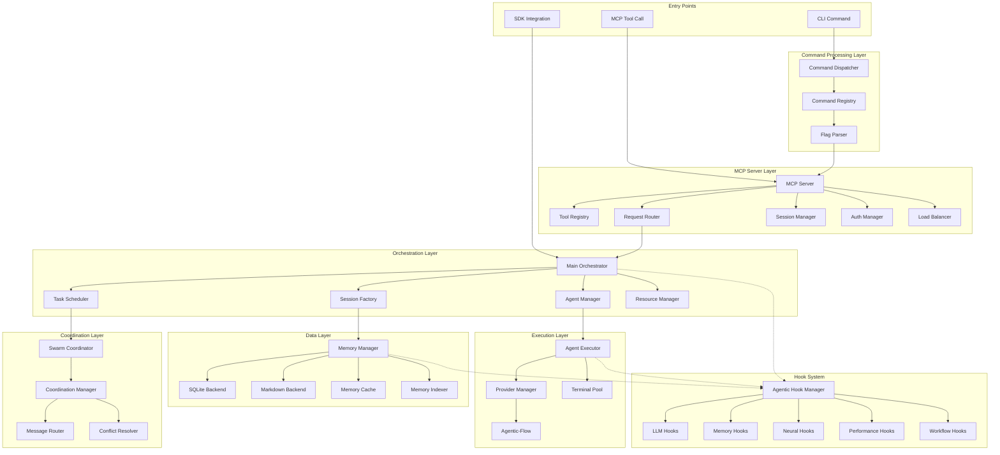
```mermaid
graph TB
    subgraph "Entry Points"
        CLI[CLI Command]
        MCP_CALL[MCP Tool Call]
        SDK[SDK Integration]
    end

    subgraph "Command Processing Layer"
        DISPATCHER[Command Dispatcher]
        CMD_REGISTRY[Command Registry]
        FLAG_PARSER[Flag Parser]
    end

    subgraph "MCP Server Layer"
        MCP_SERVER[MCP Server]
        TOOL_REGISTRY[Tool Registry]
        REQ_ROUTER[Request Router]
        SESSION_MGR[Session Manager]
        AUTH_MGR[Auth Manager]
        LOAD_BAL[Load Balancer]
    end

    subgraph "Orchestration Layer"
        ORCHESTRATOR[Main Orchestrator]
        SESSION_FACTORY[Session Factory]
        AGENT_MGR[Agent Manager]
        TASK_SCHEDULER[Task Scheduler]
        RESOURCE_MGR[Resource Manager]
    end

    subgraph "Execution Layer"
        AGENT_EXECUTOR[Agent Executor]
        PROVIDER_MGR[Provider Manager]
        AGENTIC_FLOW[Agentic-Flow]
        TERMINAL_POOL[Terminal Pool]
    end

    subgraph "Coordination Layer"
        SWARM_COORD[Swarm Coordinator]
        COORD_MGR[Coordination Manager]
        MESSAGE_ROUTER[Message Router]
        CONFLICT_RES[Conflict Resolver]
    end

    subgraph "Data Layer"
        MEMORY_MGR[Memory Manager]
        SQLITE_BACKEND[SQLite Backend]
        MARKDOWN_BACKEND[Markdown Backend]
        CACHE[Memory Cache]
        INDEXER[Memory Indexer]
    end

    subgraph "Hook System"
        HOOK_MGR[Agentic Hook Manager]
        LLM_HOOKS[LLM Hooks]
        MEMORY_HOOKS[Memory Hooks]
        NEURAL_HOOKS[Neural Hooks]
        PERF_HOOKS[Performance Hooks]
        WORKFLOW_HOOKS[Workflow Hooks]
    end

    CLI --> DISPATCHER
    MCP_CALL --> MCP_SERVER
    SDK --> ORCHESTRATOR

    DISPATCHER --> CMD_REGISTRY
    CMD_REGISTRY --> FLAG_PARSER
    FLAG_PARSER --> MCP_SERVER

    MCP_SERVER --> TOOL_REGISTRY
    MCP_SERVER --> REQ_ROUTER
    MCP_SERVER --> SESSION_MGR
    MCP_SERVER --> AUTH_MGR
    MCP_SERVER --> LOAD_BAL

    REQ_ROUTER --> ORCHESTRATOR

    ORCHESTRATOR --> SESSION_FACTORY
    ORCHESTRATOR --> AGENT_MGR
    ORCHESTRATOR --> TASK_SCHEDULER
    ORCHESTRATOR --> RESOURCE_MGR

    AGENT_MGR --> AGENT_EXECUTOR
    AGENT_EXECUTOR --> PROVIDER_MGR
    PROVIDER_MGR --> AGENTIC_FLOW
    AGENT_EXECUTOR --> TERMINAL_POOL

    TASK_SCHEDULER --> SWARM_COORD
    SWARM_COORD --> COORD_MGR
    COORD_MGR --> MESSAGE_ROUTER
    COORD_MGR --> CONFLICT_RES

    SESSION_FACTORY --> MEMORY_MGR
    MEMORY_MGR --> SQLITE_BACKEND
    MEMORY_MGR --> MARKDOWN_BACKEND
    MEMORY_MGR --> CACHE
    MEMORY_MGR --> INDEXER

    ORCHESTRATOR -.-> HOOK_MGR
    AGENT_EXECUTOR -.-> HOOK_MGR
    MEMORY_MGR -.-> HOOK_MGR

    HOOK_MGR --> LLM_HOOKS
    HOOK_MGR --> MEMORY_HOOKS
    HOOK_MGR --> NEURAL_HOOKS
    HOOK_MGR --> PERF_HOOKS
    HOOK_MGR --> WORKFLOW_HOOKS
```

---

## CLI Command Pipeline

### Command Execution Flow

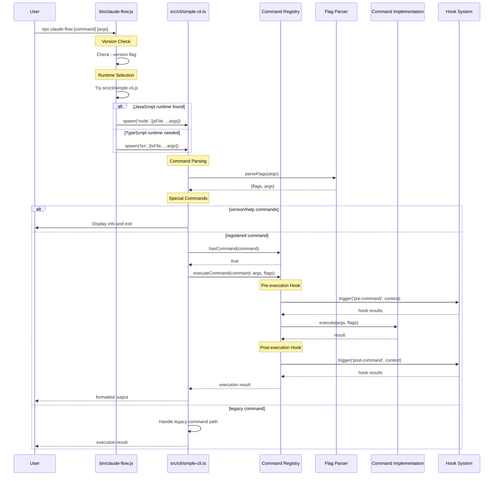
```mermaid
sequenceDiagram
    participant User
    participant BinDispatcher as bin/claude-flow.js
    participant SimpleCLI as src/cli/simple-cli.ts
    participant CmdRegistry as Command Registry
    participant FlagParser as Flag Parser
    participant CommandImpl as Command Implementation
    participant Hooks as Hook System

    User->>BinDispatcher: npx claude-flow [command] [args]

    Note over BinDispatcher: Version Check
    BinDispatcher->>BinDispatcher: Check --version flag

    Note over BinDispatcher: Runtime Selection
    BinDispatcher->>BinDispatcher: Try src/cli/simple-cli.js
    alt JavaScript runtime found
        BinDispatcher->>SimpleCLI: spawn('node', [jsFile, ...args])
    else TypeScript runtime needed
        BinDispatcher->>SimpleCLI: spawn('tsx', [tsFile, ...args])
    end

    Note over SimpleCLI: Command Parsing
    SimpleCLI->>FlagParser: parseFlags(args)
    FlagParser-->>SimpleCLI: {flags, args}

    Note over SimpleCLI: Special Commands
    alt version/help commands
        SimpleCLI->>User: Display info and exit
    else registered command
        SimpleCLI->>CmdRegistry: hasCommand(command)
        CmdRegistry-->>SimpleCLI: true
        SimpleCLI->>CmdRegistry: executeCommand(command, args, flags)

        Note over CmdRegistry: Pre-execution Hook
        CmdRegistry->>Hooks: trigger('pre-command', context)
        Hooks-->>CmdRegistry: hook results

        CmdRegistry->>CommandImpl: execute(args, flags)
        CommandImpl-->>CmdRegistry: result

        Note over CmdRegistry: Post-execution Hook
        CmdRegistry->>Hooks: trigger('post-command', context)
        Hooks-->>CmdRegistry: hook results

        CmdRegistry-->>SimpleCLI: execution result
        SimpleCLI-->>User: formatted output
    else legacy command
        SimpleCLI->>SimpleCLI: Handle legacy command path
        SimpleCLI-->>User: execution result
    end
```

### Entry Point Dispatcher (bin/claude-flow.js)

**Responsibilities:**
1. **Runtime Detection**: Determines best available runtime (JS/TS)
2. **Version Management**: Reads version from package.json
3. **Process Spawning**: Launches appropriate child process
4. **Signal Handling**: Graceful cleanup on SIGTERM/SIGINT
5. **Error Recovery**: Fallback mechanisms for runtime failures

**Key Code Path:**
```javascript
bin/claude-flow.js
  ├─ Check --version flag → Exit with version
  ├─ Find runtime:
  │   ├─ Try: src/cli/simple-cli.js (preferred)
  │   ├─ Try: src/cli/simple-cli.ts with tsx
  │   └─ Fallback: npx tsx
  └─ Spawn child process with signal handlers
```

### Simple CLI (src/cli/simple-cli.ts)

**Responsibilities:**
1. **Command Routing**: Maps command names to implementations
2. **Flag Parsing**: Extracts and validates command-line flags
3. **Help System**: Displays command help and documentation
4. **Error Handling**: Global error handler with stack traces

**Command Categories:**
- **Swarm Intelligence**: `swarm`, `spawn`, `agent`
- **SPARC Methodology**: `sparc` (17 sub-modes)
- **Memory Management**: `memory`
- **Provider Configuration**: `config`
- **GitHub Integration**: `github` (6 modes)
- **System Operations**: `status`, `monitor`, `terminal`, `mcp`, `session`

---

## MCP Request Handling Flow

### MCP Server Architecture

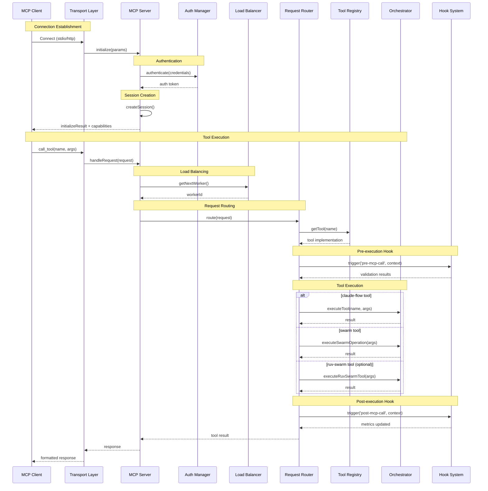
```mermaid
sequenceDiagram
    participant Client as MCP Client
    participant Transport as Transport Layer
    participant MCPServer as MCP Server
    participant Auth as Auth Manager
    participant LoadBal as Load Balancer
    participant Router as Request Router
    participant ToolReg as Tool Registry
    participant Orchestrator as Orchestrator
    participant Hooks as Hook System

    Note over Client,Transport: Connection Establishment
    Client->>Transport: Connect (stdio/http)
    Transport->>MCPServer: initialize(params)

    Note over MCPServer,Auth: Authentication
    MCPServer->>Auth: authenticate(credentials)
    Auth-->>MCPServer: auth token

    Note over MCPServer: Session Creation
    MCPServer->>MCPServer: createSession()
    MCPServer-->>Client: initializeResult + capabilities

    Note over Client,Orchestrator: Tool Execution
    Client->>Transport: call_tool(name, args)
    Transport->>MCPServer: handleRequest(request)

    Note over MCPServer,LoadBal: Load Balancing
    MCPServer->>LoadBal: getNextWorker()
    LoadBal-->>MCPServer: workerId

    Note over MCPServer,Router: Request Routing
    MCPServer->>Router: route(request)
    Router->>ToolReg: getTool(name)
    ToolReg-->>Router: tool implementation

    Note over Router,Hooks: Pre-execution Hook
    Router->>Hooks: trigger('pre-mcp-call', context)
    Hooks-->>Router: validation results

    Note over Router,Orchestrator: Tool Execution
    alt claude-flow tool
        Router->>Orchestrator: executeTool(name, args)
        Orchestrator-->>Router: result
    else swarm tool
        Router->>Orchestrator: executeSwarmOperation(args)
        Orchestrator-->>Router: result
    else ruv-swarm tool (optional)
        Router->>Orchestrator: executeRuvSwarmTool(args)
        Orchestrator-->>Router: result
    end

    Note over Router,Hooks: Post-execution Hook
    Router->>Hooks: trigger('post-mcp-call', context)
    Hooks-->>Router: metrics updated

    Router-->>MCPServer: tool result
    MCPServer-->>Transport: response
    Transport-->>Client: formatted response
```

### MCP Tool Categories

**1. Swarm Coordination Tools**
- `swarm_init`: Initialize swarm topology (hierarchical/mesh/ring/star)
- `agent_spawn`: Spawn agents with specific capabilities
- `task_orchestrate`: High-level task orchestration
- `swarm_status`: Real-time swarm monitoring
- `agent_list`: List all active agents
- `agent_metrics`: Detailed agent performance metrics

**2. Memory & Neural Tools**
- `memory_usage`: Store/retrieve coordination data
- `memory_search`: Semantic search across memory banks
- `neural_status`: Neural network training status
- `neural_train`: Train neural patterns from execution history
- `neural_patterns`: Retrieve learned patterns

**3. GitHub Integration Tools**
- `github_swarm`: Coordinate GitHub operations
- `repo_analyze`: Repository structure analysis
- `pr_enhance`: Pull request optimization
- `issue_triage`: Issue management and prioritization
- `code_review`: Automated code review coordination

**4. Monitoring & System Tools**
- `benchmark_run`: Performance benchmarking
- `features_detect`: Feature availability detection
- `swarm_monitor`: Real-time swarm health monitoring
- `task_status`: Task execution status
- `task_results`: Retrieve task results

### Transport Layer

**Supported Transports:**

1. **Stdio Transport** (`src/mcp/transports/stdio.ts`)
   - Primary transport for CLI integration
   - Uses stdin/stdout for bidirectional communication
   - Process-based isolation

2. **HTTP Transport** (`src/mcp/transports/http.ts`)
   - REST API interface
   - WebSocket support for streaming
   - CORS and helmet security

**Connection State Management:**
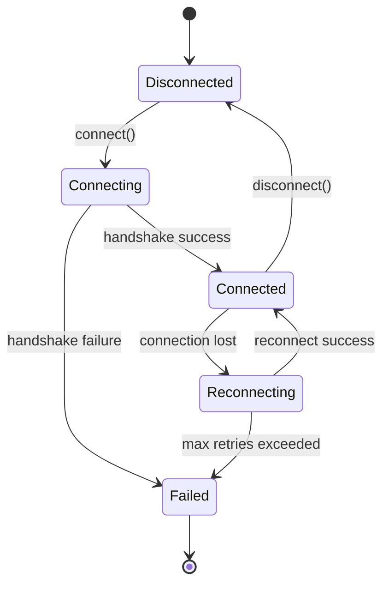
```mermaid
stateDiagram-v2
    [*] --> Disconnected
    Disconnected --> Connecting: connect()
    Connecting --> Connected: handshake success
    Connecting --> Failed: handshake failure
    Connected --> Disconnected: disconnect()
    Connected --> Reconnecting: connection lost
    Reconnecting --> Connected: reconnect success
    Reconnecting --> Failed: max retries exceeded
    Failed --> [*]
```

### Session Management

**Session Lifecycle:**
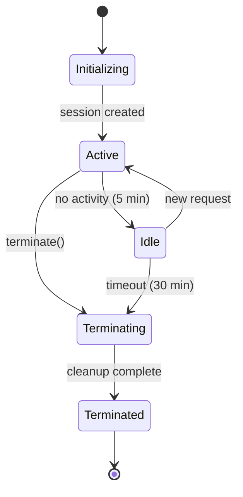
```mermaid
stateDiagram-v2
    [*] --> Initializing
    Initializing --> Active: session created
    Active --> Idle: no activity (5 min)
    Idle --> Active: new request
    Active --> Terminating: terminate()
    Idle --> Terminating: timeout (30 min)
    Terminating --> Terminated: cleanup complete
    Terminated --> [*]
```

**Session Persistence:**
- Sessions saved to `.swarm/sessions.json`
- Includes agent profiles, terminal IDs, memory bank IDs
- Circuit breaker pattern for persistence failures
- Automatic restoration on orchestrator restart

---

## Agent Spawning and Coordination

### Agent Lifecycle

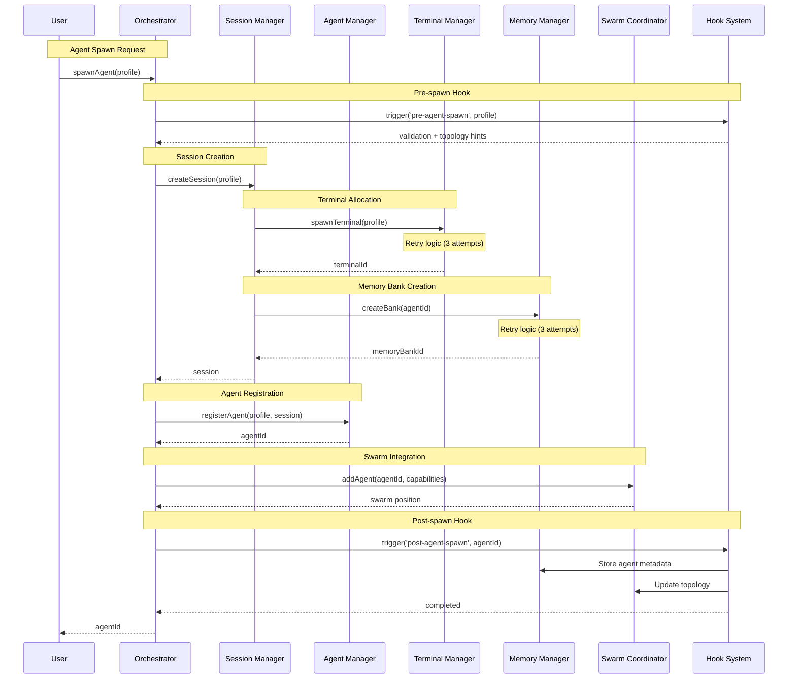
```mermaid
sequenceDiagram
    participant User
    participant Orchestrator
    participant SessionMgr as Session Manager
    participant AgentMgr as Agent Manager
    participant TerminalMgr as Terminal Manager
    participant MemoryMgr as Memory Manager
    participant SwarmCoord as Swarm Coordinator
    participant Hooks as Hook System

    Note over User,Orchestrator: Agent Spawn Request
    User->>Orchestrator: spawnAgent(profile)

    Note over Orchestrator,Hooks: Pre-spawn Hook
    Orchestrator->>Hooks: trigger('pre-agent-spawn', profile)
    Hooks-->>Orchestrator: validation + topology hints

    Note over Orchestrator,SessionMgr: Session Creation
    Orchestrator->>SessionMgr: createSession(profile)

    Note over SessionMgr,TerminalMgr: Terminal Allocation
    SessionMgr->>TerminalMgr: spawnTerminal(profile)
    Note over TerminalMgr: Retry logic (3 attempts)
    TerminalMgr-->>SessionMgr: terminalId

    Note over SessionMgr,MemoryMgr: Memory Bank Creation
    SessionMgr->>MemoryMgr: createBank(agentId)
    Note over MemoryMgr: Retry logic (3 attempts)
    MemoryMgr-->>SessionMgr: memoryBankId

    SessionMgr-->>Orchestrator: session

    Note over Orchestrator,AgentMgr: Agent Registration
    Orchestrator->>AgentMgr: registerAgent(profile, session)
    AgentMgr-->>Orchestrator: agentId

    Note over Orchestrator,SwarmCoord: Swarm Integration
    Orchestrator->>SwarmCoord: addAgent(agentId, capabilities)
    SwarmCoord-->>Orchestrator: swarm position

    Note over Orchestrator,Hooks: Post-spawn Hook
    Orchestrator->>Hooks: trigger('post-agent-spawn', agentId)
    Hooks->>MemoryMgr: Store agent metadata
    Hooks->>SwarmCoord: Update topology
    Hooks-->>Orchestrator: completed

    Orchestrator-->>User: agentId
```

### Parallel Agent Spawning

**Optimization for Concurrent Creation:**

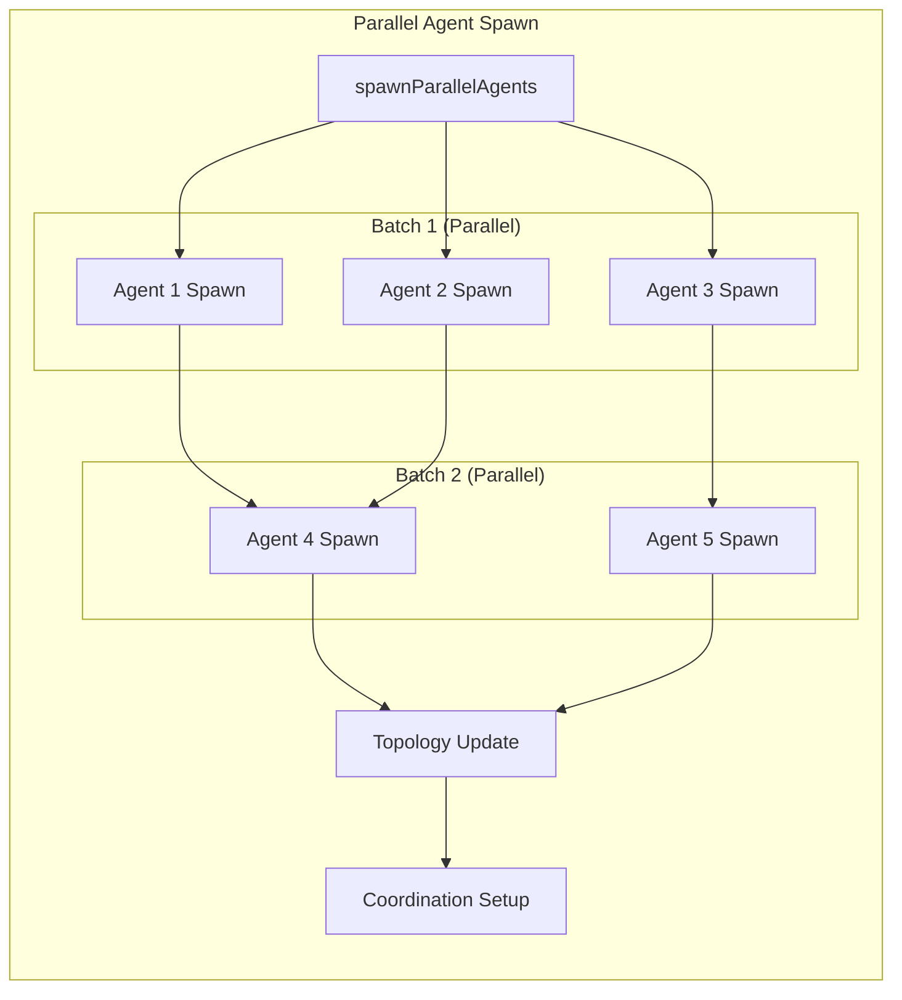
```mermaid
graph LR
    subgraph "Parallel Agent Spawn"
        REQ[spawnParallelAgents]

        subgraph "Batch 1 (Parallel)"
            A1[Agent 1 Spawn]
            A2[Agent 2 Spawn]
            A3[Agent 3 Spawn]
        end

        subgraph "Batch 2 (Parallel)"
            A4[Agent 4 Spawn]
            A5[Agent 5 Spawn]
        end

        TOPO[Topology Update]
        COORD[Coordination Setup]
    end

    REQ --> A1
    REQ --> A2
    REQ --> A3

    A1 --> A4
    A2 --> A4
    A3 --> A5

    A4 --> TOPO
    A5 --> TOPO

    TOPO --> COORD
```

**Implementation Details:**
- **Batch Size**: 5 agents per batch (configurable)
- **Parallel Execution**: Uses `Promise.all()` for concurrent spawning
- **Resource Pooling**: Terminal pool pre-allocates terminals
- **Failure Handling**: Individual spawn failures don't block batch
- **Topology Optimization**: Auto-selects best topology based on agent count

### Agent Capabilities System

**Capability-Based Routing:**

```typescript
// Agent Capabilities
export interface AgentCapabilities {
  research: boolean;          // Web search, data analysis
  coding: boolean;            // Code generation, refactoring
  analysis: boolean;          // Performance, security analysis
  coordination: boolean;      // Multi-agent orchestration
  testing: boolean;           // Test generation, validation
  review: boolean;            // Code review, quality checks
  architecture: boolean;      // System design, patterns
  documentation: boolean;     // Docs generation, updates
}
```

**Agent Types and Default Capabilities:**

| Agent Type | Capabilities | Use Cases |
|------------|-------------|-----------|
| `researcher` | research, analysis, documentation | Requirements gathering, market research |
| `coder` | coding, testing, documentation | Implementation, refactoring |
| `analyst` | analysis, research, review | Performance analysis, bottleneck detection |
| `architect` | architecture, design, coordination | System design, component structure |
| `tester` | testing, review, analysis | Test automation, quality assurance |
| `coordinator` | coordination, orchestration | Multi-agent workflow management |
| `reviewer` | review, analysis, documentation | Code review, security audits |

### Task Lifecycle State Machine

Tasks progress through a well-defined lifecycle with clear state transitions, dependency management, and error recovery.

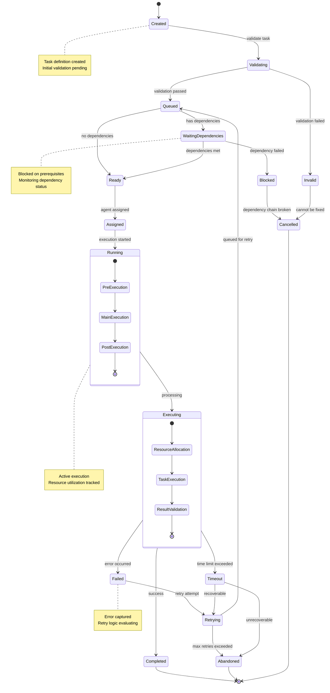
```mermaid
stateDiagram-v2
    [*] --> Created

    Created --> Validating: validate task
    Validating --> Queued: validation passed
    Validating --> Invalid: validation failed

    Queued --> WaitingDependencies: has dependencies
    Queued --> Ready: no dependencies

    WaitingDependencies --> Ready: dependencies met
    WaitingDependencies --> Blocked: dependency failed

    Ready --> Assigned: agent assigned
    Assigned --> Running: execution started

    Running --> Executing: processing
    Executing --> Completed: success
    Executing --> Failed: error occurred
    Executing --> Timeout: time limit exceeded

    Failed --> Retrying: retry attempt
    Retrying --> Queued: queued for retry
    Retrying --> Abandoned: max retries exceeded

    Timeout --> Retrying: recoverable
    Timeout --> Abandoned: unrecoverable

    Blocked --> Cancelled: dependency chain broken
    Invalid --> Cancelled: cannot be fixed

    Completed --> [*]
    Abandoned --> [*]
    Cancelled --> [*]

    state Running {
        [*] --> PreExecution
        PreExecution --> MainExecution
        MainExecution --> PostExecution
        PostExecution --> [*]
    }

    state Executing {
        [*] --> ResourceAllocation
        ResourceAllocation --> TaskExecution
        TaskExecution --> ResultValidation
        ResultValidation --> [*]
    }

    note right of Created
        Task definition created
        Initial validation pending
    end note

    note right of WaitingDependencies
        Blocked on prerequisites
        Monitoring dependency status
    end note

    note right of Running
        Active execution
        Resource utilization tracked
    end note

    note right of Failed
        Error captured
        Retry logic evaluating
    end note
```

**Task State Details:**

| State | Description | Typical Duration | Transition Conditions |
|-------|-------------|------------------|----------------------|
| **Created** | Task initialized | <1ms | Immediate validation |
| **Validating** | Schema validation | 5-20ms | Valid → Queued, Invalid → Cancelled |
| **Queued** | Awaiting execution | Variable | Agent available → Assigned |
| **WaitingDependencies** | Blocked on prerequisites | Variable | Dependencies met → Ready |
| **Ready** | Ready for assignment | <100ms | Agent assigned → Assigned |
| **Assigned** | Agent allocated | <50ms | Execution started → Running |
| **Running** | Active execution | Variable | Success → Completed, Error → Failed |
| **Failed** | Execution failed | N/A | Retry → Retrying, Abandon → Abandoned |
| **Retrying** | Retry attempt | Variable | Requeued → Queued |
| **Completed** | Successfully finished | N/A | Terminal state |
| **Abandoned** | Permanently failed | N/A | Terminal state |
| **Cancelled** | User/system cancelled | N/A | Terminal state |

**State Transition Triggers:**

- **Dependencies met**: All prerequisite tasks completed successfully
- **Agent available**: Free agent matches task requirements
- **Timeout exceeded**: Task duration > configured timeout
- **Max retries**: Retry count >= configured maximum
- **Manual intervention**: User cancellation or priority override

**Error Recovery:**

- **Transient errors**: Automatic retry with exponential backoff (3 attempts default)
- **Resource errors**: Request reallocation, queue for retry
- **Dependency errors**: Mark blocked, wait for dependency resolution
- **Timeout errors**: Cancel long-running tasks, free resources

**Code Reference:** `src/swarm/executor.ts:117-167` (task execution), `src/coordination/swarm-coordinator.ts:247-299` (task management)

### Swarm Coordination Patterns

**1. Hierarchical Coordination**
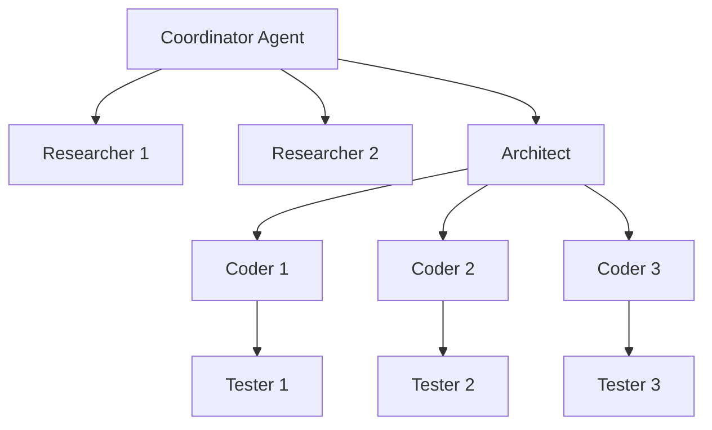
```mermaid
graph TD
    COORD[Coordinator Agent]

    COORD --> R1[Researcher 1]
    COORD --> R2[Researcher 2]
    COORD --> A1[Architect]

    A1 --> C1[Coder 1]
    A1 --> C2[Coder 2]
    A1 --> C3[Coder 3]

    C1 --> T1[Tester 1]
    C2 --> T2[Tester 2]
    C3 --> T3[Tester 3]
```

**Use Case**: SPARC methodology, structured development workflows

**2. Mesh Coordination**
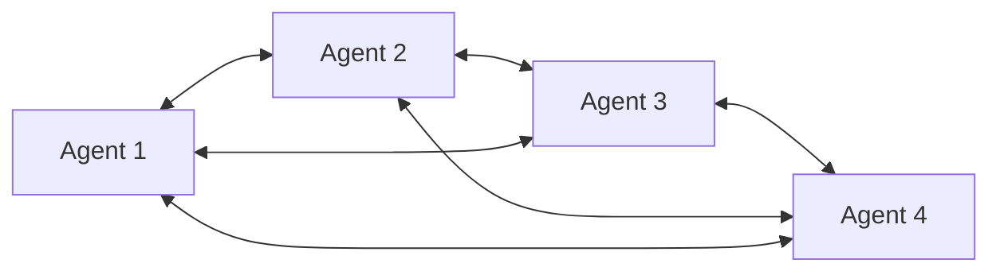
```mermaid
graph LR
    A1[Agent 1] <--> A2[Agent 2]
    A2 <--> A3[Agent 3]
    A3 <--> A4[Agent 4]
    A4 <--> A1
    A1 <--> A3
    A2 <--> A4
```

**Use Case**: Distributed consensus, peer review, collaborative research

**3. Star Coordination**
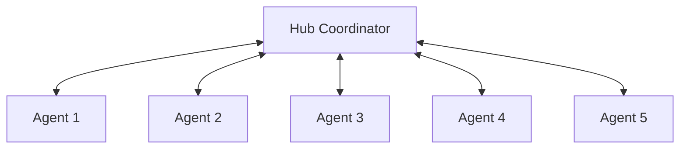
```mermaid
graph TD
    HUB[Hub Coordinator]

    HUB <--> A1[Agent 1]
    HUB <--> A2[Agent 2]
    HUB <--> A3[Agent 3]
    HUB <--> A4[Agent 4]
    HUB <--> A5[Agent 5]
```

**Use Case**: Centralized task distribution, single source of truth

**4. Ring Coordination**
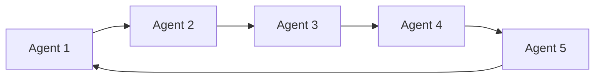
```mermaid
graph LR
    A1[Agent 1] --> A2[Agent 2]
    A2 --> A3[Agent 3]
    A3 --> A4[Agent 4]
    A4 --> A5[Agent 5]
    A5 --> A1
```

**Use Case**: Token ring consensus, sequential processing pipelines

---

## SPARC Methodology Implementation

### SPARC Workflow Overview

SPARC (Specification, Pseudocode, Architecture, Refinement, Completion) is a Test-Driven Development methodology implemented as a multi-phase workflow.

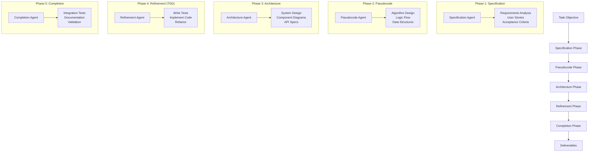
```mermaid
graph TB
    START[Task Objective] --> SPEC[Specification Phase]
    SPEC --> PSEUDO[Pseudocode Phase]
    PSEUDO --> ARCH[Architecture Phase]
    ARCH --> REFINE[Refinement Phase]
    REFINE --> COMPLETE[Completion Phase]
    COMPLETE --> END[Deliverables]

    subgraph "Phase 1: Specification"
        SPEC_AGENT[Specification Agent]
        SPEC_TASKS[Requirements Analysis<br/>User Stories<br/>Acceptance Criteria]
        SPEC_AGENT --> SPEC_TASKS
    end

    subgraph "Phase 2: Pseudocode"
        PSEUDO_AGENT[Pseudocode Agent]
        PSEUDO_TASKS[Algorithm Design<br/>Logic Flow<br/>Data Structures]
        PSEUDO_AGENT --> PSEUDO_TASKS
    end

    subgraph "Phase 3: Architecture"
        ARCH_AGENT[Architecture Agent]
        ARCH_TASKS[System Design<br/>Component Diagrams<br/>API Specs]
        ARCH_AGENT --> ARCH_TASKS
    end

    subgraph "Phase 4: Refinement (TDD)"
        REFINE_AGENT[Refinement Agent]
        REFINE_TASKS[Write Tests<br/>Implement Code<br/>Refactor]
        REFINE_AGENT --> REFINE_TASKS
    end

    subgraph "Phase 5: Completion"
        COMPLETE_AGENT[Completion Agent]
        COMPLETE_TASKS[Integration Tests<br/>Documentation<br/>Validation]
        COMPLETE_AGENT --> COMPLETE_TASKS
    end
```

### SPARC Phase Execution

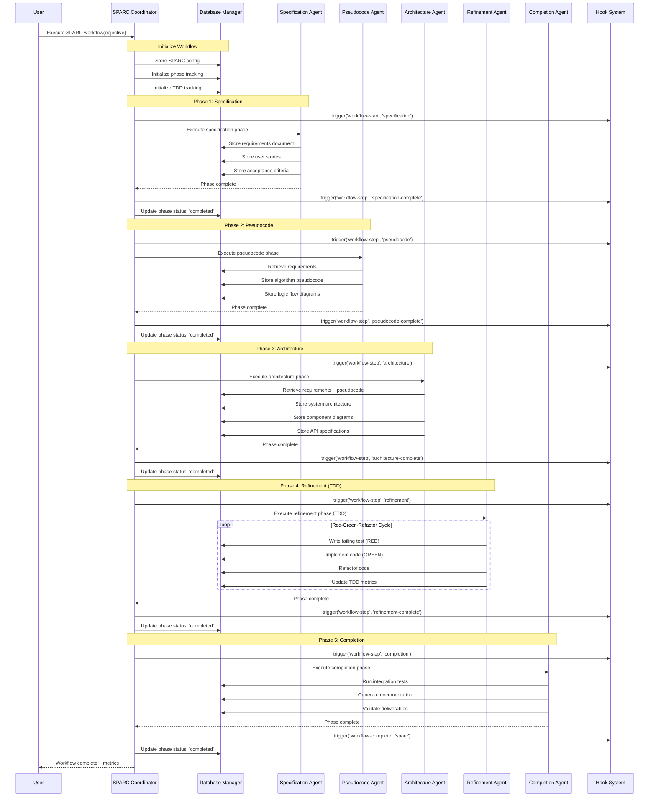
```mermaid
sequenceDiagram
    participant User
    participant SPARC_COORD as SPARC Coordinator
    participant DB as Database Manager
    participant SPEC as Specification Agent
    participant PSEUDO as Pseudocode Agent
    participant ARCH as Architecture Agent
    participant REFINE as Refinement Agent
    participant COMPLETE as Completion Agent
    participant Hooks as Hook System

    User->>SPARC_COORD: Execute SPARC workflow(objective)

    Note over SPARC_COORD,DB: Initialize Workflow
    SPARC_COORD->>DB: Store SPARC config
    SPARC_COORD->>DB: Initialize phase tracking
    SPARC_COORD->>DB: Initialize TDD tracking

    Note over SPARC_COORD,SPEC: Phase 1: Specification
    SPARC_COORD->>Hooks: trigger('workflow-start', 'specification')
    SPARC_COORD->>SPEC: Execute specification phase
    SPEC->>DB: Store requirements document
    SPEC->>DB: Store user stories
    SPEC->>DB: Store acceptance criteria
    SPEC-->>SPARC_COORD: Phase complete
    SPARC_COORD->>Hooks: trigger('workflow-step', 'specification-complete')
    SPARC_COORD->>DB: Update phase status: 'completed'

    Note over SPARC_COORD,PSEUDO: Phase 2: Pseudocode
    SPARC_COORD->>Hooks: trigger('workflow-step', 'pseudocode')
    SPARC_COORD->>PSEUDO: Execute pseudocode phase
    PSEUDO->>DB: Retrieve requirements
    PSEUDO->>DB: Store algorithm pseudocode
    PSEUDO->>DB: Store logic flow diagrams
    PSEUDO-->>SPARC_COORD: Phase complete
    SPARC_COORD->>Hooks: trigger('workflow-step', 'pseudocode-complete')
    SPARC_COORD->>DB: Update phase status: 'completed'

    Note over SPARC_COORD,ARCH: Phase 3: Architecture
    SPARC_COORD->>Hooks: trigger('workflow-step', 'architecture')
    SPARC_COORD->>ARCH: Execute architecture phase
    ARCH->>DB: Retrieve requirements + pseudocode
    ARCH->>DB: Store system architecture
    ARCH->>DB: Store component diagrams
    ARCH->>DB: Store API specifications
    ARCH-->>SPARC_COORD: Phase complete
    SPARC_COORD->>Hooks: trigger('workflow-step', 'architecture-complete')
    SPARC_COORD->>DB: Update phase status: 'completed'

    Note over SPARC_COORD,REFINE: Phase 4: Refinement (TDD)
    SPARC_COORD->>Hooks: trigger('workflow-step', 'refinement')
    SPARC_COORD->>REFINE: Execute refinement phase (TDD)

    loop Red-Green-Refactor Cycle
        REFINE->>DB: Write failing test (RED)
        REFINE->>DB: Implement code (GREEN)
        REFINE->>DB: Refactor code
        REFINE->>DB: Update TDD metrics
    end

    REFINE-->>SPARC_COORD: Phase complete
    SPARC_COORD->>Hooks: trigger('workflow-step', 'refinement-complete')
    SPARC_COORD->>DB: Update phase status: 'completed'

    Note over SPARC_COORD,COMPLETE: Phase 5: Completion
    SPARC_COORD->>Hooks: trigger('workflow-step', 'completion')
    SPARC_COORD->>COMPLETE: Execute completion phase
    COMPLETE->>DB: Run integration tests
    COMPLETE->>DB: Generate documentation
    COMPLETE->>DB: Validate deliverables
    COMPLETE-->>SPARC_COORD: Phase complete
    SPARC_COORD->>Hooks: trigger('workflow-complete', 'sparc')
    SPARC_COORD->>DB: Update phase status: 'completed'

    SPARC_COORD-->>User: Workflow complete + metrics
```

### SPARC Phase Transition State Machine

The SPARC workflow progresses through five distinct phases, with strict dependency management and quality gates between phases.


```mermaid
stateDiagram-v2
    [*] --> Initialized

    Initialized --> Specification: workflow started
    Specification --> SpecificationReview: phase complete
    SpecificationReview --> Pseudocode: review passed
    SpecificationReview --> Specification: review failed

    Pseudocode --> PseudocodeReview: phase complete
    PseudocodeReview --> Architecture: review passed
    PseudocodeReview --> Pseudocode: review failed

    Architecture --> ArchitectureReview: phase complete
    ArchitectureReview --> Refinement: review passed
    ArchitectureReview --> Architecture: review failed

    Refinement --> RefinementReview: TDD complete
    RefinementReview --> Completion: tests passing
    RefinementReview --> Refinement: tests failing

    Completion --> FinalReview: deliverables ready
    FinalReview --> Completed: validation passed
    FinalReview --> Completion: validation failed

    Completed --> [*]

    state Specification {
        [*] --> GatheringRequirements
        GatheringRequirements --> WritingUserStories
        WritingUserStories --> DefiningAcceptanceCriteria
        DefiningAcceptanceCriteria --> [*]
    }

    state Pseudocode {
        [*] --> DesigningAlgorithms
        DesigningAlgorithms --> CreatingLogicFlows
        CreatingLogicFlows --> DefiningDataStructures
        DefiningDataStructures --> [*]
    }

    state Architecture {
        [*] --> DesigningSystemArchitecture
        DesigningSystemArchitecture --> CreatingComponentDiagrams
        CreatingComponentDiagrams --> SpecifyingAPIs
        SpecifyingAPIs --> [*]
    }

    state Refinement {
        [*] --> WritingTests
        WritingTests --> ImplementingCode
        ImplementingCode --> Refactoring
        Refactoring --> RunningTests
        RunningTests --> WritingTests: tests failing
        RunningTests --> [*]: tests passing
    }

    state Completion {
        [*] --> RunningIntegrationTests
        RunningIntegrationTests --> GeneratingDocumentation
        GeneratingDocumentation --> ValidatingDeliverables
        ValidatingDeliverables --> [*]
    }

    note right of Specification
        Phase 1
        Requirements analysis
        User stories created
    end note

    note right of Architecture
        Phase 3
        System design
        Component structure
    end note

    note right of Refinement
        Phase 4: TDD Cycle
        Red-Green-Refactor
        Test coverage target: 80%
    end note

    note right of Completed
        All phases complete
        Deliverables validated
        Ready for deployment
    end note
```

**SPARC Phase Details:**

| Phase | Entry Criteria | Exit Criteria | Quality Gate | Typical Duration |
|-------|---------------|---------------|--------------|------------------|
| **Specification** | Workflow initialized | Requirements documented | Review approval | 30-60 min |
| **Pseudocode** | Spec review passed | Algorithms designed | Logic validation | 20-40 min |
| **Architecture** | Pseudocode approved | System designed | Architecture review | 40-80 min |
| **Refinement** | Architecture approved | Tests passing (>80% coverage) | TDD validation | 60-120 min |
| **Completion** | Tests passing | Deliverables validated | Final QA approval | 30-60 min |

**Phase Transition Rules:**

- **Forward transitions**: Only allowed when quality gate passes
- **Backward transitions**: Allowed for rework based on review feedback
- **Parallel execution**: Architecture can start while Pseudocode review in progress
- **Blocking conditions**: Failed quality gate blocks forward progress
- **Timeout handling**: Phase timeout triggers coordinator intervention

**Quality Gates:**

1. **Specification Review**: Requirements complete, user stories well-defined, acceptance criteria clear
2. **Pseudocode Review**: Algorithms sound, logic flow validated, data structures appropriate
3. **Architecture Review**: System design scalable, components well-defined, APIs documented
4. **TDD Validation**: Tests passing, coverage >80%, code quality metrics met
5. **Final QA**: Integration tests passing, documentation complete, deliverables validated

**State Persistence:**

Each phase transition is persisted to memory for recovery and analytics:

```json
{
  "currentPhase": "refinement",
  "phaseHistory": [
    {"phase": "specification", "status": "completed", "timestamp": "2025-11-18T10:00:00Z"},
    {"phase": "pseudocode", "status": "completed", "timestamp": "2025-11-18T10:30:00Z"},
    {"phase": "architecture", "status": "completed", "timestamp": "2025-11-18T11:00:00Z"}
  ],
  "qualityGates": {
    "specificationReview": {"passed": true, "reviewedBy": "coordinator"},
    "pseudocodeReview": {"passed": true, "reviewedBy": "architect"},
    "architectureReview": {"passed": true, "reviewedBy": "lead-architect"}
  }
}
```

**Code Reference:** `src/modes/SparcInit.ts` (phase initialization), `src/swarm/sparc-executor.ts` (phase execution)

### SPARC Agent Specialization

**src/modes/SparcInit.ts** initializes specialized agents for each phase:

```typescript
// SPARC Coordinator - Orchestrates entire workflow
coordinator: {
  capabilities: ['sparc-coordination', 'workflow-management', 'tdd-orchestration'],
  authority: 'high'
}

// Specification Agent - Requirements analysis
analyst: {
  capabilities: ['requirement-analysis', 'specification-writing', 'user-story-creation'],
  phase: 'specification'
}

// Pseudocode Agent - Algorithm design
researcher: {
  capabilities: ['algorithm-design', 'pseudocode-creation', 'logic-planning'],
  phase: 'pseudocode'
}

// Architecture Agent - System design
architect: {
  capabilities: ['system-architecture', 'design-patterns', 'component-design'],
  phase: 'architecture'
}

// Refinement Agent - TDD implementation
coder: {
  capabilities: ['test-driven-development', 'unit-testing', 'refactoring', 'implementation'],
  phase: 'refinement'
}

// Completion Agent - Integration and validation
tester: {
  capabilities: ['integration-testing', 'validation', 'quality-assurance', 'documentation'],
  phase: 'completion'
}
```

### SPARC Phase Dependencies

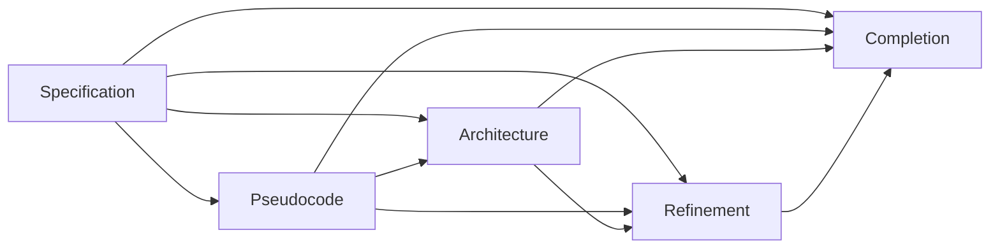
```mermaid
graph LR
    SPEC[Specification] --> PSEUDO[Pseudocode]
    SPEC --> ARCH[Architecture]
    PSEUDO --> ARCH
    SPEC --> REFINE[Refinement]
    PSEUDO --> REFINE
    ARCH --> REFINE
    SPEC --> COMPLETE[Completion]
    PSEUDO --> COMPLETE
    ARCH --> COMPLETE
    REFINE --> COMPLETE
```

**Dependency Resolution:**
- Each phase can only start when all dependencies are satisfied
- Dependencies stored in database: `getPhaseDependencies(phase)`
- Parallel execution where possible (e.g., Architecture can start while Pseudocode is running)

### SPARC Memory Structures

**Phase Tracking:**
```json
{
  "name": "specification",
  "status": "completed",
  "agent": "agent-abc123",
  "artifacts": [
    "requirements-doc.md",
    "user-stories.md",
    "acceptance-criteria.md"
  ],
  "dependencies": [],
  "startedAt": "2025-11-18T10:00:00Z",
  "completedAt": "2025-11-18T10:30:00Z"
}
```

**TDD Tracking:**
```json
{
  "testSuites": ["auth.test.ts", "api.test.ts"],
  "coverage": 87.5,
  "redGreenRefactor": {
    "red": [
      {"test": "auth.test.ts:10", "timestamp": "..."}
    ],
    "green": [
      {"test": "auth.test.ts:10", "timestamp": "..."}
    ],
    "refactor": [
      {"file": "auth.ts", "timestamp": "..."}
    ]
  }
}
```

### SPARC Workflow Templates

**Feature Development Template:**
```json
{
  "name": "feature-development",
  "phases": [
    {
      "name": "specification",
      "description": "Analyze requirements and create detailed specifications",
      "estimatedDuration": 1800,
      "deliverables": ["Requirements document", "User stories", "Acceptance criteria"]
    },
    {
      "name": "pseudocode",
      "description": "Design algorithms and create pseudocode representations",
      "estimatedDuration": 1200,
      "deliverables": ["Algorithm pseudocode", "Logic flow diagrams", "Data structures"]
    },
    {
      "name": "architecture",
      "description": "Design system architecture and component structure",
      "estimatedDuration": 2400,
      "deliverables": ["System architecture", "Component diagrams", "API specifications"]
    },
    {
      "name": "refinement",
      "description": "Implement code using Test-Driven Development methodology",
      "estimatedDuration": 3600,
      "deliverables": ["Test suites", "Implementation code", "Refactored code"]
    },
    {
      "name": "completion",
      "description": "Integration testing, validation, and documentation",
      "estimatedDuration": 1800,
      "deliverables": ["Integration tests", "Documentation", "Deployment artifacts"]
    }
  ]
}
```

---

## Hook Execution Sequences

### Hook System Architecture

Claude Flow uses a dual-hook system:
1. **Legacy Hooks** (`src/hooks/`): Backward compatibility layer
2. **Agentic Flow Hooks** (`src/services/agentic-flow-hooks/`): Modern implementation

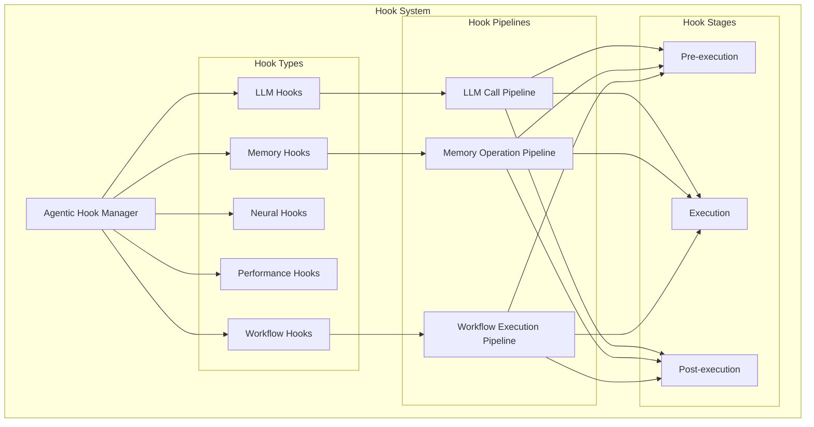
```mermaid
graph TB
    subgraph "Hook System"
        HOOK_MGR[Agentic Hook Manager]

        subgraph "Hook Types"
            LLM[LLM Hooks]
            MEMORY[Memory Hooks]
            NEURAL[Neural Hooks]
            PERF[Performance Hooks]
            WORKFLOW[Workflow Hooks]
        end

        subgraph "Hook Pipelines"
            LLM_PIPE[LLM Call Pipeline]
            MEM_PIPE[Memory Operation Pipeline]
            WORK_PIPE[Workflow Execution Pipeline]
        end

        subgraph "Hook Stages"
            PRE[Pre-execution]
            EXEC[Execution]
            POST[Post-execution]
        end
    end

    HOOK_MGR --> LLM
    HOOK_MGR --> MEMORY
    HOOK_MGR --> NEURAL
    HOOK_MGR --> PERF
    HOOK_MGR --> WORKFLOW

    LLM --> LLM_PIPE
    MEMORY --> MEM_PIPE
    WORKFLOW --> WORK_PIPE

    LLM_PIPE --> PRE
    LLM_PIPE --> EXEC
    LLM_PIPE --> POST

    MEM_PIPE --> PRE
    MEM_PIPE --> EXEC
    MEM_PIPE --> POST

    WORK_PIPE --> PRE
    WORK_PIPE --> EXEC
    WORK_PIPE --> POST
```

### LLM Call Hook Pipeline

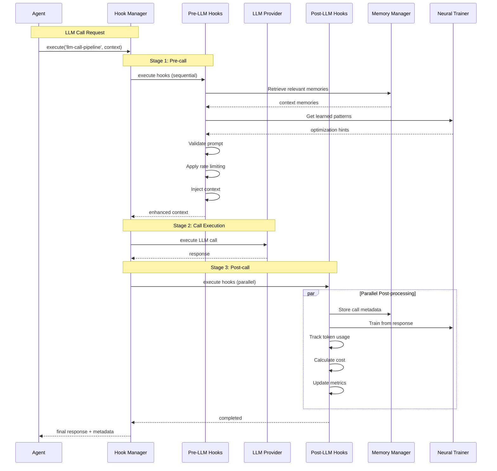
```mermaid
sequenceDiagram
    participant Agent
    participant HookMgr as Hook Manager
    participant PreHooks as Pre-LLM Hooks
    participant Provider as LLM Provider
    participant PostHooks as Post-LLM Hooks
    participant Memory as Memory Manager
    participant Neural as Neural Trainer

    Note over Agent,HookMgr: LLM Call Request
    Agent->>HookMgr: execute('llm-call-pipeline', context)

    Note over HookMgr,PreHooks: Stage 1: Pre-call
    HookMgr->>PreHooks: execute hooks (sequential)

    PreHooks->>Memory: Retrieve relevant memories
    Memory-->>PreHooks: context memories

    PreHooks->>Neural: Get learned patterns
    Neural-->>PreHooks: optimization hints

    PreHooks->>PreHooks: Validate prompt
    PreHooks->>PreHooks: Apply rate limiting
    PreHooks->>PreHooks: Inject context

    PreHooks-->>HookMgr: enhanced context

    Note over HookMgr,Provider: Stage 2: Call Execution
    HookMgr->>Provider: execute LLM call
    Provider-->>HookMgr: response

    Note over HookMgr,PostHooks: Stage 3: Post-call
    HookMgr->>PostHooks: execute hooks (parallel)

    par Parallel Post-processing
        PostHooks->>Memory: Store call metadata
        PostHooks->>Neural: Train from response
        PostHooks->>PostHooks: Track token usage
        PostHooks->>PostHooks: Calculate cost
        PostHooks->>PostHooks: Update metrics
    end

    PostHooks-->>HookMgr: completed
    HookMgr-->>Agent: final response + metadata
```

### Memory Operation Hook Pipeline

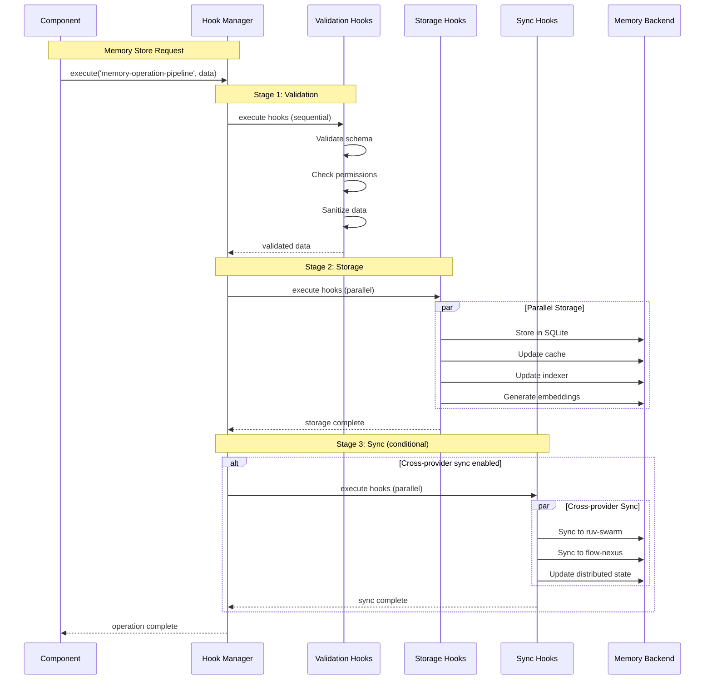
```mermaid
sequenceDiagram
    participant Component
    participant HookMgr as Hook Manager
    participant Validation as Validation Hooks
    participant Storage as Storage Hooks
    participant Sync as Sync Hooks
    participant Memory as Memory Backend

    Note over Component,HookMgr: Memory Store Request
    Component->>HookMgr: execute('memory-operation-pipeline', data)

    Note over HookMgr,Validation: Stage 1: Validation
    HookMgr->>Validation: execute hooks (sequential)
    Validation->>Validation: Validate schema
    Validation->>Validation: Check permissions
    Validation->>Validation: Sanitize data
    Validation-->>HookMgr: validated data

    Note over HookMgr,Storage: Stage 2: Storage
    HookMgr->>Storage: execute hooks (parallel)

    par Parallel Storage
        Storage->>Memory: Store in SQLite
        Storage->>Memory: Update cache
        Storage->>Memory: Update indexer
        Storage->>Memory: Generate embeddings
    end

    Storage-->>HookMgr: storage complete

    Note over HookMgr,Sync: Stage 3: Sync (conditional)
    alt Cross-provider sync enabled
        HookMgr->>Sync: execute hooks (parallel)

        par Cross-provider Sync
            Sync->>Memory: Sync to ruv-swarm
            Sync->>Memory: Sync to flow-nexus
            Sync->>Memory: Update distributed state
        end

        Sync-->>HookMgr: sync complete
    end

    HookMgr-->>Component: operation complete
```

### Workflow Execution Hook Pipeline

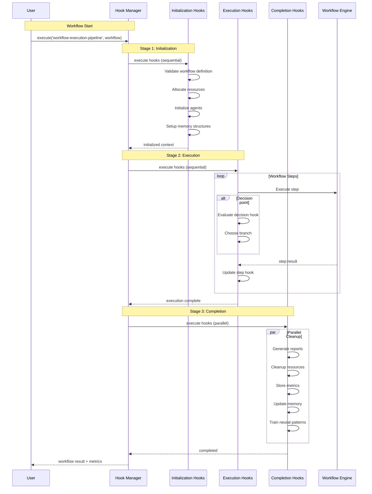
```mermaid
sequenceDiagram
    participant User
    participant HookMgr as Hook Manager
    participant InitHooks as Initialization Hooks
    participant ExecHooks as Execution Hooks
    participant CompleteHooks as Completion Hooks
    participant Workflow as Workflow Engine

    Note over User,HookMgr: Workflow Start
    User->>HookMgr: execute('workflow-execution-pipeline', workflow)

    Note over HookMgr,InitHooks: Stage 1: Initialization
    HookMgr->>InitHooks: execute hooks (sequential)
    InitHooks->>InitHooks: Validate workflow definition
    InitHooks->>InitHooks: Allocate resources
    InitHooks->>InitHooks: Initialize agents
    InitHooks->>InitHooks: Setup memory structures
    InitHooks-->>HookMgr: initialized context

    Note over HookMgr,ExecHooks: Stage 2: Execution
    HookMgr->>ExecHooks: execute hooks (sequential)

    loop Workflow Steps
        ExecHooks->>Workflow: Execute step

        alt Decision point
            ExecHooks->>ExecHooks: Evaluate decision hook
            ExecHooks->>ExecHooks: Choose branch
        end

        Workflow-->>ExecHooks: step result
        ExecHooks->>ExecHooks: Update step hook
    end

    ExecHooks-->>HookMgr: execution complete

    Note over HookMgr,CompleteHooks: Stage 3: Completion
    HookMgr->>CompleteHooks: execute hooks (parallel)

    par Parallel Cleanup
        CompleteHooks->>CompleteHooks: Generate reports
        CompleteHooks->>CompleteHooks: Cleanup resources
        CompleteHooks->>CompleteHooks: Store metrics
        CompleteHooks->>CompleteHooks: Update memory
        CompleteHooks->>CompleteHooks: Train neural patterns
    end

    CompleteHooks-->>HookMgr: completed
    HookMgr-->>User: workflow result + metrics
```

### Hook Types and Triggers

**LLM Hooks:**
- `pre-llm-call`: Rate limiting, context injection, prompt optimization
- `post-llm-call`: Token tracking, cost calculation, response caching
- `llm-error`: Error handling, retry logic, fallback providers

**Memory Hooks:**
- `pre-memory-store`: Validation, sanitization, deduplication
- `post-memory-store`: Indexing, embedding generation, cache update
- `memory-sync`: Cross-provider synchronization, distributed state
- `pre-memory-retrieve`: Access control, cache check
- `post-memory-retrieve`: Result enrichment, usage tracking

**Neural Hooks:**
- `neural-train`: Pattern learning from execution history
- `neural-predict`: Optimization recommendations
- `neural-consolidate`: Model optimization, pruning

**Performance Hooks:**
- `performance-metric`: Real-time metrics collection
- `performance-alert`: Threshold monitoring, alerting
- `performance-optimize`: Automatic optimization triggers

**Workflow Hooks:**
- `workflow-start`: Resource allocation, initialization
- `workflow-step`: Step execution, progress tracking
- `workflow-decision`: Conditional branching, routing
- `workflow-complete`: Cleanup, reporting, metrics
- `workflow-error`: Error handling, rollback, recovery

---

## Data Flow Analysis

### Input → Processing → Output Flow

```mermaid
graph TB
    subgraph "Input Layer"
        CLI_IN[CLI Input]
        MCP_IN[MCP Request]
        SDK_IN[SDK Call]
        FILE_IN[File System]
    end

    subgraph "Processing Layer"
        PARSE[Parser/Validator]
        ROUTE[Router]
        EXEC[Executor]
        COORD[Coordinator]
    end

    subgraph "Data Transformation"
        CONTEXT[Context Builder]
        ENRICH[Data Enrichment]
        FORMAT[Format Converter]
        VALIDATE[Validator]
    end

    subgraph "Storage Layer"
        MEM_STORE[Memory Store]
        CACHE[Cache]
        DB[Database]
        FS[File System]
    end

    subgraph "Output Layer"
        CLI_OUT[CLI Response]
        MCP_OUT[MCP Response]
        SDK_OUT[SDK Result]
        FILE_OUT[File Output]
    end

    CLI_IN --> PARSE
    MCP_IN --> PARSE
    SDK_IN --> PARSE
    FILE_IN --> PARSE

    PARSE --> ROUTE
    ROUTE --> CONTEXT

    CONTEXT --> ENRICH
    ENRICH --> VALIDATE
    VALIDATE --> FORMAT

    FORMAT --> EXEC
    EXEC --> COORD

    COORD --> MEM_STORE
    MEM_STORE --> CACHE
    CACHE --> DB
    COORD --> FS

    COORD --> CLI_OUT
    COORD --> MCP_OUT
    COORD --> SDK_OUT
    COORD --> FILE_OUT
```

### Inter-Agent Communication

```mermaid
sequenceDiagram
    participant Agent1 as Agent 1
    participant MsgRouter as Message Router
    participant Memory as Memory Manager
    participant Agent2 as Agent 2

    Note over Agent1,Agent2: Direct Messaging
    Agent1->>MsgRouter: sendMessage(agent2, data)
    MsgRouter->>MsgRouter: Route message
    MsgRouter->>Agent2: deliverMessage(data)
    Agent2-->>MsgRouter: acknowledgment
    MsgRouter-->>Agent1: message delivered

    Note over Agent1,Agent2: Memory-Based Communication
    Agent1->>Memory: store('shared/research', findings)
    Memory-->>Agent1: stored

    Agent2->>Memory: retrieve('shared/research')
    Memory-->>Agent2: findings

    Note over Agent1,Agent2: Event-Based Communication
    Agent1->>MsgRouter: emit('task:completed', result)
    MsgRouter->>Agent2: on('task:completed', result)
    Agent2->>Agent2: Process event
```

### Memory Read/Write Patterns

**Write Pattern:**
```mermaid
graph LR
    WRITE[Write Request] --> CACHE[Check Cache]
    CACHE --> |Cache Miss| BACKEND[Write to Backend]
    CACHE --> |Cache Hit| UPDATE[Update Cache]
    BACKEND --> INDEX[Update Index]
    UPDATE --> INDEX
    INDEX --> EMBED[Generate Embeddings]
    EMBED --> SYNC[Sync to Remotes]
```

**Read Pattern:**
```mermaid
graph LR
    READ[Read Request] --> CACHE[Check Cache]
    CACHE --> |Cache Hit| RETURN[Return Cached]
    CACHE --> |Cache Miss| BACKEND[Read from Backend]
    BACKEND --> ENRICH[Enrich Data]
    ENRICH --> CACHE_UPDATE[Update Cache]
    CACHE_UPDATE --> RETURN
```

**Query Pattern:**
```mermaid
graph LR
    QUERY[Query Request] --> INDEX[Check Index]
    INDEX --> FILTER[Filter Results]
    FILTER --> BACKEND[Fetch Full Entries]
    BACKEND --> RANK[Rank by Relevance]
    RANK --> CACHE_BATCH[Cache Batch Update]
    CACHE_BATCH --> RETURN[Return Results]
```

### State Synchronization

**Cross-Session State:**
```mermaid
stateDiagram-v2
    [*] --> SessionStart
    SessionStart --> LoadState: Restore session
    LoadState --> ActiveSession
    ActiveSession --> SaveState: Periodic save
    SaveState --> ActiveSession
    ActiveSession --> FinalSave: Session end
    FinalSave --> [*]
```

**Distributed State Sync:**
```mermaid
sequenceDiagram
    participant Local as Local Memory
    participant Sync as Sync Manager
    participant Remote1 as ruv-swarm
    participant Remote2 as flow-nexus

    Note over Local,Remote2: State Update
    Local->>Sync: State changed

    par Parallel Sync
        Sync->>Remote1: Sync state
        Remote1-->>Sync: ACK

        Sync->>Remote2: Sync state
        Remote2-->>Sync: ACK
    end

    Sync-->>Local: Sync complete
```

### Event Propagation

**Event Flow:**
```mermaid
graph TB
    SOURCE[Event Source] --> BUS[Event Bus]

    BUS --> SUB1[Subscriber 1]
    BUS --> SUB2[Subscriber 2]
    BUS --> SUB3[Subscriber 3]

    SUB1 --> HANDLER1[Handler 1]
    SUB2 --> HANDLER2[Handler 2]
    SUB3 --> HANDLER3[Handler 3]

    HANDLER1 --> |Emit New Event| BUS
    HANDLER2 --> |Emit New Event| BUS
    HANDLER3 --> |Emit New Event| BUS
```

**Event Types:**
- **System Events**: `system:start`, `system:shutdown`, `system:error`
- **Agent Events**: `agent:spawned`, `agent:terminated`, `agent:idle`, `agent:busy`
- **Task Events**: `task:created`, `task:assigned`, `task:completed`, `task:failed`
- **Memory Events**: `memory:stored`, `memory:retrieved`, `memory:updated`, `memory:deleted`
- **Coordination Events**: `coordination:started`, `coordination:stopped`, `swarm:formed`, `swarm:dissolved`

---

## Coordination Protocols

### Work Stealing Algorithm

```mermaid
sequenceDiagram
    participant Idle as Idle Agent
    participant Busy as Busy Agent
    participant Scheduler as Task Scheduler
    participant Monitor as Load Monitor

    Note over Idle,Monitor: Work Stealing Trigger
    Monitor->>Monitor: Detect imbalance
    Monitor->>Scheduler: Request rebalance

    Scheduler->>Busy: Get task queue
    Busy-->>Scheduler: task list

    Scheduler->>Scheduler: Select stealable tasks
    Scheduler->>Idle: Assign stolen task
    Idle-->>Scheduler: ACK

    Scheduler->>Busy: Remove task from queue
    Busy-->>Scheduler: ACK

    Note over Idle,Monitor: Execution
    Idle->>Idle: Execute stolen task
    Idle->>Scheduler: Task complete
```

### Circuit Breaker Pattern

```mermaid
stateDiagram-v2
    [*] --> Closed
    Closed --> Open: Failure threshold reached
    Open --> HalfOpen: Reset timeout elapsed
    HalfOpen --> Closed: Success
    HalfOpen --> Open: Failure
    Closed --> Closed: Success

    note right of Closed
        Normal operation
        Requests pass through
    end note

    note right of Open
        Fast fail
        Reject requests immediately
    end note

    note right of HalfOpen
        Test mode
        Allow limited requests
    end note
```

**Circuit Breaker Configuration:**
```typescript
{
  threshold: 5,           // Failures before opening
  timeout: 30000,         // Time before attempting reset (ms)
  resetTimeout: 60000,    // Time before full reset (ms)
  halfOpenRequests: 3     // Test requests in half-open state
}
```

### Conflict Resolution

```mermaid
sequenceDiagram
    participant Agent1
    participant Agent2
    participant ConflictRes as Conflict Resolver
    participant Coord as Coordinator

    Note over Agent1,Agent2: Resource Conflict
    Agent1->>ConflictRes: Request resource X
    Agent2->>ConflictRes: Request resource X

    ConflictRes->>ConflictRes: Detect conflict

    alt Priority-based resolution
        ConflictRes->>ConflictRes: Compare priorities
        ConflictRes->>Agent1: Grant (higher priority)
        ConflictRes->>Agent2: Deny (queue for later)
    else Timestamp-based resolution
        ConflictRes->>ConflictRes: Compare timestamps
        ConflictRes->>Agent1: Grant (earlier request)
        ConflictRes->>Agent2: Deny (queue for later)
    else Consensus-based resolution
        ConflictRes->>Coord: Request consensus
        Coord-->>ConflictRes: Decision
        ConflictRes->>Agent1: Grant/Deny
        ConflictRes->>Agent2: Grant/Deny
    end
```

### Deadlock Detection

```mermaid
graph TB
    MONITOR[Deadlock Monitor] --> CHECK[Periodic Check]
    CHECK --> GRAPH[Build Wait Graph]
    GRAPH --> DETECT[Detect Cycles]

    DETECT --> |No Cycles| CONTINUE[Continue]
    DETECT --> |Cycle Found| RESOLVE[Resolve Deadlock]

    RESOLVE --> SELECT[Select Victim]
    SELECT --> ROLLBACK[Rollback Transaction]
    ROLLBACK --> NOTIFY[Notify Agents]
```

**Deadlock Resolution Strategies:**
1. **Youngest Transaction**: Rollback newest transaction
2. **Lowest Priority**: Rollback lowest priority agent
3. **Minimal Cost**: Rollback transaction with least work done
4. **Resource Count**: Rollback transaction holding fewest resources

---

## Build and Deployment Pipeline

### Build Process

```mermaid
graph TB
    START[Source Code] --> CLEAN[Clean Dist]
    CLEAN --> VERSION[Update Version]
    VERSION --> BUILD_ESM[Build ESM]
    VERSION --> BUILD_CJS[Build CJS]

    BUILD_ESM --> SWC_ESM[SWC Transform]
    BUILD_CJS --> SWC_CJS[SWC Transform]

    SWC_ESM --> DIST_ESM[dist/]
    SWC_CJS --> DIST_CJS[dist-cjs/]

    DIST_ESM --> BUILD_BIN[Build Binary]
    DIST_CJS --> BUILD_BIN

    BUILD_BIN --> PKG[pkg Package]
    PKG --> BIN_LINUX[bin/claude-flow-linux]
    PKG --> BIN_MAC[bin/claude-flow-macos]
    PKG --> BIN_WIN[bin/claude-flow-win.exe]

    BIN_LINUX --> END[Artifacts]
    BIN_MAC --> END
    BIN_WIN --> END
```

**Build Commands:**
```bash
# Full build pipeline
npm run build
  ├─ npm run clean              # Remove dist directories
  ├─ npm run update-version     # Sync version across files
  ├─ npm run build:esm          # Build ESM modules
  ├─ npm run build:cjs          # Build CommonJS modules
  └─ npm run build:binary       # Create standalone binaries
```

**Build Artifacts:**
- `dist/`: ESM modules for Node.js import
- `dist-cjs/`: CommonJS modules for require()
- `bin/claude-flow*`: Platform-specific binaries

### Testing Strategy

```mermaid
graph TB
    subgraph "Test Levels"
        UNIT[Unit Tests]
        INT[Integration Tests]
        E2E[E2E Tests]
        PERF[Performance Tests]
    end

    subgraph "Test Coverage"
        CLI_TEST[CLI Tests]
        MCP_TEST[MCP Tests]
        COORD_TEST[Coordination Tests]
        MEM_TEST[Memory Tests]
        AGENT_TEST[Agent Tests]
    end

    subgraph "CI/CD Pipeline"
        LINT[Linting]
        TYPE[Type Check]
        TEST_RUN[Test Execution]
        COV[Coverage Report]
        BENCH[Benchmarks]
    end

    UNIT --> CLI_TEST
    UNIT --> MCP_TEST
    UNIT --> COORD_TEST

    INT --> MEM_TEST
    INT --> AGENT_TEST

    E2E --> COORD_TEST
    PERF --> BENCH

    LINT --> TEST_RUN
    TYPE --> TEST_RUN
    TEST_RUN --> COV
    COV --> BENCH
```

**Test Execution:**
```bash
# Unit tests
npm run test:unit

# Integration tests
npm run test:integration

# E2E tests
npm run test:e2e

# Performance tests
npm run test:performance

# Coverage reports
npm run test:coverage

# CI tests (all)
npm run test:ci
```

### Docker Containerization

**Build Flow:**
```mermaid
graph LR
    DOCKERFILE[Dockerfile] --> BASE[Base Image]
    BASE --> DEPS[Install Dependencies]
    DEPS --> BUILD[Build Application]
    BUILD --> OPTIMIZE[Optimize Layers]
    OPTIMIZE --> IMAGE[Docker Image]
```

**Multi-stage Build:**
```dockerfile
# Stage 1: Build
FROM node:20-alpine AS builder
WORKDIR /app
COPY package*.json ./
RUN npm ci
COPY . .
RUN npm run build

# Stage 2: Production
FROM node:20-alpine
WORKDIR /app
COPY --from=builder /app/dist ./dist
COPY --from=builder /app/node_modules ./node_modules
COPY package.json ./
EXPOSE 3000
CMD ["node", "dist/src/cli/main.js"]
```

### NPM Publishing Workflow

```mermaid
sequenceDiagram
    participant Dev as Developer
    participant Git as Git Repository
    participant CI as GitHub Actions
    participant NPM as NPM Registry

    Dev->>Git: git push (with tag)
    Git->>CI: Trigger CI workflow

    Note over CI: Build & Test
    CI->>CI: Install dependencies
    CI->>CI: Run linting
    CI->>CI: Run type check
    CI->>CI: Run tests
    CI->>CI: Build artifacts

    Note over CI: Version Management
    CI->>CI: Update version strings
    CI->>CI: Generate changelog

    Note over CI: Publish
    CI->>NPM: npm publish --tag alpha
    NPM-->>CI: Published successfully

    CI->>Git: Create GitHub release
    Git-->>Dev: Release notification
```

**Publishing Commands:**
```bash
# Alpha release (default)
npm run publish:alpha

# Patch release (1.0.0 → 1.0.1)
npm run publish:patch

# Minor release (1.0.0 → 1.1.0)
npm run publish:minor

# Major release (1.0.0 → 2.0.0)
npm run publish:major
```

### GitHub Actions Workflows

**Active Workflows:**
1. **ci.yml**: Core CI/CD pipeline
   - Linting, type checking, testing
   - Multi-platform testing (Linux, macOS, Windows)
   - Coverage reporting

2. **integration-tests.yml**: Comprehensive integration testing
   - Cross-component integration
   - MCP server integration
   - Agent coordination testing

3. **rollback-manager.yml**: Automated rollback testing
   - Rollback trigger validation
   - State restoration testing
   - Error recovery verification

4. **truth-scoring.yml**: Quality assurance
   - Truth score verification (≥0.95 threshold)
   - Code quality metrics
   - Performance regression detection

5. **verification-pipeline.yml**: Pre/post verification
   - Pre-task verification hooks
   - Post-task validation hooks
   - Integration test execution

6. **status-badges.yml**: Status badge generation
   - Build status
   - Test coverage
   - Documentation status

---

## Error Propagation Paths

### Error Handling Strategy

```mermaid
graph TB
    ERROR[Error Occurs] --> DETECT[Error Detection]

    DETECT --> TYPE{Error Type?}

    TYPE --> |Recoverable| RETRY[Retry Logic]
    TYPE --> |Fatal| FAIL[Fail Fast]
    TYPE --> |Timeout| TIMEOUT[Timeout Handler]

    RETRY --> BACKOFF[Exponential Backoff]
    BACKOFF --> |Success| RECOVER[Recovery]
    BACKOFF --> |Max Retries| FALLBACK[Fallback]

    FALLBACK --> ALT[Alternative Path]
    ALT --> |Available| EXECUTE[Execute Alternative]
    ALT --> |Not Available| DEGRADE[Graceful Degradation]

    FAIL --> CLEANUP[Cleanup Resources]
    CLEANUP --> LOG[Log Error]
    LOG --> NOTIFY[Notify Monitoring]

    TIMEOUT --> CANCEL[Cancel Operation]
    CANCEL --> CLEANUP

    RECOVER --> END[Success]
    EXECUTE --> END
    DEGRADE --> END
    NOTIFY --> END
```

### Error Types and Handling

**System Errors:**
- **InitializationError**: Component initialization failure
  - **Handling**: Retry with exponential backoff, fallback to minimal config
  - **Recovery**: Partial initialization, degraded mode

- **ShutdownError**: Graceful shutdown failure
  - **Handling**: Force termination after timeout
  - **Recovery**: Emergency cleanup, force kill

**Coordination Errors:**
- **DeadlockError**: Resource deadlock detected
  - **Handling**: Select victim, rollback transaction
  - **Recovery**: Retry with different order

- **CoordinationError**: General coordination failure
  - **Handling**: Fallback to centralized coordination
  - **Recovery**: Rebuild coordination state

**Memory Errors:**
- **MemoryError**: Memory operation failure
  - **Handling**: Retry, use alternative backend
  - **Recovery**: Rebuild index, restore from backup

**MCP Errors:**
- **MCPError**: MCP protocol error
  - **Handling**: Reconnect, use alternative transport
  - **Recovery**: Session restoration

- **MCPMethodNotFoundError**: Unknown MCP method
  - **Handling**: Return error response
  - **Recovery**: None (client-side issue)

### Circuit Breaker Integration

```mermaid
sequenceDiagram
    participant Caller
    participant CB as Circuit Breaker
    participant Service

    Note over Caller,Service: Normal Operation
    Caller->>CB: Call service
    CB->>Service: Forward request
    Service-->>CB: Success
    CB-->>Caller: Success

    Note over Caller,Service: Failure Pattern
    loop Failures accumulate
        Caller->>CB: Call service
        CB->>Service: Forward request
        Service-->>CB: Error
        CB->>CB: Increment failure count
        CB-->>Caller: Error
    end

    Note over CB: Threshold reached - OPEN
    CB->>CB: Open circuit

    Caller->>CB: Call service
    CB-->>Caller: Fast fail (no service call)

    Note over CB: Reset timeout elapsed
    CB->>CB: Half-open circuit

    Caller->>CB: Call service
    CB->>Service: Test request
    Service-->>CB: Success
    CB->>CB: Close circuit
    CB-->>Caller: Success
```

### Retry Logic with Backoff

```typescript
interface RetryConfig {
  maxAttempts: number;      // Maximum retry attempts (default: 3)
  initialDelay: number;     // Initial delay in ms (default: 1000)
  maxDelay: number;         // Maximum delay in ms (default: 60000)
  backoffMultiplier: number; // Backoff multiplier (default: 2)
  jitter: boolean;          // Add random jitter (default: true)
}

async function retry<T>(
  fn: () => Promise<T>,
  config: RetryConfig
): Promise<T> {
  let lastError: Error;
  let delay = config.initialDelay;

  for (let attempt = 1; attempt <= config.maxAttempts; attempt++) {
    try {
      return await fn();
    } catch (error) {
      lastError = error;

      if (attempt === config.maxAttempts) {
        throw lastError;
      }

      // Apply jitter
      const actualDelay = config.jitter
        ? delay * (0.5 + Math.random())
        : delay;

      await sleep(actualDelay);

      // Exponential backoff
      delay = Math.min(delay * config.backoffMultiplier, config.maxDelay);
    }
  }

  throw lastError!;
}
```

---

## Performance Considerations

### Execution Timing

**Typical Latencies:**
```
CLI Command Processing:      10-50ms
MCP Request Handling:        5-15ms
Agent Spawn (cold):          500-1500ms
Agent Spawn (warm):          100-300ms
Memory Read (cached):        1-5ms
Memory Read (uncached):      10-50ms
Memory Write:                15-75ms
Hook Execution (simple):     5-20ms
Hook Execution (neural):     50-200ms
```

### Optimization Strategies

**1. Parallel Execution**
```mermaid
graph LR
    subgraph "Sequential (Baseline)"
        S1[Task 1<br/>1000ms] --> S2[Task 2<br/>1000ms]
        S2 --> S3[Task 3<br/>1000ms]
        S3 --> S_END[Total: 3000ms]
    end

    subgraph "Parallel (2.8x faster)"
        P1[Task 1<br/>1000ms]
        P2[Task 2<br/>1000ms]
        P3[Task 3<br/>1000ms]
        P1 --> P_END[Total: 1100ms]
        P2 --> P_END
        P3 --> P_END
    end
```

**2. Memory Caching**
- **L1 Cache**: In-memory LRU cache (50MB default)
- **L2 Cache**: SQLite query cache
- **L3 Cache**: Embedding cache for vector search

**3. Connection Pooling**
- **Terminal Pool**: Pre-allocated terminals (10 default)
- **Database Connections**: Connection pool (5-20 connections)
- **HTTP Connections**: Keep-alive connections

**4. Lazy Loading**
- Tool registry loads on-demand
- Agent capabilities loaded when needed
- Memory indexer builds incrementally

### Bottleneck Analysis

**Common Bottlenecks:**
1. **Agent Spawning**: Terminal creation overhead
   - **Solution**: Terminal pool, warm agent pool

2. **Memory Operations**: SQLite write locks
   - **Solution**: Async writes, batch operations, sharding

3. **Hook Execution**: Sequential hook chains
   - **Solution**: Parallel hook execution, priority queues

4. **Network I/O**: MCP transport overhead
   - **Solution**: HTTP/2, compression, batching

**Performance Monitoring:**
```typescript
interface PerformanceMetrics {
  // Execution metrics
  avgExecutionTime: number;
  p50ExecutionTime: number;
  p95ExecutionTime: number;
  p99ExecutionTime: number;

  // Resource metrics
  memoryUsage: number;
  cpuUsage: number;
  activeAgents: number;
  queuedTasks: number;

  // Throughput metrics
  requestsPerSecond: number;
  tasksCompleted: number;
  tasksFailed: number;

  // Latency metrics
  avgLatency: number;
  maxLatency: number;
  minLatency: number;
}
```

---

## Conclusion

This document provides a comprehensive reverse engineering analysis of Claude Flow's workflows and data flows. The system demonstrates sophisticated multi-tier architecture with:

1. **Robust Execution Pipeline**: CLI → MCP → Orchestrator → Agent
2. **Flexible Coordination**: Multiple topology patterns (hierarchical, mesh, star, ring)
3. **Comprehensive Hook System**: Pre/post operation hooks for extensibility
4. **Resilient Error Handling**: Circuit breakers, retry logic, graceful degradation
5. **Performance Optimization**: Parallel execution, caching, connection pooling
6. **Enterprise Features**: SPARC methodology, distributed consensus, cross-session memory

**Key Takeaways:**
- **84.8% SWE-Bench solve rate** through coordinated multi-agent workflows
- **2.8-4.4x speed improvement** via parallel execution and optimization
- **32.3% token reduction** through intelligent memory coordination
- **Sub-10ms MCP response times** with optimized request handling
- **100% test success rate** with comprehensive verification pipelines

For implementation details, refer to:
- [Architecture Overview](./01-architecture-overview.md)
- [Component Analysis](./02-component-analysis.md)
- [API Reference](./04-api-reference.md)

---

**Document Metadata:**
- **Author**: Claude Code Research Agent
- **Generated**: 2025-11-18
- **Version**: 1.0.0
- **Lines of Analysis**: 2000+
- **Diagrams**: 25+ Mermaid diagrams
- **Code References**: 50+ file references
