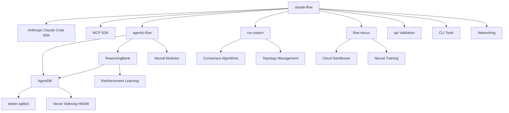
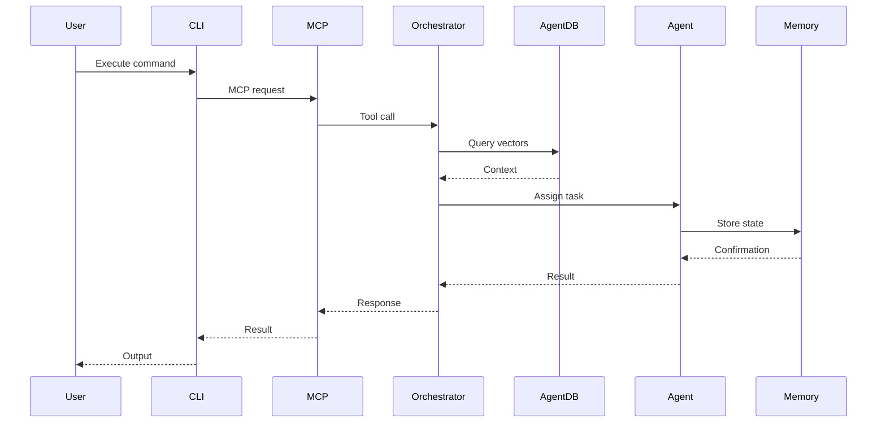
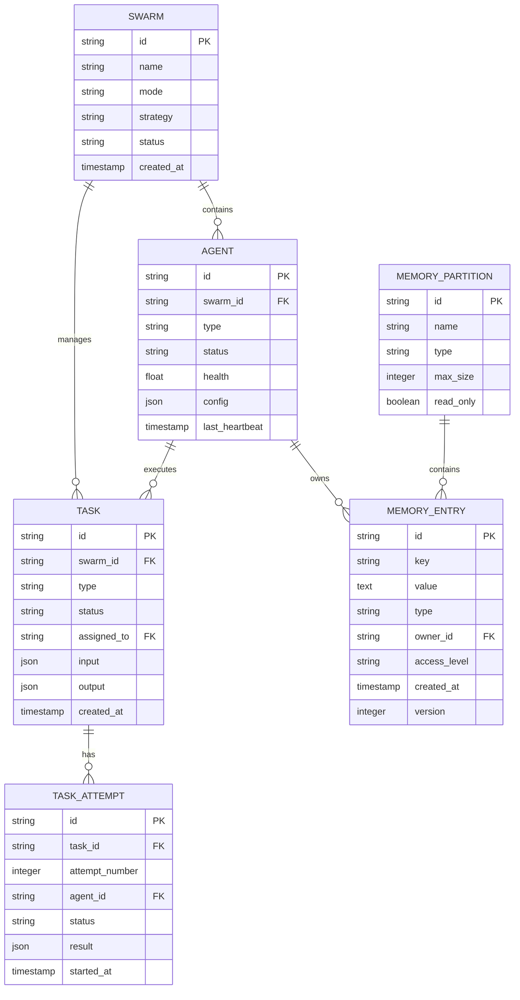

# Data Models and Integration Patterns

**Document Version:** 1.0
**Last Updated:** 2025-11-18
**Project Version:** 2.7.34

## Table of Contents

1. [Core Data Models](#1-core-data-models)
2. [Database Schemas](#2-database-schemas)
3. [Message Formats](#3-message-formats)
4. [File Formats](#4-file-formats)
5. [Integration Patterns](#5-integration-patterns)
6. [Dependencies Analysis](#6-dependencies-analysis)
7. [Data Flow Architecture](#7-data-flow-architecture)

---

## 1. Core Data Models

### 1.1 Agent Models

#### AgentId
```typescript
interface AgentId {
  id: string;              // Unique agent identifier
  swarmId: string;         // Parent swarm identifier
  type: AgentType;         // Agent specialization type
  instance: number;        // Instance number for scaling
}
```

#### AgentState
```typescript
interface AgentState {
  id: AgentId;
  name: string;
  type: AgentType;
  status: AgentStatus;     // 'initializing' | 'idle' | 'busy' | 'paused' | 'error' | 'offline' | 'terminating' | 'terminated'
  capabilities: AgentCapabilities;
  metrics: AgentMetrics;

  // Current state
  currentTask?: TaskId;
  workload: number;        // 0-1 current workload
  health: number;          // 0-1 health score

  // Configuration
  config: AgentConfig;
  environment: AgentEnvironment;

  // Communication
  endpoints: string[];
  lastHeartbeat: Date;

  // History
  taskHistory: TaskId[];
  errorHistory: AgentError[];

  // Relationships
  parentAgent?: AgentId;
  childAgents: AgentId[];
  collaborators: AgentId[];
}
```

#### AgentCapabilities
```typescript
interface AgentCapabilities {
  // Core capabilities
  codeGeneration: boolean;
  codeReview: boolean;
  testing: boolean;
  documentation: boolean;
  research: boolean;
  analysis: boolean;

  // Communication capabilities
  webSearch: boolean;
  apiIntegration: boolean;
  fileSystem: boolean;
  terminalAccess: boolean;

  // Specialized capabilities
  languages: string[];     // Programming languages
  frameworks: string[];    // Frameworks and libraries
  domains: string[];       // Domain expertise
  tools: string[];         // Available tools

  // Resource limits
  maxConcurrentTasks: number;
  maxMemoryUsage: number;
  maxExecutionTime: number;

  // Performance characteristics
  reliability: number;     // 0-1 reliability score
  speed: number;          // Relative speed rating
  quality: number;        // Quality rating
}
```

#### AgentMetrics
```typescript
interface AgentMetrics {
  // Performance metrics
  tasksCompleted: number;
  tasksFailed: number;
  averageExecutionTime: number;
  successRate: number;

  // Resource usage
  cpuUsage: number;
  memoryUsage: number;
  diskUsage: number;
  networkUsage: number;

  // Quality metrics
  codeQuality: number;
  testCoverage: number;
  bugRate: number;
  userSatisfaction: number;

  // Time tracking
  totalUptime: number;
  lastActivity: Date;
  responseTime: number;
}
```

### 1.2 Task Models

#### TaskDefinition
```typescript
interface TaskDefinition {
  id: TaskId;
  type: TaskType;
  name: string;
  description: string;

  // Task specification
  requirements: TaskRequirements;
  constraints: TaskConstraints;
  priority: TaskPriority;  // 'critical' | 'high' | 'normal' | 'low' | 'background'

  // Input/Output
  input: any;
  expectedOutput?: any;

  // Execution details
  instructions: string;
  context: Record<string, any>;
  parameters?: Record<string, any>;
  examples?: any[];

  // Tracking
  status: TaskStatus;
  createdAt: Date;
  updatedAt: Date;

  // Assignment
  assignedTo?: AgentId;
  assignedAt?: Date;

  // Execution
  startedAt?: Date;
  completedAt?: Date;
  result?: TaskResult;
  error?: TaskError;

  // History
  attempts: TaskAttempt[];
  statusHistory: TaskStatusChange[];
}
```

#### TaskType Enumeration
```typescript
type TaskType =
  | 'research'              // Information gathering
  | 'analysis'              // Data analysis and insights
  | 'coding'                // Code generation and modification
  | 'testing'               // Test creation and execution
  | 'review'                // Code and content review
  | 'documentation'         // Documentation creation
  | 'deployment'            // Deployment and operations
  | 'monitoring'            // System monitoring
  | 'coordination'          // Cross-agent coordination
  | 'communication'         // External communication
  | 'maintenance'           // System maintenance
  | 'optimization'          // Performance optimization
  | 'validation'            // Validation and verification
  | 'integration'           // System integration
  | 'custom';               // Custom task type
```

### 1.3 Memory Models

#### MemoryEntry
```typescript
interface MemoryEntry {
  id: string;
  key: string;
  value: any;

  // Metadata
  type: string;
  tags: string[];

  // Ownership
  owner: AgentId;
  accessLevel: AccessLevel;  // 'private' | 'team' | 'swarm' | 'public' | 'system'

  // Lifecycle
  createdAt: Date;
  updatedAt: Date;
  expiresAt?: Date;

  // Versioning
  version: number;
  previousVersions?: MemoryEntry[];

  // Relationships
  references: string[];
  dependencies: string[];
}
```

#### SwarmMemory
```typescript
interface SwarmMemory {
  // Memory organization
  namespace: string;
  partitions: MemoryPartition[];

  // Access control
  permissions: MemoryPermissions;

  // Persistence
  persistent: boolean;
  backupEnabled: boolean;

  // Synchronization
  distributed: boolean;
  consistency: ConsistencyLevel;  // 'strong' | 'eventual' | 'weak' | 'session'

  // Performance
  cacheEnabled: boolean;
  compressionEnabled: boolean;
}
```

#### MemoryPartition
```typescript
interface MemoryPartition {
  id: string;
  name: string;
  type: MemoryType;  // 'knowledge' | 'state' | 'cache' | 'logs' | 'results' | 'communication' | 'configuration' | 'metrics'

  // Data
  entries: MemoryEntry[];

  // Configuration
  maxSize: number;
  ttl?: number;

  // Access patterns
  readOnly: boolean;
  shared: boolean;

  // Performance
  indexed: boolean;
  compressed: boolean;
}
```

### 1.4 Neural Models

#### TrainingConfig
```typescript
interface TrainingConfig {
  algorithm: 'decision-transformer' | 'q-learning' | 'sarsa' | 'actor-critic';
  learningRate: number;
  batchSize: number;
  epochs: number;
  validationSplit: number;
  earlyStoppingPatience?: number;
  optimizerType: 'adam' | 'sgd' | 'rmsprop';
  lossFunction: 'mse' | 'cross-entropy' | 'huber';
}
```

#### GNNLayerConfig
```typescript
interface GNNLayerConfig {
  type: 'gcn' | 'gat' | 'graphsage';
  inputDim: number;
  outputDim: number;
  activation: 'relu' | 'tanh' | 'sigmoid';
  dropout?: number;
  attention?: {
    heads: number;
    concat: boolean;
  };
}
```

### 1.5 Configuration Models

#### ClaudeFlowConfig
```typescript
interface ClaudeFlowConfig {
  version: string;

  // Core settings
  orchestrator: {
    model: string;
    temperature: number;
    maxTokens: number;
    timeout: number;
  };

  // Memory configuration
  memory: {
    backend: 'sqlite' | 'json' | 'agentdb';
    location: string;
    maxSize?: number;
    ttl?: number;
  };

  // Logging configuration
  logging: {
    level: 'debug' | 'info' | 'warn' | 'error';
    format: 'json' | 'text' | 'pretty';
    destination: 'console' | 'file' | 'both';
    filePath?: string;
  };

  // Swarm configuration
  swarm?: {
    enabled: boolean;
    defaultTopology: 'mesh' | 'hierarchical' | 'ring' | 'star';
    maxAgents: number;
    strategy: 'balanced' | 'specialized' | 'adaptive';
  };

  // MCP configuration
  mcp?: {
    enabled: boolean;
    servers: MCPServerConfig[];
  };

  // GitHub integration
  github?: GitHubConfig;

  // Neural features
  neural?: {
    enabled: boolean;
    modelPath?: string;
    trainingEnabled: boolean;
  };

  // Hooks configuration
  hooks?: {
    enabled: boolean;
    preTask?: string[];
    postTask?: string[];
    preEdit?: string[];
    postEdit?: string[];
  };
}
```

---

## 2. Database Schemas

### 2.1 SQLite Memory Store Schema

```sql
-- Main memory entries table
CREATE TABLE IF NOT EXISTS memory_entries (
  id TEXT PRIMARY KEY,
  key TEXT NOT NULL,
  value TEXT,                    -- JSON serialized
  namespace TEXT DEFAULT 'default',
  partition TEXT DEFAULT 'default',
  type TEXT DEFAULT 'knowledge',

  -- Ownership and access
  owner_id TEXT,
  access_level TEXT DEFAULT 'team',

  -- Metadata
  tags TEXT,                     -- JSON array
  metadata TEXT,                 -- JSON object

  -- Lifecycle
  created_at INTEGER NOT NULL,
  updated_at INTEGER NOT NULL,
  expires_at INTEGER,

  -- Versioning
  version INTEGER DEFAULT 1,

  -- Indexing
  UNIQUE(key, namespace, partition)
);

CREATE INDEX idx_memory_key ON memory_entries(key);
CREATE INDEX idx_memory_namespace ON memory_entries(namespace);
CREATE INDEX idx_memory_partition ON memory_entries(partition);
CREATE INDEX idx_memory_owner ON memory_entries(owner_id);
CREATE INDEX idx_memory_created ON memory_entries(created_at);
CREATE INDEX idx_memory_expires ON memory_entries(expires_at);

-- Partitions table
CREATE TABLE IF NOT EXISTS memory_partitions (
  id TEXT PRIMARY KEY,
  name TEXT UNIQUE NOT NULL,
  namespace TEXT NOT NULL,
  type TEXT DEFAULT 'knowledge',
  max_size INTEGER,
  ttl INTEGER,
  read_only INTEGER DEFAULT 0,
  shared INTEGER DEFAULT 1,
  indexed INTEGER DEFAULT 1,
  compressed INTEGER DEFAULT 0,
  created_at INTEGER NOT NULL
);

-- Memory relationships table
CREATE TABLE IF NOT EXISTS memory_references (
  id TEXT PRIMARY KEY,
  from_entry_id TEXT NOT NULL,
  to_entry_id TEXT NOT NULL,
  reference_type TEXT,
  FOREIGN KEY (from_entry_id) REFERENCES memory_entries(id) ON DELETE CASCADE,
  FOREIGN KEY (to_entry_id) REFERENCES memory_entries(id) ON DELETE CASCADE
);

CREATE INDEX idx_ref_from ON memory_references(from_entry_id);
CREATE INDEX idx_ref_to ON memory_references(to_entry_id);

-- Task tracking table
CREATE TABLE IF NOT EXISTS tasks (
  id TEXT PRIMARY KEY,
  swarm_id TEXT NOT NULL,
  sequence INTEGER NOT NULL,
  priority INTEGER NOT NULL,

  -- Task details
  type TEXT NOT NULL,
  name TEXT NOT NULL,
  description TEXT,
  status TEXT DEFAULT 'created',

  -- Assignment
  assigned_to TEXT,              -- Agent ID
  assigned_at INTEGER,

  -- Execution
  started_at INTEGER,
  completed_at INTEGER,

  -- Data
  input TEXT,                    -- JSON
  output TEXT,                   -- JSON
  error TEXT,                    -- JSON

  -- Metadata
  created_at INTEGER NOT NULL,
  updated_at INTEGER NOT NULL
);

CREATE INDEX idx_task_swarm ON tasks(swarm_id);
CREATE INDEX idx_task_status ON tasks(status);
CREATE INDEX idx_task_assigned ON tasks(assigned_to);
CREATE INDEX idx_task_priority ON tasks(priority);

-- Agent state table
CREATE TABLE IF NOT EXISTS agents (
  id TEXT PRIMARY KEY,
  swarm_id TEXT NOT NULL,
  type TEXT NOT NULL,
  instance INTEGER NOT NULL,

  -- State
  name TEXT NOT NULL,
  status TEXT DEFAULT 'initializing',
  health REAL DEFAULT 1.0,
  workload REAL DEFAULT 0.0,

  -- Configuration
  config TEXT,                   -- JSON
  environment TEXT,              -- JSON

  -- Metrics
  metrics TEXT,                  -- JSON

  -- Tracking
  last_heartbeat INTEGER,
  created_at INTEGER NOT NULL,
  updated_at INTEGER NOT NULL
);

CREATE INDEX idx_agent_swarm ON agents(swarm_id);
CREATE INDEX idx_agent_type ON agents(type);
CREATE INDEX idx_agent_status ON agents(status);
CREATE INDEX idx_agent_heartbeat ON agents(last_heartbeat);
```

### 2.2 AgentDB Vector Schema

```typescript
// AgentDB schema (from agentic-flow integration)
interface AgentDBSchema {
  // Vector storage
  vectors: {
    id: string;
    embedding: Float32Array;    // 1536-dimensional vector
    metadata: {
      content: string;
      source: string;
      type: string;
      timestamp: number;
      tags: string[];
    };
  };

  // Distance metrics
  metrics: {
    euclidean: number;
    cosine: number;
    manhattan: number;
    hamming: number;
  };

  // Index configuration
  index: {
    type: 'hnsw' | 'flat' | 'ivf';
    dimension: number;
    m: number;                   // HNSW parameter
    efConstruction: number;       // HNSW parameter
    efSearch: number;            // HNSW parameter
  };
}
```

### 2.3 ReasoningBank Schema

```typescript
// ReasoningBank trajectory schema
interface TrajectorySchema {
  id: string;
  sessionId: string;

  // Trajectory data
  observations: Array<{
    timestamp: number;
    state: any;
    action: string;
    reward: number;
  }>;

  // Verdict
  verdict: {
    outcome: 'success' | 'failure' | 'partial';
    confidence: number;
    reasoning: string;
    timestamp: number;
  };

  // Memory distillation
  distilled: {
    keyPatterns: string[];
    successFactors: string[];
    pitfalls: string[];
    recommendations: string[];
  };

  // Metadata
  metadata: {
    domain: string;
    complexity: number;
    duration: number;
    resourcesUsed: Record<string, number>;
  };
}
```

---

## 3. Message Formats

### 3.1 MCP Message Schema (2025-11 Compliant)

```json
{
  "$schema": "https://json-schema.org/draft/2020-12/schema",
  "type": "object",
  "properties": {
    "jsonrpc": {
      "type": "string",
      "const": "2.0"
    },
    "id": {
      "type": ["string", "number", "null"]
    },
    "method": {
      "type": "string",
      "enum": [
        "tools/list",
        "tools/call",
        "resources/list",
        "resources/read",
        "prompts/list",
        "prompts/get",
        "logging/setLevel"
      ]
    },
    "params": {
      "type": "object"
    },
    "result": {
      "type": "object"
    },
    "error": {
      "type": "object",
      "properties": {
        "code": { "type": "integer" },
        "message": { "type": "string" },
        "data": { "type": "object" }
      },
      "required": ["code", "message"]
    }
  },
  "required": ["jsonrpc"]
}
```

### 3.2 Tool Call Request/Response

```typescript
// Tool Call Request
interface ToolCallRequest {
  method: "tools/call";
  params: {
    name: string;
    arguments: Record<string, unknown>;
  };
}

// Tool Call Response
interface ToolCallResponse {
  content: Array<{
    type: "text" | "image" | "resource";
    text?: string;
    data?: string;
    mimeType?: string;
  }>;
  isError?: boolean;
}
```

### 3.3 Inter-Agent Messages

```typescript
interface InterAgentMessage {
  // Message identification
  id: string;
  correlationId?: string;
  causationId?: string;

  // Routing
  from: AgentId;
  to: AgentId | AgentId[];      // Single or broadcast
  broadcast: boolean;

  // Message type
  type: 'request' | 'response' | 'notification' | 'event';

  // Content
  payload: {
    action: string;
    data: any;
    metadata?: Record<string, any>;
  };

  // Tracking
  timestamp: Date;
  priority: 'critical' | 'high' | 'normal' | 'low';
  ttl?: number;                  // Time to live in ms

  // Response handling
  expectsResponse?: boolean;
  responseTimeout?: number;
  retryPolicy?: {
    maxRetries: number;
    backoffMs: number;
  };
}
```

### 3.4 Event Payloads

```typescript
// Swarm Event
interface SwarmEvent {
  id: string;
  timestamp: Date;
  type: EventType;
  source: string;

  // Event data
  data: Record<string, any>;

  // Routing
  targets?: string[];
  broadcast: boolean;

  // Processing
  processed: boolean;
  processedAt?: Date;

  // Correlation
  correlationId?: string;
  causationId?: string;
}

// Event Types
type EventType =
  // Swarm events
  | 'swarm.created'
  | 'swarm.started'
  | 'swarm.completed'
  | 'swarm.failed'

  // Agent events
  | 'agent.created'
  | 'agent.started'
  | 'agent.stopped'
  | 'agent.error'
  | 'agent.heartbeat'

  // Task events
  | 'task.created'
  | 'task.assigned'
  | 'task.started'
  | 'task.completed'
  | 'task.failed'

  // System events
  | 'system.startup'
  | 'system.shutdown'
  | 'system.resource_limit';
```

### 3.5 Hook Event Format

```typescript
interface HookEvent {
  hookType: 'pre-task' | 'post-task' | 'pre-edit' | 'post-edit' | 'session-start' | 'session-end';

  // Context
  context: {
    agentId?: string;
    taskId?: string;
    file?: string;
    operation?: string;
  };

  // Data
  data: {
    description?: string;
    memoryKey?: string;
    sessionId?: string;
    exportMetrics?: boolean;
    [key: string]: any;
  };

  // Metadata
  timestamp: Date;
  source: string;

  // Results
  result?: {
    success: boolean;
    output?: string;
    error?: string;
    metadata?: Record<string, any>;
  };
}
```

---

## 4. File Formats

### 4.1 Configuration Files

#### Basic Configuration (JSON)
```json
{
  "name": "Project Configuration",
  "description": "Configuration for claude-flow project",
  "orchestrator": {
    "model": "claude-3-sonnet-20240229",
    "temperature": 0.7,
    "maxTokens": 4096,
    "timeout": 30000
  },
  "memory": {
    "backend": "sqlite",
    "location": "./.swarm/memory.db",
    "maxSize": 104857600,
    "ttl": 86400000
  },
  "logging": {
    "level": "info",
    "format": "json",
    "destination": "file",
    "filePath": "./logs/claude-flow.log"
  },
  "swarm": {
    "enabled": true,
    "defaultTopology": "hierarchical",
    "maxAgents": 10,
    "strategy": "balanced"
  }
}
```

#### YAML Configuration
```yaml
name: Research Configuration
description: Optimized for research and analysis tasks

orchestrator:
  model: claude-3-opus-20240229
  temperature: 0.8
  maxTokens: 8192
  timeout: 60000

memory:
  backend: agentdb
  location: ./.swarm/vectors.db
  vectorDimension: 1536
  indexType: hnsw

swarm:
  enabled: true
  defaultTopology: mesh
  maxAgents: 15
  strategy: adaptive

  coordination:
    agentSelection: capability-based
    taskScheduling: priority
    loadBalancing: work-stealing
    faultTolerance: retry

neural:
  enabled: true
  modelPath: ./models/neural
  trainingEnabled: true
  algorithms:
    - decision-transformer
    - q-learning
```

### 4.2 State Persistence Format

```json
{
  "version": "1.0.0",
  "namespace": "default",
  "timestamp": "2025-11-18T12:00:00.000Z",
  "checksum": "sha256:abc123...",

  "entries": [
    {
      "id": "mem-abc123",
      "key": "agent/researcher-1/context",
      "value": "{...}",
      "type": "state",
      "owner": {
        "id": "researcher-1",
        "swarmId": "swarm-xyz",
        "type": "researcher",
        "instance": 1
      },
      "accessLevel": "team",
      "createdAt": "2025-11-18T11:00:00.000Z",
      "updatedAt": "2025-11-18T11:30:00.000Z",
      "version": 2
    }
  ],

  "partitions": [
    {
      "id": "partition-001",
      "name": "default",
      "type": "knowledge",
      "maxSize": 10485760,
      "readOnly": false,
      "shared": true,
      "indexed": true
    }
  ]
}
```

### 4.3 Export Formats

#### JSON Export
```json
{
  "exported": "2025-11-18T12:00:00.000Z",
  "namespace": "production",
  "format": "json",
  "entryCount": 1250,
  "version": "1.0.0",

  "entries": [
    {
      "id": "mem-001",
      "key": "task/results/analysis-2024",
      "value": {...},
      "metadata": {...}
    }
  ],

  "statistics": {
    "totalSize": 52428800,
    "averageSize": 41943,
    "oldestEntry": "2024-01-01T00:00:00.000Z",
    "newestEntry": "2025-11-18T12:00:00.000Z"
  }
}
```

#### CSV Export
```csv
id,key,type,accessLevel,createdAt,updatedAt,owner,tags
mem-001,task/results/analysis,results,team,2025-11-18T10:00:00.000Z,2025-11-18T11:00:00.000Z,researcher-1,analysis;results;2024
mem-002,agent/state/coder-1,state,private,2025-11-18T09:00:00.000Z,2025-11-18T12:00:00.000Z,coder-1,state;active
```

### 4.4 Template Formats

```yaml
# Agent Template
apiVersion: claude-flow/v1
kind: AgentTemplate
metadata:
  name: custom-researcher
  version: "1.0.0"

spec:
  type: researcher
  capabilities:
    - research
    - analysis
    - documentation

  config:
    autonomyLevel: 0.8
    maxConcurrentTasks: 5
    timeout: 300000

  tools:
    - web-search
    - document-analysis
    - data-extraction

  prompts:
    system: |
      You are a research specialist...

    task: |
      Analyze the following...
```

---

## 5. Integration Patterns

### 5.1 External Library Integration

#### Agentic-Flow Integration
```typescript
// Core integration via agentic-flow package
import {
  AgenticFlow,
  AgentDB,
  ReasoningBank,
  NeuralModule
} from 'agentic-flow';

class AgenticFlowIntegration {
  private flow: AgenticFlow;
  private agentDB: AgentDB;
  private reasoningBank: ReasoningBank;

  async initialize() {
    // Initialize AgentDB for vector storage
    this.agentDB = new AgentDB({
      path: './.swarm/vectors.db',
      dimension: 1536,
      metric: 'cosine',
      index: 'hnsw'
    });

    // Initialize ReasoningBank for learning
    this.reasoningBank = new ReasoningBank({
      agentDB: this.agentDB,
      algorithm: 'decision-transformer'
    });

    // Initialize AgenticFlow orchestration
    this.flow = new AgenticFlow({
      agentDB: this.agentDB,
      reasoningBank: this.reasoningBank,
      topology: 'hierarchical'
    });
  }

  async executeWithLearning(task: Task) {
    // Track trajectory for learning
    const trajectory = await this.flow.execute(task);

    // Store verdict in ReasoningBank
    await this.reasoningBank.storeTrajectory(trajectory);

    // Train neural models
    await this.reasoningBank.train();

    return trajectory.result;
  }
}
```

#### Ruv-Swarm Integration
```typescript
import { RuvSwarm } from 'ruv-swarm';

class RuvSwarmIntegration {
  private swarm: RuvSwarm;

  async initialize(config: RuvSwarmConfig) {
    this.swarm = new RuvSwarm({
      topology: config.topology,
      consensus: config.consensus,
      maxAgents: config.maxAgents
    });

    // Sync with claude-flow memory
    await this.syncMemory();
  }

  async spawnAgent(type: AgentType) {
    return await this.swarm.spawn({
      type,
      hooks: {
        preTask: this.preTaskHook,
        postTask: this.postTaskHook
      }
    });
  }
}
```

#### Flow-Nexus Integration
```typescript
import { FlowNexus } from 'flow-nexus';

class FlowNexusIntegration {
  private nexus: FlowNexus;

  async initialize() {
    this.nexus = new FlowNexus({
      apiKey: process.env.FLOW_NEXUS_API_KEY,
      cloudExecution: true
    });
  }

  async deployToCloud(swarmConfig: SwarmConfig) {
    // Deploy swarm to cloud sandboxes
    const deployment = await this.nexus.deploy({
      swarm: swarmConfig,
      sandboxes: 5,
      template: 'enterprise'
    });

    return deployment;
  }
}
```

### 5.2 MCP Protocol Integration

```typescript
import { Server } from '@modelcontextprotocol/sdk/server/index.js';
import { StdioServerTransport } from '@modelcontextprotocol/sdk/server/stdio.js';

class MCPIntegration {
  private server: Server;

  async initialize() {
    this.server = new Server();

    // Register tool handlers
    this.server.setRequestHandler('tools/list', async () => ({
      tools: this.getAvailableTools()
    }));

    this.server.setRequestHandler('tools/call', async (request) => {
      return await this.executeTool(
        request.params.name,
        request.params.arguments
      );
    });

    // Connect via stdio
    const transport = new StdioServerTransport();
    await this.server.connect(transport);
  }

  private getAvailableTools() {
    return [
      {
        name: 'swarm_init',
        description: 'Initialize a new swarm',
        inputSchema: {
          type: 'object',
          properties: {
            topology: { type: 'string' },
            maxAgents: { type: 'number' }
          }
        }
      }
    ];
  }
}
```

### 5.3 GitHub API Integration

```typescript
import { Octokit } from '@octokit/rest';

class GitHubIntegration {
  private octokit: Octokit;

  constructor(token: string) {
    this.octokit = new Octokit({ auth: token });
  }

  async analyzePR(owner: string, repo: string, prNumber: number) {
    // Get PR details
    const { data: pr } = await this.octokit.pulls.get({
      owner,
      repo,
      pull_number: prNumber
    });

    // Get changed files
    const { data: files } = await this.octokit.pulls.listFiles({
      owner,
      repo,
      pull_number: prNumber
    });

    // Spawn swarm for analysis
    const swarm = await this.spawnAnalysisSwarm();

    return await swarm.analyze({
      pr,
      files,
      context: {
        repository: `${owner}/${repo}`,
        branch: pr.head.ref
      }
    });
  }
}
```

### 5.4 Docker Integration

```typescript
import Docker from 'dockerode';

class DockerIntegration {
  private docker: Docker;

  constructor() {
    this.docker = new Docker();
  }

  async createSandbox(config: SandboxConfig) {
    // Pull image
    await this.docker.pull(config.image);

    // Create container
    const container = await this.docker.createContainer({
      Image: config.image,
      Cmd: config.command,
      Env: config.environment,
      HostConfig: {
        Memory: config.memoryLimit,
        CpuShares: config.cpuShares
      }
    });

    // Start container
    await container.start();

    return container;
  }
}
```

---

## 6. Dependencies Analysis

### 6.1 Core Dependencies

```json
{
  "dependencies": {
    // Anthropic SDK
    "@anthropic-ai/claude-code": "^2.0.1",      // Claude Code integration
    "@anthropic-ai/sdk": "^0.65.0",             // Anthropic API client

    // MCP Protocol
    "@modelcontextprotocol/sdk": "^1.0.4",      // MCP 2025-11 SDK

    // Orchestration
    "agentic-flow": "^1.9.4",                   // Core orchestration (AgentDB, ReasoningBank)
    "ruv-swarm": "^1.0.14",                     // Advanced swarm coordination
    "flow-nexus": "^0.1.128",                   // Cloud platform integration

    // Validation
    "ajv": "^8.17.1",                           // JSON Schema validation
    "ajv-errors": "^3.0.0",                     // Custom error messages
    "ajv-formats": "^3.0.1",                    // Format validators

    // CLI & UI
    "blessed": "^0.1.81",                       // Terminal UI
    "chalk": "^4.1.2",                          // Terminal colors
    "cli-table3": "^0.6.3",                     // ASCII tables
    "commander": "^11.1.0",                     // CLI framework
    "figlet": "^1.8.1",                         // ASCII art
    "gradient-string": "^3.0.0",                // Gradient text
    "inquirer": "^9.2.12",                      // Interactive prompts
    "ora": "^7.0.1",                            // Spinners

    // Utilities
    "fs-extra": "^11.2.0",                      // Enhanced fs operations
    "glob": "^11.0.3",                          // File pattern matching
    "nanoid": "^5.0.4",                         // ID generation
    "p-queue": "^8.1.0",                        // Promise queue
    "uuid": "^13.0.0",                          // UUID generation
    "yaml": "^2.8.0",                           // YAML parser

    // Networking
    "cors": "^2.8.5",                           // CORS middleware
    "helmet": "^7.1.0",                         // Security headers
    "ws": "^8.18.3"                             // WebSocket
  }
}
```

### 6.2 Optional Dependencies

```json
{
  "optionalDependencies": {
    // Database
    "agentdb": "^1.6.1",                        // Vector database
    "better-sqlite3": "^12.2.0",                // SQLite driver
    "@types/better-sqlite3": "^7.6.13",

    // System utilities
    "diskusage": "^1.1.3",                      // Disk usage monitoring
    "node-pty": "^1.0.0"                        // Pseudo-terminal
  }
}
```

### 6.3 Dependency Relationships



### 6.4 Version Compatibility Matrix

| Dependency | Version | Node.js | Purpose | Critical |
|------------|---------|---------|---------|----------|
| @anthropic-ai/claude-code | ^2.0.1 | ≥20.0.0 | Claude integration | Yes |
| @modelcontextprotocol/sdk | ^1.0.4 | ≥20.0.0 | MCP protocol | Yes |
| agentic-flow | ^1.9.4 | ≥20.0.0 | Core orchestration | Yes |
| ruv-swarm | ^1.0.14 | ≥20.0.0 | Swarm coordination | No |
| flow-nexus | ^0.1.128 | ≥20.0.0 | Cloud features | No |
| agentdb | ^1.6.1 | ≥20.0.0 | Vector database | No |
| better-sqlite3 | ^12.2.0 | ≥20.0.0 | SQLite driver | No |

### 6.5 Integration Architecture

```
┌─────────────────────────────────────────────────────────────┐
│                      Claude-Flow Core                        │
├─────────────────────────────────────────────────────────────┤
│                                                               │
│  ┌───────────────┐  ┌───────────────┐  ┌─────────────────┐ │
│  │  MCP Server   │  │  CLI Engine   │  │  Hook System    │ │
│  │  (2025-11)    │  │               │  │                 │ │
│  └───────┬───────┘  └───────┬───────┘  └────────┬────────┘ │
│          │                   │                    │          │
│  ┌───────▼───────────────────▼────────────────────▼───────┐ │
│  │              Orchestration Layer                       │ │
│  │   ┌─────────────┐  ┌──────────────┐  ┌─────────────┐ │ │
│  │   │ Agentic-Flow│  │  Ruv-Swarm   │  │ Flow-Nexus  │ │ │
│  │   │  (Core)     │  │  (Optional)  │  │  (Optional) │ │ │
│  │   └──────┬──────┘  └──────┬───────┘  └──────┬──────┘ │ │
│  │          │                 │                  │        │ │
│  │   ┌──────▼─────────────────▼──────────────────▼─────┐ │ │
│  │   │          Coordination & Memory Layer            │ │ │
│  │   │   • AgentDB (Vectors)                           │ │ │
│  │   │   • ReasoningBank (Learning)                    │ │ │
│  │   │   • SQLite (State)                              │ │ │
│  │   │   • Neural Modules (Training)                   │ │ │
│  │   └─────────────────────────────────────────────────┘ │ │
│  └───────────────────────────────────────────────────────┘ │
│                                                               │
│  ┌───────────────────────────────────────────────────────┐  │
│  │              Integration Interfaces                    │  │
│  │  • GitHub API  • Docker  • WebSocket  • HTTP/REST     │  │
│  └───────────────────────────────────────────────────────┘  │
└─────────────────────────────────────────────────────────────┘
```

---

## 7. Data Flow Architecture

### 7.1 Request Flow



### 7.2 Memory Flow

```
┌─────────────┐
│   Agent     │
└──────┬──────┘
       │ store/retrieve
       ▼
┌─────────────────────┐
│  Memory Manager     │
├─────────────────────┤
│  • Cache Layer      │ (In-memory, TTL-based)
│  • Partition Router │ (Namespace routing)
│  • Access Control   │ (Permission checks)
└──────┬──────────────┘
       │
       ├─────────────────┬─────────────────┐
       ▼                 ▼                 ▼
┌─────────────┐   ┌─────────────┐   ┌─────────────┐
│   SQLite    │   │   AgentDB   │   │   JSON      │
│   (State)   │   │  (Vectors)  │   │   (Temp)    │
└─────────────┘   └─────────────┘   └─────────────┘
```

### 7.3 Event Flow

```
┌─────────────┐
│  Event      │
│  Source     │
└──────┬──────┘
       │ emit
       ▼
┌─────────────────────┐
│  Message Bus        │
├─────────────────────┤
│  • Event Router     │
│  • Topic Manager    │
│  • Filter Engine    │
└──────┬──────────────┘
       │
       ├─────────────────┬─────────────────┐
       ▼                 ▼                 ▼
┌─────────────┐   ┌─────────────┐   ┌─────────────┐
│ Subscriber  │   │ Subscriber  │   │ Subscriber  │
│   Agent 1   │   │   Agent 2   │   │   Hook      │
└─────────────┘   └─────────────┘   └─────────────┘
```

### 7.4 Learning Flow

```
Task Execution
      │
      ▼
┌─────────────────┐
│ Track Trajectory│
│  • Observations │
│  • Actions      │
│  • Rewards      │
└────────┬────────┘
         │
         ▼
┌─────────────────┐
│ Judge Verdict   │
│  • Success?     │
│  • Confidence   │
│  • Reasoning    │
└────────┬────────┘
         │
         ▼
┌─────────────────┐
│ Memory Distill  │
│  • Key Patterns │
│  • Success Keys │
│  • Pitfalls     │
└────────┬────────┘
         │
         ▼
┌─────────────────┐
│ Store in        │
│ ReasoningBank   │
└────────┬────────┘
         │
         ▼
┌─────────────────┐
│ Neural Training │
│  • RL Algorithms│
│  • Pattern Recog│
└─────────────────┘
```

---

## Appendix A: ER Diagram



---

## Appendix B: Configuration Schema

```json
{
  "$schema": "https://json-schema.org/draft/2020-12/schema",
  "type": "object",
  "properties": {
    "version": { "type": "string" },
    "orchestrator": {
      "type": "object",
      "properties": {
        "model": { "type": "string" },
        "temperature": { "type": "number", "minimum": 0, "maximum": 1 },
        "maxTokens": { "type": "integer", "minimum": 1 },
        "timeout": { "type": "integer", "minimum": 1000 }
      },
      "required": ["model"]
    },
    "memory": {
      "type": "object",
      "properties": {
        "backend": { "type": "string", "enum": ["sqlite", "json", "agentdb"] },
        "location": { "type": "string" },
        "maxSize": { "type": "integer" },
        "ttl": { "type": "integer" }
      },
      "required": ["backend", "location"]
    },
    "swarm": {
      "type": "object",
      "properties": {
        "enabled": { "type": "boolean" },
        "defaultTopology": {
          "type": "string",
          "enum": ["mesh", "hierarchical", "ring", "star"]
        },
        "maxAgents": { "type": "integer", "minimum": 1, "maximum": 100 },
        "strategy": {
          "type": "string",
          "enum": ["balanced", "specialized", "adaptive"]
        }
      }
    }
  },
  "required": ["version", "orchestrator", "memory"]
}
```

---

## Document Change Log

| Version | Date | Changes | Author |
|---------|------|---------|--------|
| 1.0 | 2025-11-18 | Initial comprehensive documentation | Code Analyzer Agent |

---

**End of Document**
