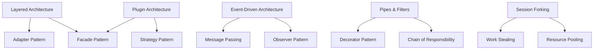

# Design Patterns & Technical Glossary

**Architectural Patterns, Design Principles, and Technical Terms in Claude-Flow**

Version: 2.7.34 | Last Updated: 2025-11-18

---

## 📖 Purpose

This document catalogs the design patterns, architectural principles, and technical terminology used throughout the claude-flow codebase. Use it as a reference when reading code or documentation.

---

## 🏗️ Architectural Patterns

### 1. **Layered Architecture**

**Description:** System organized into horizontal layers with clear dependencies.

**Implementation in Claude-Flow:**
```
┌─────────────────────┐
│  Presentation       │  CLI, MCP Server
├─────────────────────┤
│  Application        │  Orchestrator, Coordinators
├─────────────────────┤
│  Domain Logic       │  Agents, Tasks, Memory
├─────────────────────┤
│  Infrastructure     │  Database, File System, External APIs
└─────────────────────┘
```

**Files:**
- Entry: `src/cli/`, `src/mcp/`
- Application: `src/core/`, `src/coordination/`
- Domain: `src/agents/`, `src/task/`, `src/memory/`
- Infrastructure: `src/memory/backends/`, `src/integration/`

**Benefits:**
- Clear separation of concerns
- Easier testing and maintenance
- Reduced coupling between components

---

### 2. **Event-Driven Architecture**

**Description:** Components communicate via events rather than direct calls.

**Implementation:**
```typescript
// src/core/orchestrator.ts
eventBus.emit('agent:spawned', agentData);

// Subscriber in src/monitoring/
eventBus.on('agent:spawned', (data) => {
  metrics.incrementAgentCount();
});
```

**Event Types:**
- `agent:*` - Agent lifecycle events
- `task:*` - Task execution events
- `memory:*` - Memory operation events
- `hook:*` - Hook execution events
- `system:*` - System-level events

**Benefits:**
- Loose coupling between components
- Easy to add new functionality
- Supports parallel processing

---

### 3. **Plugin Architecture**

**Description:** Core system with extensible plugin points.

**Extension Points:**
1. **Custom Agents** - `.claude/agents/<name>.md`
2. **Custom Hooks** - Shell scripts or TypeScript
3. **Custom MCP Tools** - Tool registration API
4. **Custom Backends** - Memory storage implementations

**Example:**
```typescript
// Plugin interface
interface MemoryBackend {
  store(key: string, value: any): Promise<void>;
  retrieve(key: string): Promise<any>;
  query(criteria: any): Promise<any[]>;
}

// Custom implementation
class MyCustomBackend implements MemoryBackend {
  // Implementation
}

// Registration
memoryManager.registerBackend('custom', new MyCustomBackend());
```

---

### 4. **Microkernel (Core + Extensions)**

**Description:** Minimal core with functionality added via extensions.

**Core Components:**
- Orchestrator
- MCP Server
- Memory Manager
- Agent Executor

**Extensions:**
- SPARC methodology
- GitHub integration
- Docker support
- Neural components
- Swarm coordination patterns

---

### 5. **Pipes and Filters**

**Description:** Data flows through a series of processing stages.

**Hook Pipeline:**
```
Input → Pre-Hook 1 → Pre-Hook 2 → Operation → Post-Hook 1 → Post-Hook 2 → Output
```

**Implementation:**
```typescript
// src/services/agentic-flow-hooks/index.ts
async function executePipeline(context: HookContext) {
  await executePreHooks(context);
  const result = await context.operation();
  await executePostHooks(context, result);
  return result;
}
```

---

## 🎨 Design Patterns (GoF)

### **Creational Patterns**

#### 1. **Factory Pattern**

**Usage:** Creating agents based on type.

**Location:** `src/execution/agent-executor.ts`

```typescript
class AgentFactory {
  createAgent(type: string): Agent {
    switch(type) {
      case 'researcher': return new ResearcherAgent();
      case 'coder': return new CoderAgent();
      case 'tester': return new TesterAgent();
      default: throw new Error(`Unknown agent type: ${type}`);
    }
  }
}
```

---

#### 2. **Singleton Pattern**

**Usage:** Single instance of orchestrator, memory manager.

**Location:** `src/core/orchestrator.ts`, `src/memory/manager.ts`

```typescript
class Orchestrator {
  private static instance: Orchestrator;

  static getInstance(): Orchestrator {
    if (!Orchestrator.instance) {
      Orchestrator.instance = new Orchestrator();
    }
    return Orchestrator.instance;
  }
}
```

---

#### 3. **Builder Pattern**

**Usage:** Constructing complex configuration objects.

**Location:** `src/config/builder.ts`

```typescript
const config = new ConfigBuilder()
  .withMaxAgents(10)
  .withMemoryBackend('hybrid')
  .withTopology('mesh')
  .build();
```

---

### **Structural Patterns**

#### 4. **Adapter Pattern**

**Usage:** Adapting external libraries to internal interfaces.

**Location:** `src/providers/`

```typescript
// src/providers/agentic-flow-adapter.ts
class AgenticFlowAdapter implements AIProvider {
  async execute(prompt: string): Promise<string> {
    const agenticFlow = require('agentic-flow');
    return await agenticFlow.run(prompt);
  }
}
```

**Adapters:**
- `agentic-flow-adapter.ts` - Multi-provider AI
- `agentdb-adapter.ts` - Vector database
- `ruv-swarm-adapter.ts` - Consensus protocols

---

#### 5. **Facade Pattern**

**Usage:** Simplified interface to complex subsystems.

**Location:** `src/core/orchestrator.ts`

```typescript
// Facade for agent operations
class Orchestrator {
  async spawnAgent(type: string, task: string): Promise<Agent> {
    // Handles coordination, memory, hooks, execution internally
    const coordinator = this.getCoordinator();
    const memory = this.getMemory();
    const executor = this.getExecutor();

    // Complex orchestration hidden behind simple interface
    return await this.complexSpawnLogic(type, task);
  }
}
```

---

#### 6. **Decorator Pattern**

**Usage:** Adding functionality to hooks dynamically.

**Location:** `src/services/agentic-flow-hooks/`

```typescript
function withLogging(hook: Hook): Hook {
  return async (context) => {
    console.log('Before hook');
    await hook(context);
    console.log('After hook');
  };
}

function withMetrics(hook: Hook): Hook {
  return async (context) => {
    const start = Date.now();
    await hook(context);
    metrics.record(Date.now() - start);
  };
}

// Usage
const enhancedHook = withMetrics(withLogging(myHook));
```

---

#### 7. **Proxy Pattern**

**Usage:** OpenRouter proxy for AI models.

**Location:** `src/proxy/openrouter-proxy.ts`

```typescript
class OpenRouterProxy implements AIProvider {
  async execute(prompt: string): Promise<string> {
    // Add authentication
    const headers = this.addAuth();

    // Forward to OpenRouter
    return await fetch(OPENROUTER_API, {
      method: 'POST',
      headers,
      body: JSON.stringify({ prompt })
    });
  }
}
```

---

### **Behavioral Patterns**

#### 8. **Strategy Pattern**

**Usage:** Interchangeable memory backends, coordination topologies.

**Location:** `src/memory/backends/`, `src/coordination/`

```typescript
interface MemoryBackend {
  store(key: string, value: any): Promise<void>;
}

class SQLiteBackend implements MemoryBackend { /* ... */ }
class MarkdownBackend implements MemoryBackend { /* ... */ }
class HybridBackend implements MemoryBackend { /* ... */ }

// Strategy selection
const backend = config.backend === 'sqlite'
  ? new SQLiteBackend()
  : new HybridBackend();
```

---

#### 9. **Observer Pattern**

**Usage:** Event bus for system events.

**Location:** `src/core/event-bus.ts`

```typescript
class EventBus {
  private listeners: Map<string, Function[]> = new Map();

  on(event: string, callback: Function) {
    if (!this.listeners.has(event)) {
      this.listeners.set(event, []);
    }
    this.listeners.get(event).push(callback);
  }

  emit(event: string, data: any) {
    const callbacks = this.listeners.get(event) || [];
    callbacks.forEach(cb => cb(data));
  }
}
```

---

#### 10. **Command Pattern**

**Usage:** CLI commands as objects.

**Location:** `src/cli/commands/`

```typescript
interface Command {
  execute(args: string[]): Promise<void>;
}

class AgentSpawnCommand implements Command {
  async execute(args: string[]): Promise<void> {
    // Parse args
    // Execute spawn logic
  }
}
```

---

#### 11. **Template Method Pattern**

**Usage:** SPARC phase execution.

**Location:** `src/modes/`

```typescript
abstract class SparcPhase {
  async execute(): Promise<void> {
    await this.setup();
    await this.run();
    await this.teardown();
  }

  abstract setup(): Promise<void>;
  abstract run(): Promise<void>;
  async teardown(): Promise<void> {
    // Default implementation
  }
}

class SpecificationPhase extends SparcPhase {
  async setup() { /* ... */ }
  async run() { /* ... */ }
}
```

---

#### 12. **Chain of Responsibility**

**Usage:** Hook pattern matching and execution.

**Location:** `src/services/agentic-flow-hooks/matcher.ts`

```typescript
class HookMatcher {
  private patterns: Pattern[] = [];

  match(event: string): Hook[] {
    for (const pattern of this.patterns) {
      if (pattern.matches(event)) {
        return pattern.hooks;
      }
    }
    return [];
  }
}
```

---

## 🧩 Concurrency Patterns

### 1. **Session Forking**

**Description:** Parallel execution via process forking.

**Implementation:** `src/execution/session-forker.ts`

```typescript
async function forkSessions(agents: Agent[]): Promise<Result[]> {
  const processes = agents.map(agent =>
    fork('agent-worker.js', [agent.id])
  );

  return Promise.all(processes.map(p => p.result));
}
```

**Performance:** 2.8-4.4x speedup vs sequential

---

### 2. **Work Stealing**

**Description:** Idle agents steal tasks from busy agents.

**Implementation:** `src/coordination/work-stealing.ts`

```typescript
class WorkStealingScheduler {
  async assignTask(task: Task): Promise<Agent> {
    const idleAgent = this.findIdleAgent();
    if (idleAgent) return idleAgent;

    // Steal from busiest agent's queue
    return this.stealFromBusiestAgent();
  }
}
```

---

### 3. **Message Passing**

**Description:** Agents communicate via message queues.

**Implementation:** `src/coordination/message-bus.ts`

```typescript
class MessageBus {
  send(from: AgentId, to: AgentId, message: any) {
    this.queues.get(to).push({ from, message });
  }

  receive(agent: AgentId): Message[] {
    return this.queues.get(agent).drain();
  }
}
```

---

### 4. **Resource Pooling**

**Description:** Pre-allocated terminals for faster agent spawning.

**Implementation:** `src/execution/terminal-pool.ts`

```typescript
class TerminalPool {
  private pool: Terminal[] = [];

  async acquire(): Promise<Terminal> {
    if (this.pool.length > 0) {
      return this.pool.pop();  // O(1)
    }
    return await this.createTerminal();  // Fallback
  }

  release(terminal: Terminal) {
    this.pool.push(terminal);
  }
}
```

**Performance:** 500-1500ms (cold) → 100-300ms (warm)

---

## 🔐 Security Patterns

### 1. **Credential Isolation**

**Description:** API keys never exposed in logs or errors.

**Implementation:**
```typescript
class CredentialManager {
  private credentials: Map<string, string> = new Map();

  store(key: string, value: string) {
    this.credentials.set(key, value);
    // Never logged
  }

  toString() {
    return '[CredentialManager: <redacted>]';
  }
}
```

---

### 2. **Input Validation**

**Description:** All MCP inputs validated against JSON Schema.

**Implementation:**
```typescript
const validator = new Ajv();

function validateInput(schema: any, data: any) {
  const valid = validator.validate(schema, data);
  if (!valid) {
    throw new ValidationError(validator.errors);
  }
}
```

---

### 3. **Rate Limiting**

**Description:** Prevent API abuse via circuit breakers.

**Implementation:**
```typescript
class CircuitBreaker {
  async execute<T>(fn: () => Promise<T>): Promise<T> {
    if (this.state === 'open') {
      throw new Error('Circuit breaker open');
    }

    try {
      const result = await fn();
      this.onSuccess();
      return result;
    } catch (error) {
      this.onFailure();
      throw error;
    }
  }
}
```

---

## 📊 Performance Patterns

### 1. **Lazy Loading**

**Description:** Load modules only when needed.

**Implementation:**
```typescript
class PluginManager {
  private plugins: Map<string, any> = new Map();

  async getPlugin(name: string): Promise<Plugin> {
    if (!this.plugins.has(name)) {
      const module = await import(`./plugins/${name}.js`);
      this.plugins.set(name, module.default);
    }
    return this.plugins.get(name);
  }
}
```

---

### 2. **Caching**

**Description:** LRU cache for frequently accessed data.

**Implementation:**
```typescript
class LRUCache<K, V> {
  private cache: Map<K, V> = new Map();
  private maxSize: number;

  get(key: K): V | undefined {
    const value = this.cache.get(key);
    if (value) {
      // Move to end (most recently used)
      this.cache.delete(key);
      this.cache.set(key, value);
    }
    return value;
  }
}
```

**Usage:**
- Memory reads: 50-100ms → 1-5ms
- Pattern matching: 10-50ms → 2-5ms

---

### 3. **Indexing**

**Description:** Full-text and vector indexes for fast search.

**Implementation:**
```typescript
// Full-text index (SQLite FTS5)
CREATE VIRTUAL TABLE memory_fts USING fts5(content);

// Vector index (AgentDB HNSW)
const index = await agentdb.createIndex({
  type: 'hnsw',
  metric: 'cosine',
  dimensions: 1536
});
```

**Performance:** Linear scan (1000ms) → Index lookup (5-10ms)

---

## 📚 Technical Glossary

### A

**Agent**
An autonomous AI worker that executes tasks. Each agent has a type, capabilities, memory, and execution environment.

**AgentDB**
A vector database optimized for AI agents, providing 150x faster semantic search than traditional databases.

**Agentic-Flow**
External library providing multi-provider AI execution (Anthropic, OpenRouter, ONNX, Gemini).

---

### C

**Circuit Breaker**
A pattern that prevents cascading failures by stopping requests to failing services.

**Consensus**
Agreement among distributed agents on a single value or decision.

**Coordination**
The process of organizing multiple agents to work together efficiently.

---

### E

**Event Bus**
A publish-subscribe system for decoupled communication between components.

**Event-Driven Architecture**
System design where components react to events rather than calling each other directly.

---

### H

**Hive-Mind**
A coordination pattern where agents share collective knowledge and decision-making.

**Hook**
An extension point where custom code can be injected into the execution pipeline.

**HNSW (Hierarchical Navigable Small World)**
A graph-based algorithm for approximate nearest neighbor search in vector databases.

---

### M

**MCP (Model Context Protocol)**
A standardized protocol for AI model interactions, defining tools, resources, and prompts.

**Memory Backend**
A storage implementation for agent memory (SQLite, Markdown, Hybrid, etc.).

**Mesh Topology**
A coordination pattern where every agent can communicate directly with every other agent.

---

### O

**Orchestrator**
The central coordinator that manages all system operations and component interactions.

**OpenRouter**
A proxy service providing access to multiple AI models with cost optimization (85-98% savings).

---

### R

**ReasoningBank**
A WASM-powered adaptive learning system that improves agent decisions through experience.

**Ruv-Swarm**
External library providing consensus algorithms and distributed coordination.

---

### S

**SPARC**
Specification, Pseudocode, Architecture, Refinement, Completion - a systematic development methodology.

**Swarm**
A group of coordinated agents working together on complex tasks.

**Session Forking**
Creating parallel execution contexts for concurrent agent operations.

---

### T

**Terminal Pooling**
Pre-allocating execution environments to reduce agent spawn time.

**Topology**
The communication pattern among agents (hierarchical, mesh, star, ring).

**TDD (Test-Driven Development)**
A development methodology where tests are written before implementation.

---

### V

**Vector Database**
A database optimized for storing and searching high-dimensional vectors (embeddings).

**Verdict**
A judgment on the success or failure of an operation, used by ReasoningBank for learning.

---

### W

**Work Stealing**
A load balancing technique where idle agents take tasks from busy agents' queues.

**WASM (WebAssembly)**
A binary format for running code at near-native speed in various environments.

---

## 🔗 Pattern Relationships



---

## 📖 Further Reading

**Design Patterns:**
- "Design Patterns" by Gang of Four (GoF)
- "Enterprise Integration Patterns" by Hohpe & Woolf
- "Pattern-Oriented Software Architecture" by Buschmann et al.

**Architectural Patterns:**
- "Software Architecture Patterns" by Mark Richards
- "Building Microservices" by Sam Newman
- "Domain-Driven Design" by Eric Evans

**Concurrency:**
- "Java Concurrency in Practice" by Brian Goetz
- "The Art of Multiprocessor Programming" by Herlihy & Shavit

---

*This glossary is a living document. As new patterns emerge in the codebase, they should be documented here.*
