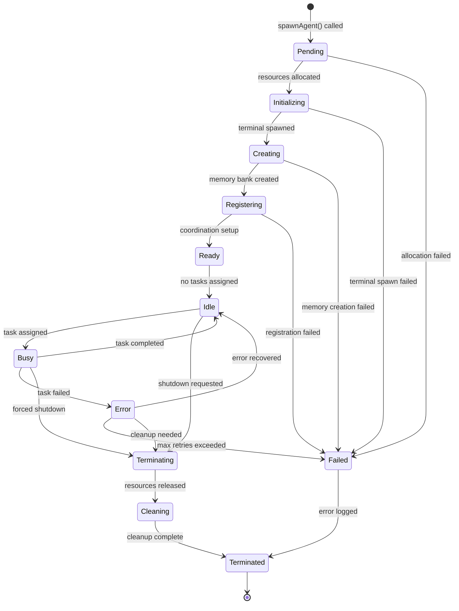
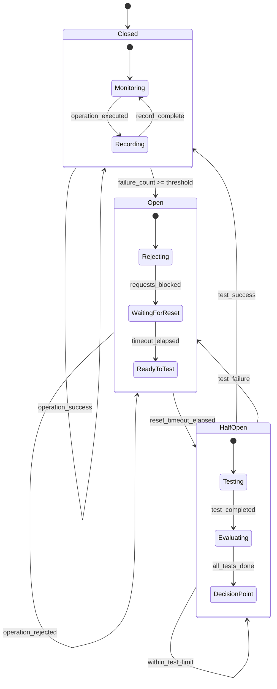
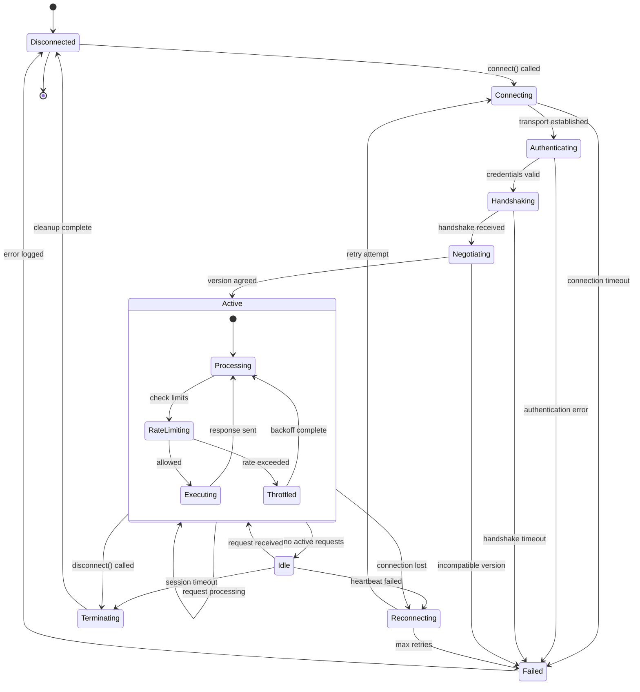
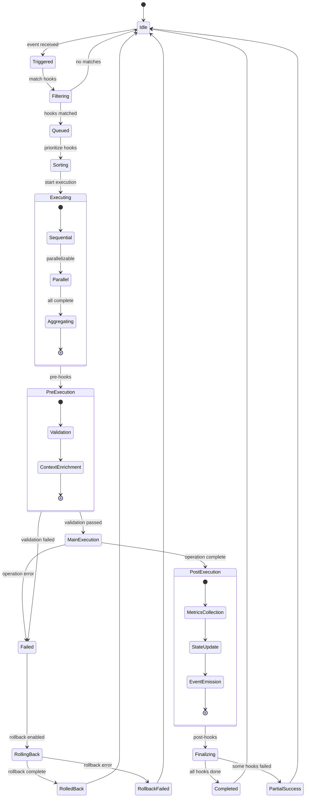
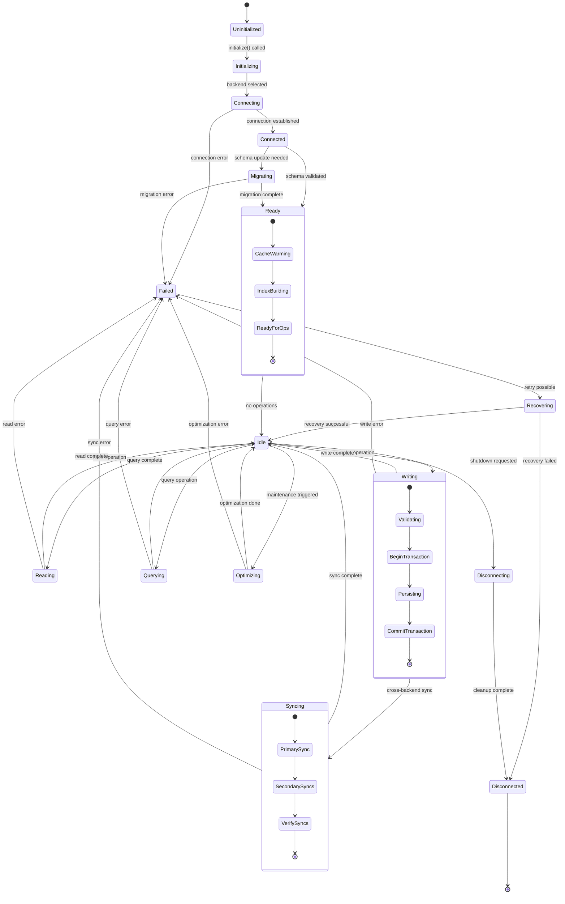
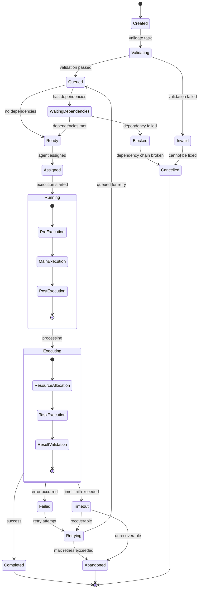
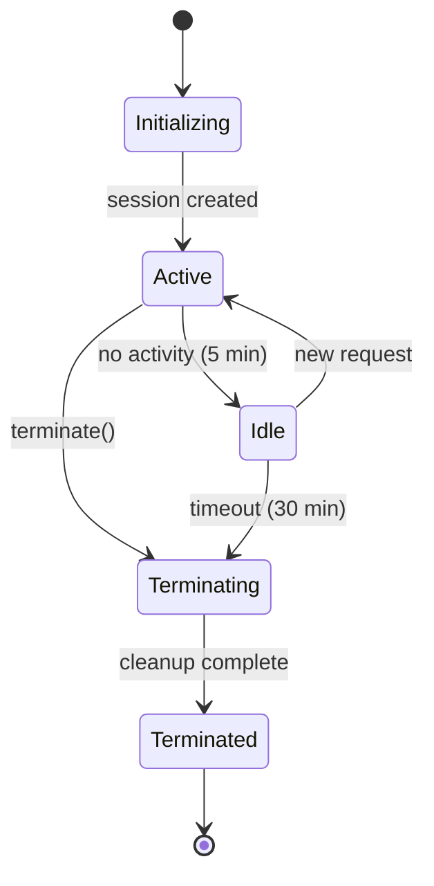

# State Machines Reference - Claude Flow

**Document Version:** 1.0.0
**Analysis Date:** 2025-11-18
**Codebase Version:** 2.7.34

---

## Table of Contents

1. [Introduction](#introduction)
2. [Agent Lifecycle State Machine](#agent-lifecycle-state-machine)
3. [Circuit Breaker State Machine](#circuit-breaker-state-machine)
4. [MCP Server Connection State Machine](#mcp-server-connection-state-machine)
5. [Hook Execution State Machine](#hook-execution-state-machine)
6. [Memory Backend State Machine](#memory-backend-state-machine)
7. [Task Lifecycle State Machine](#task-lifecycle-state-machine)
8. [Session State Machine](#session-state-machine)
9. [SPARC Phase Transition State Machine](#sparc-phase-transition-state-machine)
10. [State Machine Patterns & Best Practices](#state-machine-patterns--best-practices)
11. [Error Recovery Procedures](#error-recovery-procedures)

---

## Introduction

This document consolidates all state machine definitions for the Claude Flow system. State machines provide formal specifications for component behavior, ensuring predictable state transitions, error handling, and recovery procedures.

### Document Purpose

- **Centralized Reference**: All state machines in one location
- **Behavioral Specification**: Formal definition of system behavior
- **Error Handling**: Recovery procedures for each state
- **Developer Guide**: Implementation reference for contributors

### State Machine Notation

All diagrams use Mermaid `stateDiagram-v2` syntax with the following conventions:

- **States**: Rectangles representing system states
- **Transitions**: Arrows with conditions
- **Composite States**: Nested state machines
- **Terminal States**: `[*]` indicates start/end
- **Notes**: Additional context for complex states

---

## Agent Lifecycle State Machine

### Overview

The agent lifecycle state machine manages the complete lifecycle of agents from creation to termination, including resource allocation, execution, error recovery, and graceful shutdown.

### State Diagram



### State Descriptions

| State | Description | Entry Actions | Exit Actions |
|-------|-------------|---------------|--------------|
| **Pending** | Agent creation requested | Allocate agent ID | Reserve resources |
| **Initializing** | Resource allocation in progress | Create terminal session | Validate terminal |
| **Creating** | Memory bank creation | Initialize memory backend | Validate memory access |
| **Registering** | Registering with coordinator | Register capabilities | Join swarm topology |
| **Ready** | Fully initialized, ready for tasks | Mark available | Emit ready event |
| **Idle** | Waiting for task assignment | Enter wait state | None |
| **Busy** | Executing assigned task | Start execution timer | Update metrics |
| **Error** | Recoverable error state | Log error, increment retry | Determine recovery |
| **Failed** | Unrecoverable error | Log critical error | Mark as failed |
| **Terminating** | Graceful shutdown initiated | Stop accepting tasks | Release locks |
| **Cleaning** | Resource cleanup in progress | Close connections | Free memory |
| **Terminated** | Agent fully stopped | Emit termination event | None |

### Transition Table

| From | To | Condition | Timeout | Retry Logic |
|------|-----|-----------|---------|-------------|
| Pending | Initializing | Resources available | 30s | 3 attempts |
| Initializing | Creating | Terminal spawned | 60s | 3 attempts |
| Creating | Registering | Memory created | 30s | 3 attempts |
| Registering | Ready | Registration success | 15s | 3 attempts |
| Ready | Idle | No tasks queued | N/A | N/A |
| Idle | Busy | Task assigned | N/A | N/A |
| Busy | Idle | Task complete | Task timeout | Per-task config |
| Busy | Error | Task error | N/A | N/A |
| Error | Idle | Retry successful | N/A | 3 attempts |
| Error | Failed | Max retries | N/A | None |
| * | Terminating | Shutdown signal | N/A | Forced after 60s |
| Terminating | Cleaning | Resources released | 30s | Force cleanup |
| Cleaning | Terminated | Cleanup done | 30s | Force terminate |

### Error Recovery

**Transient Errors (Temporary failures)**:
- **Strategy**: Exponential backoff retry (3 attempts)
- **Backoff**: 1s → 2s → 4s
- **Action**: Retry same operation
- **Fallback**: Mark as Error state after max retries

**Resource Errors (Missing resources)**:
- **Strategy**: Request reallocation
- **Action**: Release partial resources, request fresh allocation
- **Fallback**: Degraded mode with reduced capabilities

**Network Errors (Connection issues)**:
- **Strategy**: Reconnect with circuit breaker protection
- **Action**: Close stale connections, establish new ones
- **Fallback**: Queue operations, retry when reconnected

**Timeout Errors (Operation too slow)**:
- **Strategy**: Cancel operation, free resources
- **Action**: Send cancel signal, force terminate if unresponsive
- **Fallback**: Mark task as abandoned, reassign

### Code References

- **Implementation**: `src/core/orchestrator.ts:469-508` (spawnAgent)
- **State Management**: `src/agents/agent-manager.ts`
- **Lifecycle Events**: `src/core/event-bus.ts`

---

## Circuit Breaker State Machine

### Overview

The circuit breaker pattern protects the system from cascading failures by monitoring operation success rates and failing fast when thresholds are exceeded.

### State Diagram



### State Descriptions

| State | Description | Behavior | Entry Actions | Exit Actions |
|-------|-------------|----------|---------------|--------------|
| **Closed** | Normal operation | Pass all requests | Reset failure count | Record metrics |
| **Open** | Fast fail mode | Reject all requests immediately | Start reset timer | Log circuit open event |
| **HalfOpen** | Testing recovery | Allow limited test requests | Initialize test counter | Evaluate test results |

### Configuration

```typescript
interface CircuitBreakerConfig {
  threshold: number;          // Failures before opening (default: 5)
  timeout: number;            // Reset timeout in ms (default: 30000)
  resetTimeout: number;       // Full reset timeout (default: 60000)
  halfOpenRequests: number;   // Test requests in half-open (default: 3)
  monitoringWindow: number;   // Sliding window in ms (default: 60000)
}
```

### Transition Conditions

- **Closed → Open**: `failure_count >= threshold` within monitoring window
- **Open → HalfOpen**: Reset timeout elapsed (default 30s)
- **HalfOpen → Closed**: All test requests succeed
- **HalfOpen → Open**: Any test request fails

### Monitoring Metrics

**Per-Operation Metrics**:
- Total requests
- Successful requests
- Failed requests
- Current failure rate
- Time in current state

**Circuit Metrics**:
- State transitions count
- Time spent in each state
- Average recovery time
- Circuit trips per hour

### Code References

- **Implementation**: `src/utils/helpers.ts`
- **Usage**: `src/core/orchestrator.ts:336-348`

---

## MCP Server Connection State Machine

### Overview

The MCP server manages client connections through initialization, authentication, and session lifecycle with automatic reconnection and failure handling.

### State Diagram



### State Descriptions

| State | Description | Timeout | Recovery Action | Typical Duration |
|-------|-------------|---------|-----------------|------------------|
| **Disconnected** | No connection | N/A | Establish connection | N/A |
| **Connecting** | Establishing transport | 10s | Retry with backoff | 100-500ms |
| **Authenticating** | Validating credentials | 5s | Return auth error | 50-200ms |
| **Handshaking** | Protocol negotiation | 10s | Fallback to legacy | 100-300ms |
| **Negotiating** | Capability exchange | 5s | Use minimal capabilities | 50-150ms |
| **Active** | Processing requests | None | Rate limiting enforced | Variable |
| **Idle** | No active requests | 30min | Auto-terminate session | Variable |
| **Reconnecting** | Attempting recovery | 60s | Exponential backoff | 1-60s |
| **Terminating** | Graceful shutdown | 10s | Force disconnect | 100-500ms |
| **Failed** | Unrecoverable error | N/A | Log and cleanup | N/A |

### Connection Lifecycle

**Establishment Phase** (Disconnected → Active):
1. **Connect**: Establish transport layer (stdio/HTTP/WebSocket)
2. **Authenticate**: Validate credentials, create session token
3. **Handshake**: Exchange protocol version and capabilities
4. **Negotiate**: Agree on features, tools, and limits
5. **Activate**: Enter normal operation mode

**Operation Phase** (Active ↔ Idle):
- **Active**: Processing incoming requests with rate limiting
- **Idle**: No requests, periodic heartbeat checks
- **Transitions**: Based on request queue and heartbeat status

**Termination Phase** (Active → Disconnected):
1. **Initiate**: Receive disconnect signal or timeout
2. **Complete**: Finish in-flight requests
3. **Cleanup**: Release resources, save state
4. **Disconnect**: Close transport, emit event

### Recovery Procedures

**Connection Lost**:
```typescript
// Automatic reconnection with exponential backoff
const reconnectConfig = {
  maxAttempts: 5,
  initialDelay: 1000,  // 1s
  maxDelay: 60000,     // 60s
  backoffMultiplier: 2,
  jitter: true
};
```

**Authentication Failed**:
- **Non-recoverable**: Return error to client
- **Action**: Log failure, update metrics, close connection
- **Client action**: Re-authenticate with valid credentials

**Version Mismatch**:
- **Fallback**: Attempt legacy mode if supported
- **Graceful degradation**: Use common subset of features
- **Client notification**: Inform of limited capabilities

### Code References

- **Implementation**: `src/mcp/server.ts:271-355`
- **Handshake**: `src/mcp/server-mcp-2025.ts:163-229`
- **Transport**: `src/mcp/transports/`

---

## Hook Execution State Machine

### Overview

Hooks execute through a well-defined state machine ensuring proper sequencing, error handling, and rollback capabilities for pre/post operation automation.

### State Diagram



### State Descriptions

| State | Entry Condition | Exit Condition | Side Effects | Error Handling |
|-------|----------------|----------------|--------------|----------------|
| **Idle** | No pending hooks | Event received | None | N/A |
| **Triggered** | Event emitted | Hooks matched | Load hook registry | Continue on registry error |
| **Filtering** | Hook list available | Pattern match complete | Filter by criteria | Skip unmatched hooks |
| **Queued** | Hooks matched | Priority sorted | Queue management | Continue with available |
| **Executing** | Execution started | All hooks done | Execute handlers | Per-hook error strategy |
| **PreExecution** | Pre-hooks queued | Validation complete | Validate context | Halt on validation error |
| **MainExecution** | Pre-hooks passed | Operation done | Execute main op | Halt and rollback |
| **PostExecution** | Main op complete | Post-hooks done | Update state | Continue on non-critical |
| **Failed** | Hook error | Rollback initiated | Log error | Attempt rollback |
| **RollingBack** | Failure detected | State restored | Undo operations | Log rollback failure |
| **Completed** | Success | Return to idle | Emit event | N/A |

### Hook Types & Triggers

**LLM Hooks**:
- **pre-llm-call**: Rate limiting, context injection, prompt optimization
- **post-llm-call**: Token tracking, cost calculation, response caching
- **llm-error**: Error handling, retry logic, fallback providers

**Memory Hooks**:
- **pre-memory-store**: Validation, sanitization, deduplication
- **post-memory-store**: Indexing, embedding generation, cache update
- **memory-sync**: Cross-provider synchronization
- **pre-memory-retrieve**: Access control, cache check
- **post-memory-retrieve**: Result enrichment

**Neural Hooks**:
- **neural-train**: Pattern learning from execution history
- **neural-predict**: Optimization recommendations
- **neural-consolidate**: Model optimization

**Performance Hooks**:
- **performance-metric**: Real-time metrics collection
- **performance-alert**: Threshold monitoring
- **performance-optimize**: Automatic optimization

**Workflow Hooks**:
- **workflow-start**: Resource allocation
- **workflow-step**: Progress tracking
- **workflow-decision**: Conditional branching
- **workflow-complete**: Cleanup, reporting
- **workflow-error**: Error recovery

### Error Handling Strategies

```typescript
interface HookErrorStrategy {
  // Continue execution ignoring error
  continue: boolean;

  // Halt execution on error
  halt: boolean;

  // Attempt rollback
  rollback: boolean;

  // Retry failed hook
  retry: {
    enabled: boolean;
    maxAttempts: number;
    backoff: 'linear' | 'exponential';
  };
}
```

### Code References

- **Pipeline**: `src/services/agentic-flow-hooks/index.ts:69-93`
- **Matching**: `src/hooks/hook-matchers.ts:89-174`
- **Execution**: `src/services/agentic-flow-hooks/`

---

## Memory Backend State Machine

### Overview

Memory backends (SQLite, Markdown, Hybrid) manage connection lifecycle, transactions, and error recovery for persistent storage operations.

### State Diagram



### Backend-Specific Behaviors

**SQLite Backend**:
```typescript
{
  connectionPooling: {
    minConnections: 5,
    maxConnections: 20,
    idleTimeout: 30000
  },
  journaling: {
    mode: 'WAL',  // Write-Ahead Logging
    synchronous: 'NORMAL',
    pageSize: 4096
  },
  optimization: {
    autoVacuum: 'INCREMENTAL',
    cacheSize: -2000,  // 2MB
    tempStore: 'MEMORY'
  }
}
```

**Markdown Backend**:
```typescript
{
  fileLocking: {
    exclusive: true,
    timeout: 5000
  },
  atomicWrites: {
    useTempFile: true,
    renameOnComplete: true
  },
  backup: {
    enabled: true,
    timestamped: true,
    maxBackups: 10
  }
}
```

**Hybrid Backend**:
```typescript
{
  primary: 'sqlite',    // Fast queries
  secondary: 'markdown', // Human-readable
  syncStrategy: 'async',
  consistency: 'eventual',
  conflictResolution: 'primary-wins'
}
```

### Transaction Management

**ACID Transactions** (SQLite):
- **Atomicity**: All-or-nothing commits
- **Consistency**: Schema constraints enforced
- **Isolation**: Serializable by default
- **Durability**: WAL ensures persistence

**Retry Logic**:
```typescript
const retryConfig = {
  maxAttempts: 3,
  transientErrors: ['SQLITE_BUSY', 'SQLITE_LOCKED'],
  backoff: 'exponential',
  initialDelay: 100,
  maxDelay: 5000
};
```

### Code References

- **SQLite**: `src/memory/backends/sqlite.ts`
- **Markdown**: `src/memory/backends/markdown.ts`
- **Hybrid**: `src/memory/backends/hybrid.ts`

---

## Task Lifecycle State Machine

### Overview

Tasks progress through a comprehensive lifecycle with dependency management, retry logic, and parallel execution support.

### State Diagram



### State Descriptions

| State | Description | Typical Duration | Transition Conditions | Recovery Path |
|-------|-------------|------------------|----------------------|---------------|
| **Created** | Task initialized | <1ms | Immediate validation | Retry creation |
| **Validating** | Schema validation | 5-20ms | Valid → Queued | Fix validation |
| **Queued** | Awaiting execution | Variable | Agent available | Wait for agent |
| **WaitingDependencies** | Blocked on prerequisites | Variable | All deps complete | Wait for deps |
| **Ready** | Ready for assignment | <100ms | Agent assigned | None |
| **Assigned** | Agent allocated | <50ms | Execution started | Reassign on failure |
| **Running** | Active execution | Variable | Success/Error | Retry on error |
| **Failed** | Execution failed | N/A | Retry or abandon | Retry with backoff |
| **Retrying** | Retry attempt | Variable | Requeued | Final attempt |
| **Completed** | Success | N/A | Terminal state | None |
| **Abandoned** | Permanently failed | N/A | Terminal state | Manual intervention |
| **Cancelled** | User/system cancelled | N/A | Terminal state | None |

### Dependency Management

**Dependency Graph**:
```typescript
interface TaskDependency {
  taskId: string;
  type: 'hard' | 'soft';  // hard = blocking, soft = optional
  status: 'pending' | 'completed' | 'failed';
}
```

**Dependency Resolution**:
- **Topological sort**: Determine execution order
- **Parallel execution**: Independent tasks run concurrently
- **Blocking behavior**: Hard dependencies block execution
- **Soft dependencies**: Optional, execution continues on failure

### Retry Configuration

```typescript
interface TaskRetryConfig {
  maxAttempts: number;      // Default: 3
  backoffStrategy: 'linear' | 'exponential';
  initialDelay: number;     // ms, default: 1000
  maxDelay: number;         // ms, default: 60000
  retryableErrors: string[]; // Error codes to retry
}
```

### Code References

- **Execution**: `src/swarm/executor.ts:117-167`
- **Management**: `src/coordination/swarm-coordinator.ts:247-299`

---

## Session State Machine

### Overview

Sessions manage the lifecycle of MCP client connections, including authentication, activity tracking, and automatic cleanup.

### State Diagram



### State Descriptions

| State | Description | Timeout | Actions | Persistence |
|-------|-------------|---------|---------|-------------|
| **Initializing** | Creating session | 10s | Allocate resources | None |
| **Active** | Processing requests | None | Handle requests | Save after each request |
| **Idle** | No recent activity | 30min | Heartbeat checks | Periodic save (5min) |
| **Terminating** | Graceful shutdown | 10s | Complete in-flight | Final save |
| **Terminated** | Session ended | N/A | Release resources | Archival |

### Session Data Structure

```typescript
interface Session {
  id: string;
  clientId: string;
  agentProfiles: AgentProfile[];
  terminalIds: string[];
  memoryBankIds: string[];
  createdAt: Date;
  lastActivity: Date;
  metadata: SessionMetadata;
}
```

### Persistence Strategy

**Save Triggers**:
- After each successful request
- Periodic save every 5 minutes (Idle state)
- On state transition
- Before termination

**Recovery**:
- Restore from `.swarm/sessions.json`
- Reestablish connections
- Resume from last saved state

---

## SPARC Phase Transition State Machine

### Overview

The SPARC (Specification, Pseudocode, Architecture, Refinement, Completion) workflow manages five development phases with quality gates.

### State Diagram



```mermaid
stateDiagram-v2
    [*] --> Initialized

    Initialized --> Specification: workflow started
    Specification --> SpecificationReview: phase complete
    SpecificationReview --> Pseudocode: review passed
    SpecificationReview --> Specification: review failed

    Pseudocode --> PseudocodeReview: phase complete
    PseudocodeReview --> Architecture: review passed
    PseudocodeReview --> Pseudocode: review failed

    Architecture --> ArchitectureReview: phase complete
    ArchitectureReview --> Refinement: review passed
    ArchitectureReview --> Architecture: review failed

    Refinement --> RefinementReview: TDD complete
    RefinementReview --> Completion: tests passing
    RefinementReview --> Refinement: tests failing

    Completion --> FinalReview: deliverables ready
    FinalReview --> Completed: validation passed
    FinalReview --> Completion: validation failed

    Completed --> [*]

    state Specification {
        [*] --> GatheringRequirements
        GatheringRequirements --> WritingUserStories
        WritingUserStories --> DefiningAcceptanceCriteria
        DefiningAcceptanceCriteria --> [*]
    }

    state Pseudocode {
        [*] --> DesigningAlgorithms
        DesigningAlgorithms --> CreatingLogicFlows
        CreatingLogicFlows --> DefiningDataStructures
        DefiningDataStructures --> [*]
    }

    state Architecture {
        [*] --> DesigningSystemArchitecture
        DesigningSystemArchitecture --> CreatingComponentDiagrams
        CreatingComponentDiagrams --> SpecifyingAPIs
        SpecifyingAPIs --> [*]
    }

    state Refinement {
        [*] --> WritingTests
        WritingTests --> ImplementingCode
        ImplementingCode --> Refactoring
        Refactoring --> RunningTests
        RunningTests --> WritingTests: tests failing
        RunningTests --> [*]: tests passing
    }

    state Completion {
        [*] --> RunningIntegrationTests
        RunningIntegrationTests --> GeneratingDocumentation
        GeneratingDocumentation --> ValidatingDeliverables
        ValidatingDeliverables --> [*]
    }
```

### Phase Details

| Phase | Entry Criteria | Exit Criteria | Quality Gate | Duration |
|-------|---------------|---------------|--------------|----------|
| **Specification** | Workflow initialized | Requirements documented | Review approval | 30-60min |
| **Pseudocode** | Spec review passed | Algorithms designed | Logic validation | 20-40min |
| **Architecture** | Pseudocode approved | System designed | Architecture review | 40-80min |
| **Refinement** | Architecture approved | Tests passing (>80%) | TDD validation | 60-120min |
| **Completion** | Tests passing | Deliverables validated | Final QA | 30-60min |

### Quality Gates

1. **Specification Review**:
   - Requirements complete and unambiguous
   - User stories well-defined with acceptance criteria
   - Stakeholder approval obtained

2. **Pseudocode Review**:
   - Algorithms sound and efficient
   - Logic flow validated
   - Data structures appropriate

3. **Architecture Review**:
   - System design scalable and maintainable
   - Components well-defined with clear interfaces
   - APIs documented

4. **TDD Validation**:
   - All tests passing
   - Code coverage >80%
   - Code quality metrics met

5. **Final QA**:
   - Integration tests passing
   - Documentation complete
   - Deliverables validated

### Phase Transition Rules

- **Forward**: Only when quality gate passes
- **Backward**: Rework based on review feedback
- **Parallel**: Some phases can overlap (Architecture + Pseudocode review)
- **Blocking**: Failed gate blocks forward progress
- **Timeout**: Phase timeout triggers coordinator intervention

---

## State Machine Patterns & Best Practices

### Design Patterns

**1. Hierarchical States**

Use nested states for complex behaviors:

```typescript
state Running {
    [*] --> PreExecution
    PreExecution --> MainExecution
    MainExecution --> PostExecution
    PostExecution --> [*]
}
```

**Benefits**:
- Encapsulates sub-behaviors
- Reduces top-level complexity
- Enables state composition

**2. Error State Pattern**

Always include explicit error states:

```typescript
Normal --> Error: error occurred
Error --> Recovering: retry
Recovering --> Normal: success
Recovering --> Failed: max retries
```

**Benefits**:
- Explicit error handling
- Clear recovery paths
- Prevents undefined behavior

**3. Terminal State Pattern**

Define clear terminal states:

```typescript
Completed --> [*]
Abandoned --> [*]
Cancelled --> [*]
```

**Benefits**:
- Prevents state machine lockup
- Clear lifecycle completion
- Resource cleanup trigger

### Implementation Guidelines

**State Transition Validation**:
```typescript
class StateMachine {
  private validateTransition(from: State, to: State): boolean {
    // Check allowed transitions
    const allowed = this.transitionTable.get(from);
    if (!allowed || !allowed.includes(to)) {
      throw new InvalidTransitionError(from, to);
    }
    return true;
  }
}
```

**State Entry/Exit Actions**:
```typescript
class StateMachine {
  private async transition(to: State): Promise<void> {
    // Exit current state
    await this.states[this.currentState].onExit();

    // Transition
    const from = this.currentState;
    this.currentState = to;

    // Enter new state
    await this.states[to].onEntry();

    // Emit event
    this.emit('stateChanged', { from, to });
  }
}
```

**Timeout Handling**:
```typescript
class StateMachine {
  private startStateTimeout(state: State, timeoutMs: number): void {
    const timer = setTimeout(() => {
      this.handleStateTimeout(state);
    }, timeoutMs);

    this.stateTimers.set(state, timer);
  }
}
```

---

## Error Recovery Procedures

### General Recovery Strategy

**1. Error Classification**

```typescript
enum ErrorSeverity {
  TRANSIENT = 'transient',      // Temporary, retry possible
  RECOVERABLE = 'recoverable',  // Requires intervention
  FATAL = 'fatal'               // Unrecoverable
}
```

**2. Recovery Decision Tree**

```
Error Detected
├── Transient?
│   ├── Yes → Retry with backoff
│   └── No → Check recoverable
├── Recoverable?
│   ├── Yes → Attempt recovery procedure
│   └── No → Mark as failed
└── Fatal?
    └── Yes → Immediate cleanup and terminate
```

**3. Retry Configuration**

```typescript
const retryConfig = {
  maxAttempts: 3,
  backoffStrategy: 'exponential',
  initialDelay: 1000,
  maxDelay: 60000,
  jitter: true,
  retryableErrors: [
    'ETIMEDOUT',
    'ECONNRESET',
    'SQLITE_BUSY'
  ]
};
```

### Component-Specific Recovery

**Agent Recovery**:
- **Resource allocation failure**: Release partial resources, retry
- **Execution timeout**: Cancel task, reassign to different agent
- **Communication loss**: Reconnect with exponential backoff

**MCP Connection Recovery**:
- **Authentication failure**: Re-authenticate with fresh credentials
- **Connection loss**: Automatic reconnection up to 5 attempts
- **Protocol mismatch**: Fallback to legacy mode if supported

**Memory Recovery**:
- **Write failure**: Retry with transaction rollback
- **Index corruption**: Rebuild index from persistent storage
- **Disk full**: Trigger cleanup, archive old data

**Task Recovery**:
- **Dependency failure**: Mark blocked, wait for dependency resolution
- **Timeout**: Cancel and reassign with increased timeout
- **Agent failure**: Reassign to different agent

### Monitoring & Alerting

**Health Checks**:
```typescript
interface HealthCheck {
  componentName: string;
  status: 'healthy' | 'degraded' | 'unhealthy';
  lastCheck: Date;
  consecutiveFailures: number;
  metadata: {
    stateTransitions: number;
    errorRate: number;
    recoveryAttempts: number;
  };
}
```

**Alert Thresholds**:
- **Warning**: Error rate >5% over 5 minutes
- **Critical**: Error rate >20% or consecutive failures >3
- **Emergency**: Component stuck in error state >5 minutes

---

## Appendix: State Machine Implementation Template

```typescript
import { EventEmitter } from 'events';

interface StateDefinition<TContext> {
  name: string;
  onEntry?: (context: TContext) => Promise<void>;
  onExit?: (context: TContext) => Promise<void>;
  timeout?: number;
  onTimeout?: (context: TContext) => Promise<void>;
}

interface TransitionDefinition {
  from: string;
  to: string;
  condition?: (context: any) => boolean;
  action?: (context: any) => Promise<void>;
}

class StateMachine<TContext> extends EventEmitter {
  private currentState: string;
  private states: Map<string, StateDefinition<TContext>>;
  private transitions: TransitionDefinition[];
  private context: TContext;
  private stateTimers: Map<string, NodeJS.Timeout>;

  constructor(
    initialState: string,
    states: StateDefinition<TContext>[],
    transitions: TransitionDefinition[],
    context: TContext
  ) {
    super();
    this.currentState = initialState;
    this.states = new Map(states.map(s => [s.name, s]));
    this.transitions = transitions;
    this.context = context;
    this.stateTimers = new Map();
  }

  async transition(to: string): Promise<void> {
    // Validate transition
    const allowed = this.transitions.find(
      t => t.from === this.currentState && t.to === to
    );

    if (!allowed) {
      throw new Error(`Invalid transition: ${this.currentState} -> ${to}`);
    }

    // Check condition
    if (allowed.condition && !allowed.condition(this.context)) {
      throw new Error(`Transition condition not met: ${this.currentState} -> ${to}`);
    }

    // Exit current state
    const currentStateDef = this.states.get(this.currentState);
    if (currentStateDef?.onExit) {
      await currentStateDef.onExit(this.context);
    }

    // Clear timeout
    this.clearStateTimeout(this.currentState);

    // Execute transition action
    if (allowed.action) {
      await allowed.action(this.context);
    }

    // Transition
    const from = this.currentState;
    this.currentState = to;

    // Enter new state
    const newStateDef = this.states.get(to);
    if (newStateDef?.onEntry) {
      await newStateDef.onEntry(this.context);
    }

    // Set timeout if defined
    if (newStateDef?.timeout) {
      this.startStateTimeout(to, newStateDef.timeout);
    }

    // Emit event
    this.emit('stateChanged', { from, to, context: this.context });
  }

  private startStateTimeout(state: string, timeoutMs: number): void {
    const timer = setTimeout(async () => {
      const stateDef = this.states.get(state);
      if (stateDef?.onTimeout) {
        await stateDef.onTimeout(this.context);
      }
      this.emit('stateTimeout', { state, context: this.context });
    }, timeoutMs);

    this.stateTimers.set(state, timer);
  }

  private clearStateTimeout(state: string): void {
    const timer = this.stateTimers.get(state);
    if (timer) {
      clearTimeout(timer);
      this.stateTimers.delete(state);
    }
  }

  getState(): string {
    return this.currentState;
  }

  getContext(): TContext {
    return this.context;
  }
}

export { StateMachine, StateDefinition, TransitionDefinition };
```

---

## Document Metadata

**Author**: Claude Code System Architecture Team
**Generated**: 2025-11-18
**Version**: 1.0.0
**State Machines Documented**: 8
**Total Diagrams**: 8
**Code References**: 20+

**Maintenance Notes**:
- Review state machines when adding new features
- Update transition tables when modifying error handling
- Validate diagrams against implementation
- Keep recovery procedures synchronized with code

---

**End of State Machines Reference**
